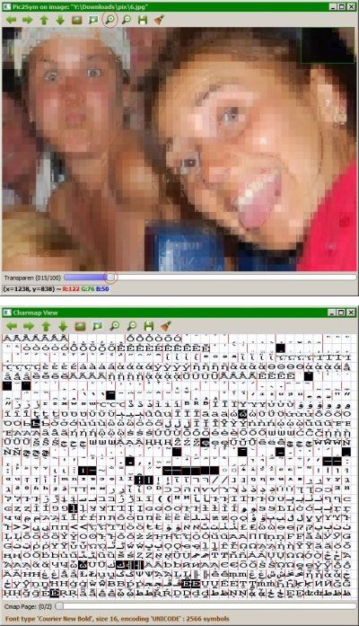
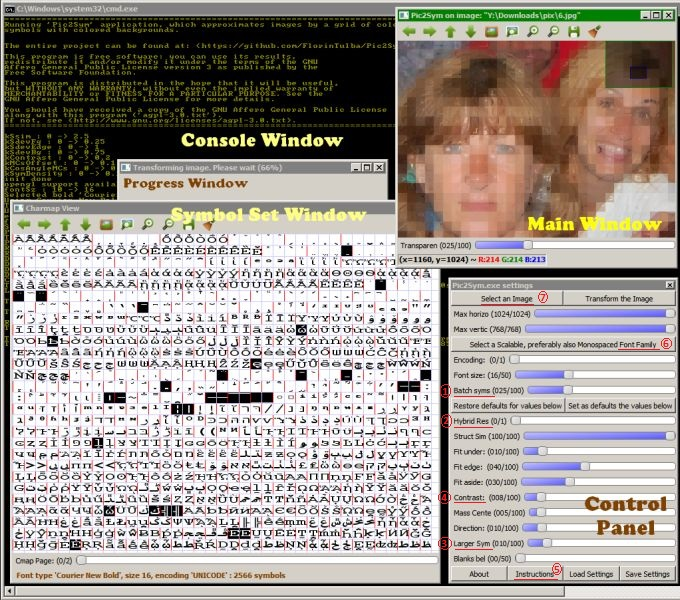
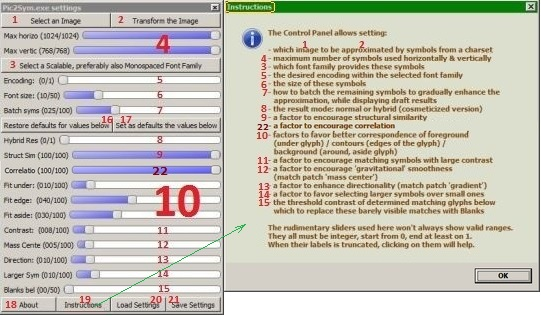
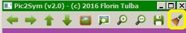
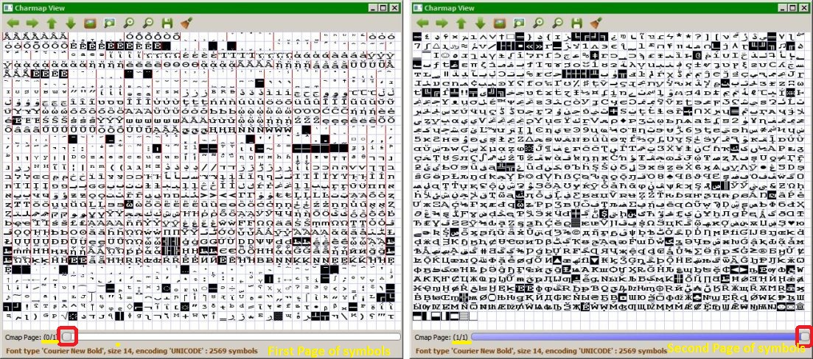
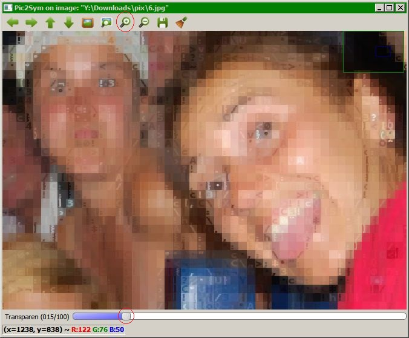

# Pic2Sym v2.0

This application **approximates images** by a **grid of colored symbols with colored backgrounds**. 
It runs on **64\-bit Windows \(at least version 7\)**. 

<table style="width:100%; margin-left:0; margin-right:0" border="0" cellpadding="0" cellspacing="0">
  <tr valign="top" style="vertical-align:top">
    <td width="40%">
		<strong>Topics:</strong>
		<ol>
			<li><a href="#Description">Description of Pic2Sym application</a></li>
			<li><a href="doc/pages/relatedWork/relatedWork.md">Related work</a></li>
			<li><a href="doc/pages/results/results.md">Example results</a></li>
			<li><a href="doc/pages/performance/performance.md">Performance</a></li>
			<li><a href="doc/pages/conclusions/conclusions.md">Conclusions and further directions</a></li>
			<li><a href="doc/pages/testBinary/testBinary.md">Testing the application</a> (<i>64-bit Windows only</i>)</li>
			<li><a href="doc/pages/dev/dev.md">Development environment configuration</a></li>
			<li><a href="../version_1.0/doc/releases.md">Other released versions</a></li>
			<li><a href="doc/pages/appendix/appendix.md">Appendix</a> (<i>various technical details</i>)</li>
		</ol>
    </td> 
    <td rowspan="2" align="center" style="padding-top:0; padding-bottom:0; padding-right:0">
    	</img>
    </td> 
  </tr>
  <tr>
    <td align="justify" style="text-align:justify; padding-left:0; padding-right:0">
    	

		The first view from the right allows <i>comparing</i> the <i>original image</i> with the <i>approximation result</i> using the <i>Transparency slider</i> at the bottom of the window. 
    	

		<i>Magnifying a region</i> is possible using the toolbar or the mouse wheel.
    	

    	The second view displays <i>a part from the symbols used for the approximation</i>. Its status bar provides <i>complete information about these symbols</i> (font family, style, size, encoding and total count).
    	

    	They are <i>grouped by similarity</i> and <i>those with inverted colors might be ignored</i> while approximating images.
    	

    	A <i>Control Panel</i> presented later on this page details the control options of the application.
    	

    	An additional <i>console window</i> is tracing relevant events.
    </td>
  </tr>
</table>

## Description of the application ##

The symbols used for approximation are **scalable**, *preferably* **fixed\-width** fonts, like *Consolas*, *Courier New* and *Lucida Console*. [Here](https://en.wikipedia.org/wiki/Samples_of_monospaced_typefaces) are more examples of such fonts. Scalable fonts allow using virtually any size of the font while preserving their quality. Fixed\-width fonts are more evenly width\-distributed, thus more helpful to approximate random patches.

The **result** of the image transformation is a grid of __*square* cells__. All the symbols are **preprocessed** to fit such cells, so the *original symbol set* is *altered*. Therefore the **output is simply a new image**, and cannot be saved neither as a character table in HTML, nor as a text file (like similar applications do). Displaying the output into a console is also ruled out, first because there are only a couple of console font sizes available and secondly, because consoles usually provide only 16 colors.

Next comes a snapshot of the application *while processing an image*: 
 

Several **features** from *Pic2Sym* (explained in more detail in the [Appendix][Appendix], [Control Panel][CtrlPanel] and in the [*configuration*](res/varConfig.txt) file):

- Transformations display **intermediary results (drafts)** *as often as adjusted during the ongoing process* \[see (*1*) from the image above \- &#39;*Batch Symbols*&#39; explained in [Control Panel][CtrlPanel]\]. When **aborting** a transformation (with *ESC* key), the *last draft gets saved*
- The *artistic quality* of generated results can be improved by:
	- making sure that **_poorly_ approximated image patches will remain discreet** \[see (*2*) from image above - &#39;*Hybrid Result*&#39; explained in [Control Panel][CtrlPanel]\]
	- **removing undesirable glyphs** from the symbol set, like *barely readable ones*, or *large rectangles* a.o. (This *reduces transformation time*, since it shrinks the symbol set)
- The symbol set is **arranged by similarity of the glyphs**, resulting a **set of clusters** (which gets *saved* and can be *reused afterwards*). This **accelerates the image transformation** because of *less compare operations* between patches and symbols:
	- image patches are **first** compared just with a ***representative of each such cluster***
	- **if the cluster representative is similar-enough to the patch**, then *all individual symbols from the group compete* to determine the best match for the patch among them
	- but **otherwise, no symbol from that group needs to be compared against the given patch**
- During an image transformation, the *competing glyphs* can also undergo a ***symbols preselection process*** (which is particularly advantageous for *larger font sizes*):
	- comparing *initially* **tiny versions** of the glyphs from the symbol set and of the patches from the image
	- a *second step* tackles normal-size glyphs and patches and just **selects the best matching symbol among the few good candidates** resulted from the *first pass*
- The user might **specify several aspects of interest** for every transformation (like a preference for results with many *large symbols* \[(*3*) from image above\], or if the patches might get approximated by less similar symbols, but with *better contrast* \[(*4*) from image above\]). See [Control Panel][CtrlPanel] for the entire list of *matching aspects*
- All requested matching aspects (mentioned above) will use a *heuristic evaluation* and will get rearranged in a *particular order* that allows **detecting as cheap and as early as possible** when a symbol *cannot be the best match for a given patch of the image*. A **surprising consequence** for images with rather coarse texture:
	- when using only a single *complex* enabled matching aspect, this must be evaluated for each pair symbol\-patch
	- but when using the *same complex matching aspect* *together with a few simpler enabled aspects*, this allows *skipping often enough the evaluation of the most complex ones*. In turn, this means **a faster transformation, despite there are more enabled matching aspects to consider** compared to the first case
- The application is **faster on multi-core machines** (unless it&#39;s configured for no parallelism)
- **Elapsed and estimated remaining time** for *image conversions* and also for *loading symbol sets* are provided *within the console window*
- Multiple *non\-conflicting* **user commands** can run in **parallel** (e.g. clicking &#39;*Instructions*&#39; \[(*5*) from image above\] while both, a *large symbol set* \[(*6*) from image above\] and also a *large image* \[(*7*) from image above\] are loading)

- - -

The **Control Panel** contains all the necessary controls to **customize and generate approximations for various images**: 
 
[Here][CtrlPanel] are more explanations about the controls.

The user can **display / hide** it using **Ctrl\+P** or the **last tool from the toolbar** from any other window: 
 

To **leave the application**, please **activate a window** (except the console and the Control Panel) and **press ESC** \(check this [limitation][CloseWinIssue] on that\).

- - -

The **Symbol set window** helps browsing the pages of the **symbols used for the approximation**. 
 
The presented glyphs are *already resized to fit in square cells* (using *widening* and sometimes additional *minor translation / crop* operations).

*Blanks and exact\-duplicates were removed* and the remaining symbols were ***reordered*** **primarily by similarity** (*showing larger groups first*) and **finally by their &#39;density&#39;** (*how much surface from their patch they consume*).

The glyphs with **inverted colors** were detected as **undesirable symbols** (they just induce a *slower and lower quality transformation*). *Any selected* category of *undesired symbols* can be **easily hidden** from a [*configuration file*](res/varConfig.txt) to *improve the conversion process*.

- - -

The Unit Tests written for the project report all detected [mismatches and wrongfully filtered symbols](doc/pages/UnitTesting/UnitTesting.md) in a visual and easy to inspect manner based on the zoom and compare features of the **main window**.

Illustrating again the power of this main window: 

* * *

Kindly address any observations, suggestions or questions to me using *florintulba@yahoo.com*. &copy; 2016, 2017 Florin Tulba (GNU AGPL v3 license)

* * *

**Note:**
*For exemplifying the conversions performed by the project, I&#39;ve applied the transformations on several images provided by 3 friends with well\-developed artistic abilities, all of us sharing the love for nature. So, many thanks to [Trifa Carina](https://www.facebook.com/trifa.carina), [Muntean Flavia](https://www.facebook.com/darkfavy) and [Rosca Adrian](https://www.facebook.com/rosca.adrian.9). If you need those beautiful pictures or similar ones, please contact them.*

[CtrlPanel]:doc/pages/CtrlPanel/CtrlPanel.md
[Appendix]:doc/pages/appendix/appendix.md
[CloseWinIssue]:https://github.com/FlorinTulba/Pic2Sym/issues/1
