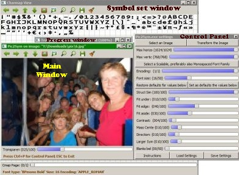
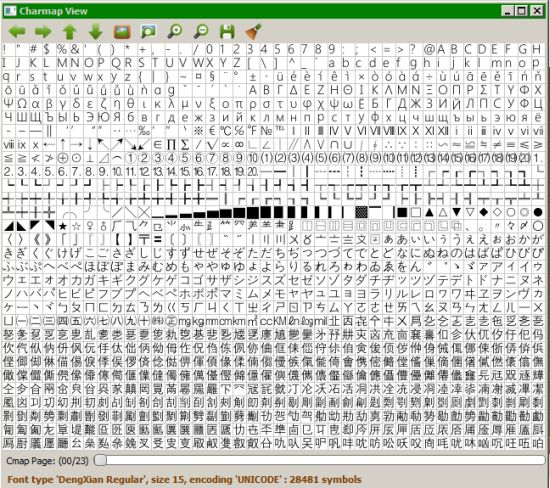
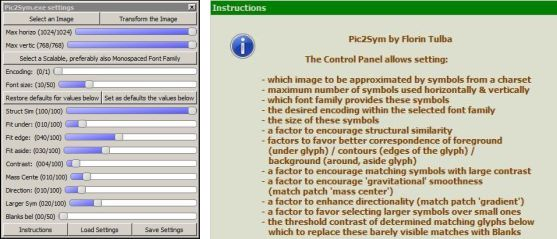

# Pic2Sym #

**Topics:**

1. Description of Pic2Sym application \(*see below*\)
1. [Related work](doc/relatedWork.md)
1. [Example results](doc/results.md)
1. [Performance](doc/performance.md)
1. [Conclusions and further directions](doc/conclusions.md)
1. [Testing the Provided Binary](doc/testBinary.md) \(*Windows 64bits only*\)
1. [Released versions](../version_1.0/releases.md)
1. [Appendix](doc/appendix.md) \(*various technical details*\)

## Description of the application ##

*Pic2Sym* **approximates images** by a **grid of colored symbols with colored backgrounds**.

It runs on **Windows \(at least version 7; 64 bits\)**. It comes with a *graphical interface* and a *console* tracing relevant events.

The symbols used for approximation are **scalable**, *preferably* **fixed\-width** fonts, like *Consolas*, *Courier New* and *Lucida Console*. See [this](https://en.wikipedia.org/wiki/Samples_of_monospaced_typefaces) for more examples of such fonts. Scalable fonts allow using virtually any size of the font while preserving its quality. Fixed\-width fonts are more evenly width\-distributed, thus more helpful to approximate random patches.

The resulted grid has **square cells** and *the symbols are preprocessed* to fit such cells by widening them all. Therefore the **output is simply a new image**, and cannot be saved as a char table in html or as a text file, like in similar applications.
Console output is also ruled out, first because there are only a couple of font sizes available and secondly, because consoles usually provide only 16 colors.

- - -

This is how *Pic2Sym* looks like *while transforming an image*: 

- - -

The **main window** allows **comparing** the *original image* with the *approximation result* using the **Transparency slider** at the bottom of the window. 
**Magnifying a region** is possible using the toolbar or the mouse wheel. \(Large zoom factors display even the values of the pixels.\) 
 
Same window is used to [present mismatches detected during Unit Tests](doc/UnitTesting.md).

- - -

**Symbol set window** displays the **symbols used for the approximation**, one page at a time. 
 
The presented glyphs are *already resized to fit in square cells*. *Blanks and exact\-duplicates were removed*, as well.  The status bar provides *complete information about these symbols* \(font family, style, size, encoding and total count\).

Notice that most symbols on the first rows are not centered after the resize, leaving a large gap to their right. This happens for **non**\-*fixed\-width* fonts, which are **not** *recommended for approximations*. The glyphs in the first image \(presenting the application\) are fixed\-width.

- - -

The **Control Panel** contains all the necessary controls to **customize and generate approximations for various images**. The user can **display / hide** it using **Ctrl\+P** or the **last tool from the toolbar** from any other window. 
 
[Here](doc/CtrlPanel.md) are more explanations about the controls.

_ _ _

To **leave the application**, please **activate a window** (except the console and the Control Panel) and **press ESC**. \(This is a limitation of ***highgui*** module from ***OpenCV***.\)

----------

Kindly address any observations, suggestions or questions to me using ***<florintulba@yahoo.com>***. &copy; 2016 Florin Tulba (GNU AGPL v3 license)
