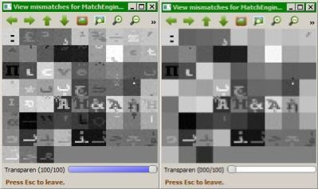

## Interpreting the mismatches signaled during Unit Testing ##

[Back to start page](../ReadMe.md)

The image from left displays the symbols that couldn&#39;t be recognized when testing algorithm accuracy on Courier fonts with Unicode encoding. Same level of noise was added to all original symbols to be identified. In this case only 66 out of more than 2800 noisy glyphs were misidentified (*less than 3%*).

The right-side image presents the actual approximations.

Here are 2 categories of mismatches:

- first one is for approximations with near\-zero contrast (selected glyph is unknown, but different from the expected one);
- the second one is due to the fact some symbol sets contain near\-duplicates which can&rsquo;t be distinguished in the presence of noise

Exact\-duplicates were removed right from the start. Large zoom factors (pixel level), together with the Transparency slider help spot such near\-duplicates.

----------

[Back to start page](../ReadMe.md)