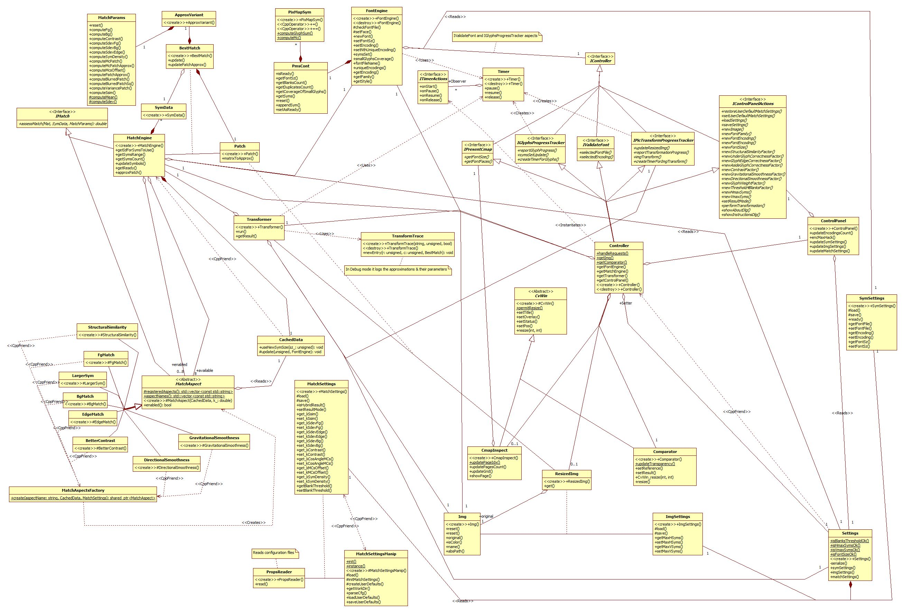

## Appendix ##
[Back to start page](../ReadMe.md)

#### A.	Technical Details of Pic2Sym v1.1

The application was tested on *Windows 7 64 bits* and developed in *C++*.

Following *open\-source* and *platform\-independent* libraries were employed in the code:
- **[Boost](http://www.boost.org/)** for *filesystem*, *serialization* and other utilities
- **[FreeType 2](http://freetype.org/)** for *reading and processing fonts*
- **[OpenCV](http://opencv.org/)** for a minimal *graphical interface* and the provided *matrix and image processing capabilities*

However, it *runs only under Windows*, as it uses Windows\-specific:
- *Open / Save Dialog*
- *Select Font Dialog* and also *reads the registries* to find the *font file for the chosen font* (**FreeType** needs that file).

The decision to offer *support only for 64bits machines* originated from the lengthy compilation of **OpenCV** from latest sources (*version 3.0.0 at that time*). There were no binaries yet for that version. Now [they exist](http://sourceforge.net/projects/opencvlibrary/files/opencv-win/3.0.0/opencv-3.0.0.exe/download), but I prefer the binaries customized for my machine.

If *interested in the 32bits version of Pic2Sym*, you may search for ***Win32*** *binaries* of **OpenCV**, **FreeType 2** and **Boost**(*Serialization*, *System* and *Filesystem*), then link them within the project.

The *class diagram* from below presents a *simplified* perspective of the application: 
 
The ***Controller*** manages the image transformation process through the following interfaces / classes:
- Interfaces virtually extending ***IController***:
	- ***IValidateFont*** \- checks if a *new font or encoding* is valid
	- ***IPresentCmap*** \- support for *displaying a page of glyphs from current charmap*
    - ***IControlPanelActions*** \- methods to *address each action from Control Panel*
    - ***IGlyphsProgressTracker*** \- *timing for loading and preprocessing* of a new / updated set of glyphs
    - ***IPicTransformProgressTracker*** \- tracking the *progress during the picture approximation* process
- ***Img*** \- the image to approximate with symbols
- ***Transformer*** \- preprocesses the image (resizes it - ***ResizedImg***) and demands its approximation  ***Patch*** by patch from ***MatchEngine***
- ***FontEngine*** \- involved in loading a new font file from which to use a given encoding of a certain size
	- ***PmsCont*** \- simple container holding each loaded glyph and some related data (part of ***FontEngine***)
		- ***PixMapSym*** \- a particular loaded symbol (item in ***PmsCont***)
- ***MatchEngine*** \- the responsible of finding ***BestMatch***, the best symbol approximating a patch; also a **composite** referring match aspects
	- ***MatchAspect*** \- base class for all 8 implemented match aspects
	- ***CachedData*** \- generic values needed during transformations
	- ***SymData*** \- symbol\-specific values needed during transformations
- ***Settings*** \- how to configure the transformation
	- ***ImgSettings*** \- sets the result size limits
	- ***SymSettings*** \- which font family, style, encoding and size tto use for the approximating symbols
	- ***MatchSettings*** \- how to adjust the matching aspects during approximation

While comparing the symbol set with a Patch, there are values which can be reused among the employed ***MatchAspect***s. Such shareable values are grouped by the ***MatchParams*** class.

***BestMatch*** holds the index of the most similar symbol to a patch, found at a given time, while investigating sequentially all the glyphs.

Each symbol compared to a match produces a possible approximation ***ApproxVariant*** of the patch. Thus, *ApproxVariant* could be an *association class between Patch and one SymData item from MatchEngine*.

Timing is provided by ***Timer*** class which expects a realization class of ***ITimerActions*** interface.

Logging preserves the reasons behind the approximation of each patch with a certain glyph - ***TransformTrace*** makes that possible.

***ControlPanel*** class configures and updates the sliders from the dialog.

***Comparator*** and ***CmapInspect*** share ***CvWin*** interface and provide support for comparing original images with results, and displaying the symbols from a charmap.

***MatchSettingsManip*** facilitates version management coupled with external configuration (see *res/defaultMatchSettings.txt*) for ***MatchSettings***.

***PropsReader*** provides the application with configuration items found in:
- *res/defaultMatchSettings.txt* \- used by ***MatchSettings***
- *res/varConfig.txt* \- adjustable constants grouped to **permit no-recompilation changes**

Classes *omitted from the diagram*:
- ***Dialog classes*** which appear when choosing a new image / font / settings file
- ***FontFinder*** class who searches for a new font file

The comments within the code provide more explanations.

#### B.	Installation of Pic2Sym v1.1

1.	Download the repository files
2.	Copy ***Common.props***, ***Debug.props*** and ***Release.props*** from **install/** folder to the solution folder
3.	Unpack ***include.zip*** and ***lib.zip*** to the solution folder
4.	Open the solution file and build it for **64bits** platform
5.	*Optionally* install the free font file ***BPmonoBold.ttf*** from the **res/** folder or from [here][1], in order to be visible while running the application

#### C.	Directory Structure for Pic2Sym v1.1

- **bin**/ contains the archieve ***Pic2Sym.zip*** with the *executable* and *required dll\-s*
- **doc**/ contains the *documentation of the project* and 2 subfolders:
	- **examples** with various results generated by the Pic2Sym project
	- **licenses** with the *license files* from *Boost*, *FreeType* and *OpenCV*
- **install**/ contains following files (*generated by scripts*) needed during installation:
	- 3 *properties files* (***Common.props***, ***Debug.props*** and ***Release.props***) used by the 2 projects: Pic2Sym and UnitTesting
	- 2 *archives* ***include.zip*** and ***lib.zip*** that contain the *headers* and *libraries* needed by the 2 projects, except from those provided already by Windows and Visual Studio.
- **res**/ contains:
    - 2 small free *font files* (***BPmonoBold.ttf*** and ***vga855.fon***) used by Unit Tests
    - ***NoImage.jpg*** that appears when the application starts
    - ***defaultMatchSettings.txt*** \- configuration file used for the first start
	- ***varConfig.txt*** \- configurable constants controlling look and behavior of the application
- **src**/ contains the *sources* of the project
- **test**/ contains *Unit Test* files

The root folder contains also the *solution file*, *projects\-specific* files and the license file *agpl-3.0.txt*.

-------
[Back to start page](../ReadMe.md)

[1]:http://www.dafont.com/bpmono.font