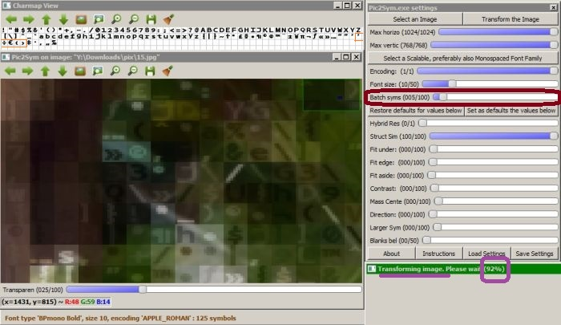

## Appendix ##
[Back to start page](../ReadMe.md)

##### A. Visualizing Draft Results in Pic2Sym v1.3

Version **1.3** permits visualizing several *draft results* during the image approximation process. The user can adjust *dynamically* such feedback from the application using the **&#39;Batch syms&#39;** slider. The transformation uses dynamic charmap partitioning, so a new better draft is generated for each new lot of considered symbols. The mentioned slider dictates the size of next lots. 
 
In this case, **&#39;Batch syms&#39;** was left from the beginning to the end of the transformation on value **5**. The *charmap* contains **125 symbols**, so there were 125 / 5 = **25 drafts** - *one generated every 4%*. Reported progress is **92%**, so the displayed draft is **23rd**. The application was just computing **24th** draft, based on the symbols with indeces *115 - 119* (the ones surrounded with *orange contour* in the image). None of the symbols 115-124 would appear in the 23rd draft, as they were not compared with the patches yet.

Suppose at the captured instant the user moves the slider on value **1**. Then next batches (starting with index *120*) will have size **1**, so there will be **5** additional drafts following the one currently generated.

Slider value **0** wouldn&#39;t make any sense, but since 0 is a *mandatory slider value in highgui library*, it was assigned a special meaning: **infinite batch size** - that is *next batch* should include **all remaining unprocessed glyphs**.

While the last batch is considered (the one generating the final result), any changes of the **&#39;Batch syms&#39;** slider will no longer affect this transformation. So charmap partitioning is dynamic as long as there still are unprocessed batches left.

Keep in mind that drafts are more visually appealing progress reports than simple completion percents, but they incur some time penalty. *Quickest approximation* is obtained with **&#39;Batch syms&#39;** slider on **0**. The *slowest* happens for **1**.

The memory footprint of v1.3 is larger than v1.2 as it maintains a matrix of best matches, so that drafts are gradually improving.

#### B.	Technical Details of Pic2Sym v1.3

The application was tested on *Windows 7 64 bits* and developed in *C++*.

Following *open\-source* and *platform\-independent* libraries were employed in the code:
- **[Boost](http://www.boost.org/)** for *filesystem*, *serialization* and other utilities
- **[FreeType 2](http://freetype.org/)** for *reading and processing fonts*
- **[OpenCV](http://opencv.org/)** for a minimal *graphical interface* and the provided *matrix and image processing capabilities*

However, it *runs only under Windows*, as it uses Windows\-specific:
- **[OpenMP](https://msdn.microsoft.com/en-us/library/tt15eb9t.aspx)** (*its Visual C++ implementation*) for simple *multi\-threading support*
- *Open / Save Dialog*
- *Select Font Dialog* and also *reads the registries* to find the *font file for the chosen font* (**FreeType** needs that file).

The decision to offer *support only for 64bits machines* originated from the lengthy compilation of **OpenCV** from latest sources (*version 3.0.0 at that time*). There were no binaries yet for that version. Now [they exist](http://sourceforge.net/projects/opencvlibrary/files/opencv-win/3.0.0/opencv-3.0.0.exe/download), but I prefer the binaries customized for my machine.

If *interested in the 32bits version of Pic2Sym*, you may search for ***Win32*** *binaries* of **OpenCV**, **FreeType 2** and **Boost**(*Serialization*, *System* and *Filesystem*), then link them within the project.

- - -

The ***parallelization switches*** from _version **1.3**_, configurable from [res/varConfig.txt](../res/varConfig.txt) are *effective only when* the *global UsingOMP switch* is *on* and they _don&#39;t trigger **nested parallelism**_. The optional **nested** parallelism from the image transformation code from version **1.2** was *removed in v1.3*. It turns out this reduces OpenMP checks concerning eventual dynamic parallelization requests, so the performance improves.

- - -

The *class diagram* from below presents a *simplified* perspective of the application: 
 
The ***Controller*** manages the image transformation process through the following interfaces / classes:
- Interfaces virtually extending ***IController***:
	- ***IValidateFont*** \- checks if a *new font or encoding* is valid
	- ***IPresentCmap*** \- support for *displaying a page of glyphs from current charmap*
    - ***IControlPanelActions*** \- methods to *address each action from Control Panel*
    - ***IGlyphsProgressTracker*** \- *timing for loading and preprocessing* of a new / updated set of glyphs
    - ***IPicTransformProgressTracker*** \- tracking the *progress during the picture approximation* process
- ***Img*** \- the image to approximate with symbols
- ***Transformer*** \- preprocesses the image (resizes it - ***ResizedImg***) and demands its approximation  ***Patch*** by patch from ***MatchEngine***
- ***FontEngine*** \- involved in loading a new font file from which to use a given encoding of a certain size
	- ***PmsCont*** \- simple container holding each loaded glyph and some related data (part of ***FontEngine***). It is used to present an *early preview of the charmap* by simply *launching a preview thread* when there are *enough processed glyphs to fill a page*
		- ***PixMapSym*** \- a particular loaded symbol (item in ***PmsCont***)
- ***MatchEngine*** \- the responsible of finding ***BestMatch***, the best symbol approximating a patch; also a **composite** referring match aspects
	- ***MatchAspect*** \- base class for all 8 implemented match aspects
	- ***CachedData*** \- generic values needed during transformations
	- ***SymData*** \- symbol\-specific values needed during transformations
- ***Settings*** \- how to configure the transformation
	- ***ImgSettings*** \- sets the result size limits
	- ***SymSettings*** \- which font family, style, encoding and size tto use for the approximating symbols
	- ***MatchSettings*** \- how to adjust the matching aspects during approximation

While comparing the symbol set with a Patch, there are values which can be reused among the employed ***MatchAspect***s. Such shareable values are grouped by the ***MatchParams*** class.

***BestMatch*** holds the index of the most similar symbol to a patch, found at a given time, while investigating sequentially all the glyphs, batch by batch. ***Transformer*** keeps a matrix of ***BestMatch***-es for all the ***Patch***-es of the ***ResizedImg***. It provides this matrix as starting reference for generating another draft based on a new batch of glyphs. Besides, subsequent transformations of the same image with different charmaps will reuse previously computed ***Patch***-related data.

Each symbol compared to a match produces a possible approximation ***ApproxVariant*** of the patch. Thus, *ApproxVariant* could be an *association class between Patch and one SymData item from MatchEngine*.

*Timing* is provided by ***Timer*** class which expects a realization class of ***ITimerActions*** interface.

*Logging* preserves the reasons behind the approximation of each patch with a certain glyph - ***TransformTrace*** makes that possible in Debug mode for transformations not canceled.

*Saving resulted approximations* (completed or only partial) is the responsibility of ***ResultFileManager***, which also *detects redundant transformation requests*, when it displays the available results.

***ControlPanel*** class configures and updates the sliders from the dialog.

***Comparator*** and ***CmapInspect*** share ***CvWin***&#39;s interface and provide support for *comparing original images with results*, and *displaying the symbols from a charmap*. ***CmapInspect*** will also attempt displaying an *early preview of a large charmap*, while it&#39;s loading. Throughout this load process, the GUI is updated based on action requests (instantiations of ***IUpdateSymsAction***) added / consumed from a queue.

***MatchSettingsManip*** facilitates version management coupled with external configuration (see [*res/defaultMatchSettings.txt*](../res/defaultMatchSettings.txt)) for ***MatchSettings***.

***PropsReader*** provides the application with configuration items found in:
- [*res/defaultMatchSettings.txt*](../res/defaultMatchSettings.txt) \- used by ***MatchSettings***
- [*res/varConfig.txt*](../res/varConfig.txt) \- adjustable constants grouped to **permit no-recompilation changes**

Classes *omitted from the diagram*:
- ***Dialog classes*** which appear when choosing a new image / font / settings file
- ***FontFinder*** class who searches for a new font file

The comments within the code provide more explanations.

#### C.	Installation of Pic2Sym v1.3

1.	Download the repository files
1.	Copy ***Common.props***, ***Debug.props*** and ***Release.props*** from **install/** folder to the solution folder
1.	Unpack ***include.zip*** and ***lib.zip*** to the solution folder
1.	Open the solution file and build it for **64bits** platform
1.	*Optionally* install the free font file ***BPmonoBold.ttf*** from the **res/** folder or from [here][1], in order to be visible while running the application

#### D.	Directory Structure for Pic2Sym v1.3

- **bin**/ contains:
	- ***Pic2Sym.zip*** with the *executable*
    - ***dlls.zip*** with the *required dll\-s*
    - ***agpl-3.0.txt*** - the *license* of the application
- **doc**/ contains the *documentation of the project* and 2 subfolders:
	- **examples** with various results generated by the Pic2Sym project
	- **licenses** with the *license files* from *Boost*, *FreeType* and *OpenCV*
- **install**/ contains following files (*generated by scripts*) needed during installation:
	- 3 *properties files* (***Common.props***, ***Debug.props*** and ***Release.props***) used by the 2 projects: Pic2Sym and UnitTesting
	- 2 *archives* ***include.zip*** and ***lib.zip*** that contain the *headers* and *libraries* needed by the 2 projects, except from those provided already by Windows and Visual Studio.
- **res**/ contains:
    - 2 small free *font files* (***BPmonoBold.ttf*** and ***vga855.fon***) used by Unit Tests
    - ***NoImage.jpg*** that appears when the application starts
    - ***defaultMatchSettings.txt*** \- configuration file used for the first start
	- ***varConfig.txt*** \- configurable constants controlling look and behavior of the application
- **src**/ contains the *sources* of the project
- **test**/ contains *Unit Test* files

The root folder contains also the *solution file*, *projects\-specific* files and the license file *agpl-3.0.txt*.

-------
[Back to start page](../ReadMe.md)

[1]:http://www.dafont.com/bpmono.font