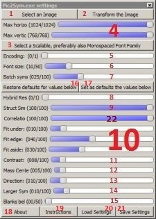

## Description of the Control Panel ##
[Back to start page](../../../ReadMe.md)

These are the controls explained below: 

- Button \[*1*\] **Select an Image** prompts the user with the Open File Dialog to choose which image to approximate by symbols

- Button \[*2*\] **Transform the Image** performs the approximation if there is an image and the configuration is complete and correct. The results are saved in ***Output*** folder

- Slider **Max horizontal symbols** (*mhs*) \[*first from group 4*\] limits the width of the grid that approximates the image. Before the transformation, the original is resized to be at most _mhs*fontSize_ pixels wide

- Slider **Max vertical symbols** (*mvs*) \[*second from group 4*\] limits the height of the grid that approximates the image. Before the transformation, the original is resized to be at most _mvs*fontSize_ pixels tall

- Button \[*3*\] **Select a Scalable, preferably also Monospaced Font Family** prompts the user with the Select Font Dialog to choose which font family to use when approximating an image. Monospace fonts have same width, so a more even width distribution - feature useful when approximating patches with random width distributions. Please ignore *Font Size* and *Script* presented by the standard dialog, as *they are configured by the next 2 sliders*. After selection, the ***symbol set window*** will quickly present some of the symbols from the **default encoding** of the chosen font family

- Slider \[*5*\] **Encoding** lets the user decide which encoding to use from the selected font family (when there are more available). The *name of the current encoding* appears at the end of the status bar in the ***symbol set window***. Examples of typical encoding names: *UNICODE*, *APPLE ROMAN*, *ADOBE STANDARD*. Sliders provided by *highgui* module from ***OpenCV*** must contain the values 0 and 1, so font families with a single encoding will still appear as offering 2. The application ignores bad encoding requests

- Slider \[*6*\] **Font size** allows resizing the selected font using scales beyond the normal sizes exposed by the Select Font Dialog. The valid range is 7..50. Smaller values mean more faithful approximations and more computation time, while larger ones produce coarser results, but faster. Symbols less than 7x7 are really hard to distinguish

- Slider \[*7*\] **Batch syms** *dynamically* controls *draft results frequency* during a transformation. The drafts are generated using *charmap partitioning* and this slider sets the width of next unprocessed batches of glyphs:
	- **0** means *no more drafts for the rest of the ongoing transformation* (It sets an infinite batch size). **Once this 0 is processed**, *other slider values will be ignored until the transformation finishes / is canceled*. 0 is useful to achieve **fastest transformation time** (usually faster than version 1.2)

	- **small non-zero values** produce *more frequent drafts*, but these incur time penalties

	- **larger values** will *decrease draft visualizations and management*, thus also the processing duration

- The buttons \[*16*\] **Restore defaults for values below** and \[*17*\] **Set as defaults the values below** are handy when experimenting with the transformation parameters

- Slider \[*8*\] **Hybrid Result** is merely a checkbox:
	- **0** means that the result is the *actual* approximation of the image (from version 1.0), with no cosmeticizing

	- **1** is for *Hybrid Result* - combination of approximated patches with the blurred version of those original patches. Good approximations will be more visible on the result patch, while the rest of less-inspired approximations will be dominated by the blurred patch

- Slider \[*9*\] **Structural similarity** (see [this](https://ece.uwaterloo.ca/~z70wang/research/ssim) for details) does contribute to generating *great approximations*, however it incurs a *much longer transformation*

- The group \[*10*\] of sliders **Fit under**, **Fit edge** and **Fit aside** penalizes poor approximations (they aim for the *correctness* of the match, but *lack precision* due to the *discrete nature of the masks* they&#39;re using):
	- **Fit under** will measure the match betweeen the foreground of the symbol and the patch. Normally, this checks an area smaller than the regions used by the next 2 sliders. This setting can _remain smaller than the values of *Fit edge* and *Fit aside*_

	- **Fit edge** assesses how different is the contour of the glyph from the corresponding patch region. This _should be set larger than *Fit under* and *Fit aside*_

	- **Fit aside** evaluates the similarity between the background of the symbol and the corresponding zone from the patch. It involves typically the largest investigated patch region, so it _matters more than *Fit under*_

- Slider \[*11*\] **Contrast** penalizes weak foreground-background contrast of the approximations. Sometimes this favors small symbols with high\-contrast while ignoring relevant texture around the considered symbol

- The sliders \[*12*\] **Mass Center** and \[*13*\] **Direction** help to the *smoothness*, not the accuracy of the result. When viewing the result from a certain distance, it is best that each approximated patch to preserve its direction of flow in the result. So if an original patch seems to be brighter in the top\-right corner, then the approximation should also be a symbol that makes the top\-right corner brighter. Such a gradient-like mechanism was implemented by comparing the mass-centers of the patch and of the candidate symbol, in terms of how far are they apart as distance and as angle

- Slider \[*14*\] **Larger Symbols** permits generating *fancier*, but less accurate approximations. It&#39;s just more appealing to see K,S,H instead of commas and quotes

- Slider \[*15*\] **Blanks below Threshold** spares the viewer from struggling to read symbols with the difference between foreground and background under a certain threshold, so in the generated result *such barely visible symbols are replaced by blanks*

- Button \[*18*\] **About** offers a short description of the application

- Button \[*19*\] **Instructions** displays a shorter version of these explanations

- The buttons **Load/Save Settings** \[*20* and *21*\] ensure rapid setup of various complete scenarios of transformation (apart from the image to approximate).

Setting any _slider from the 9\-14 range to 0 disables the corresponding matching aspect_.

----------
[Back to start page](../../../ReadMe.md)

