## Several details about the provided Unit Tests

[Back to start page](../../../ReadMe.md)

Unit Testing presents some of its results also in graphical form. This helps spotting potential problems easier.
In order to do that, it displays a window with a series of symbols / patches that failed to meet some expected conditions.

These are the type of tests that offer graphical feedback:

### 1. Identification of slightly altered glyphs from an entire symbol set

The alteration involves additive noise and different foreground and background colors. 
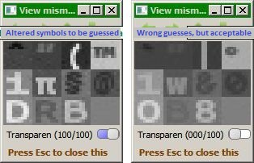 
For this type of test, the title of the displayed windows is like:

&quot;*View mismatches for*...***BPmonoBold.ttf***\_***APPLE\_ROMAN***\_\_*with*\_***kSsim\_\_\_1***\_\_***without\_Preselection***...&quot;,

where &quot;**BPmonoBold.ttf** \- **APPLE\_ROMAN**&quot; is the used font family and encoding, &quot;**kSsim = 1**&quot; expresses that only the [Structural Similarity][StructuralSimilarity] matching aspect was used for approximation and &quot;**without Preselection**&quot; states that the preselection mechanism was not used.

The 2 views are same window, but with the Transparency slider on the 2 extremes: the left view (transparency on 100) presents the patches containing several altered symbols that were not correctly identified, while the right view (transparency on 0) presents the corresponding guessed symbols that were wrong.

Typically, the [Structural Similarity][StructuralSimilarity] matching aspect delivers great patch approximations, even in the presence of noise, like here.

When approximating a patch, a symbol applies its binary foreground and background masks onto the patch and averages the colors under these masks. The foreground mask is locating where the pixels of the symbol have their highest values, while the background mask marks where the lowest values are. For small fonts, no matter the threshold (adaptive or fixed) between high and low values, these binary masks continue to remain inadequate for many symbols and they lower the delivered accuracy.

So, the foreground and background colors of the delivered approximation are obtained by averaging the colors under the mentioned binary masks applied on the patch. Those 2 colors can be sometimes nearly the same, thus it could happen that the approximation lacks contrast, or even appears as a blank, although it&#39;s not: 
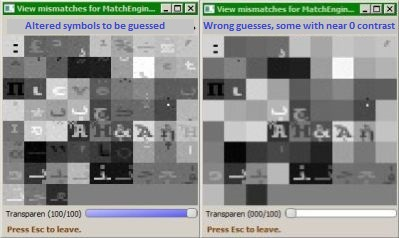 
Here, only these 66 from more than 2000 noisy symbols (from Courier, Unicode) were misidentified. Preselection mechanism was disabled. Some of the approximations seem correct matches, but the symbol set contains several near\-duplicates, which are easy to confound if noise is present. Large zoom factors (pixel level), together with the Transparency slider help spot such near\-duplicates.

Normally, for a disabled preselection mechanism, the accuracy is 97%.

Instead of accuracy, the goal of the **Preselection technique** is using less complex computations for larger font sizes. It works with tiny versions of the symbols and of the patches as long as possible and it lets a given patch (of actual size, this time) be compared only to the most-promising actual size symbols.

For tiny symbols, the more they are, the more difficult is to discern between them and the lower the resulted accuracy will be (the previously mentioned binary masks are in this case more a burden, than a help).

So, when the preselection mechanism is enabled, the accuracy is 87% for symbol sets of 100 symbols, but it drops to only 45% for 2000 symbols.

Considering the Preselection mechanism from the speed of the transformation perspective (and ignoring accuracy):

- there is barely any gain for smaller font sizes
- for larger font sizes it looks to be more worth using it

### 2. Recognizing undesirable categories of symbols

Based on the experiments so far, various symbol types just slow the transformation process and reduce the quality of the produced result.

To recognize these symbols, several filters were implemented and Matlab was really helpful for elaborating and refining the algorithms (avoided this way numerous C\+\+ recompilations).

The quality of any particular filter can be evaluated by enabling it within the [configuration file](../../../res/varConfig.txt) and setting there also **PreserveRemovableSymbolsForExamination** on true. The application will display the filtered glyphs with *inverted colors* within the symbol set window. The example below shows the removable symbols selected by all available filters applied on a set of 2569 glyphs: 
 
Like here, the filtered characters won&#39;t always be the expected ones when checking on many font families with various font sizes. For a better classification, supervised learning could be the answer. However, the focus of this application is more on transforming images quickly, rather than on how to correctly label glyphs.

To validate the tests for the mentioned filters, lists with undesired symbols and also with allowed glyphs had to be used.

In order to create such a list, open successively the desired fonts (family, encoding and size - all might be different) in the Symbol Set window, then perform Ctrl+click on each symbol of interest. Finally, when all desired glyphs were added, just double-click on the Symbol Set window and the list will be saved to a text file mentioned in a message from the console.

The tests will check their 2 own lists of positive undesired symbols and negative ones. A window will display those glyphs that fail these checks.

Below are the categories of symbols that can be avoided right now. These classes sometimes overlap:

#### Barely readable symbols
These might be really difficult to recognize (read) when inspecting the result - so there is no point keeping them. 
The list with the unreadable symbols checked by this filter: 
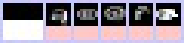 
and the symbols still readable: 
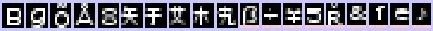
#### Filled rectangles
Simple lines with a minimum length and parallel to the axes were categorized here, as well. 
They just worsen the unpleasant grid-like appearance of the result. 
The list with such symbols checked by this filter: 
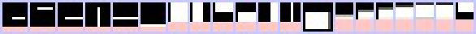 
and the negatives: 
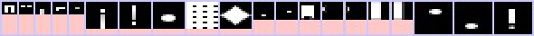
#### Bulky symbols
Similar to the consideration from the Filled Rectangles - they are usually condensed within a single large contour, while most natural patches are noisy and edgy. When approximating a patch, even when they have the best matching score, these approximations appear quite odd. Thin curves matching something within a given patch are better accepted by the viewer. 
The list with such symbols checked by this filter: 
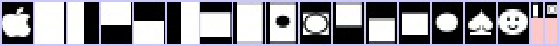 
and the negatives: 
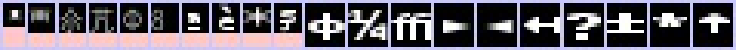
#### Grid bar symbols (normally used for displaying tables)
Similar to the consideration from the Filled Rectangles - they fragment even more the initial grid result. 
The list with such symbols checked by this filter: 
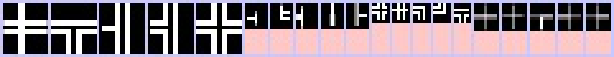 
and the negatives: 
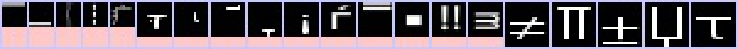
#### Sieve\-like symbols
They simply approximate patches with a blank of the average color of the patch (since the binary foreground and background masks sample the entire patch on almost overlapping locations, so the resulted contrast is typically 0). 2-D Fourier Transform was helpful for the implementation. 
The list with such symbols checked by this filter: 
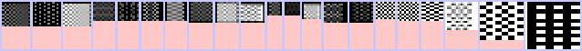 
and the negatives: 
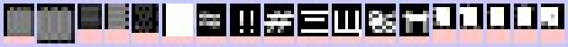

----------

[Back to start page](../../../ReadMe.md)

[StructuralSimilarity]:https://ece.uwaterloo.ca/~z70wang/research/ssim