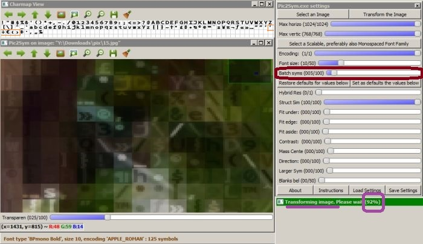
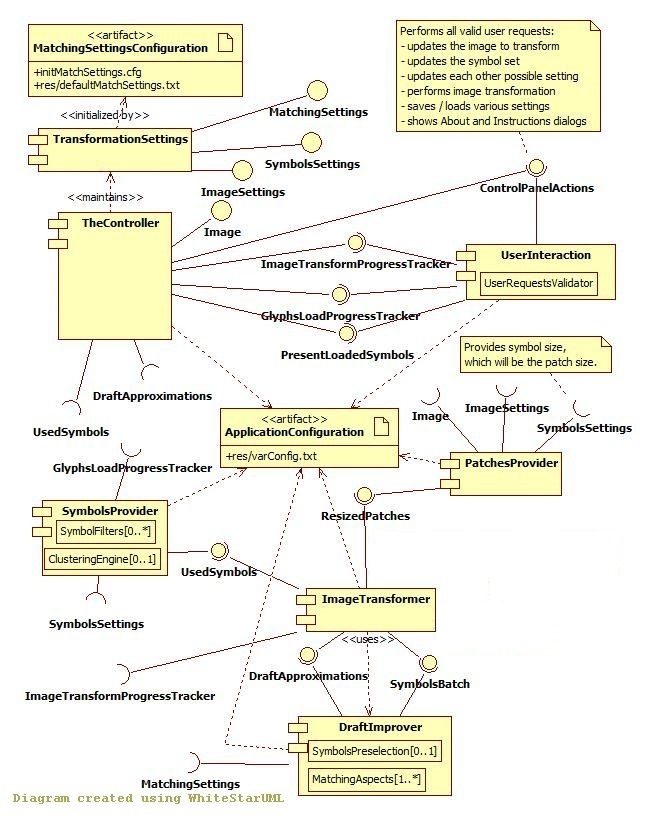

## Appendix (Pic2Sym v2.0)

[Back to start page](../../../ReadMe.md)

#### Table of contents

A. [**Visualizing Draft Results while Transforming an Image**](#VisualizeDrafts) 
B. [**Several Configurable Settings**](#ConfigurableSettings) 
C. [**Inspecting Interesting Suppressed Execution Details**](#RequestSuppressedDetails) 
D. [**Technical Details and Modules Description**](#TechnicalDetails) 
E. [**Installation of Pic2Sym**](#Installation) 
F. [**Directory Structure**](#DirectoryStructure) 

----

#### A. Visualizing Draft Results while Transforming an Image

Starting with version **1.3** it&#39;s possible visualizing several *draft results* during the image approximation process. The user can adjust *dynamically* such feedback from the application using the **&#39;Batch syms&#39;** slider. The transformation uses dynamic charmap partitioning, so a new better draft is generated for each new lot of considered symbols. The mentioned slider dictates the size of next lots. 
 
In this case, **&#39;Batch syms&#39;** was left from the beginning to the end of the transformation on value **5**. The *charmap* contains **125 symbols**, so there were 125 / 5 = **25 drafts** - *one generated every 4%*. Reported progress is **92%**, so the displayed draft is **23rd**. The application was just computing **24th** draft, based on the symbols with indeces *115 - 119* (the ones surrounded with *orange contour* in the image). None of the symbols 115-124 would appear in the 23rd draft, as they were not compared with the patches yet.

Suppose at the captured instant the user moves the slider on value **1**. Then next batches (starting with symbol index *120*) will have size **1**, so there will be **5** additional drafts following the one currently generated.

Slider value **0** wouldn&#39;t make any sense, but since 0 is a *mandatory slider value in highgui library*, it was assigned a special meaning: **infinite batch size** - that is *next batch* should include **all remaining unprocessed glyphs**.

While the last batch is considered (the one generating the final result), any changes of the **&#39;Batch syms&#39;** slider will no longer affect this transformation. So charmap partitioning is dynamic as long as there still are unprocessed batches left.

Keep in mind that although drafts are preferable to the simpler completion percents, they incur some time penalty. *Quickest approximation* is obtained with **&#39;Batch syms&#39;** slider on **0**. The *slowest* happens for **1**.

#### B. Several Configurable Settings
Some behavior aspects of the application can be changed without recompiling the project by modifying various settings in a [configuration file][]. The ones enumerated below are the *high-level* ones (the others involve many technical details):

1. **Letting all / individual code sections that use OpenMP Perform in Parallel or not** 
    Check the group of settings around &quot;*UsingOMP*&quot; in the [configuration file][]. 
    Initially, Parallelism is Enabled for all of them  
1. **Setting the Size of Small Symbols used by Clustering and by Symbols Preselection** 
	See &quot;*TinySymsSize*&quot; from the [configuration file][]. 
	Initial value is 5  
1. **Applying the Transformation onto a Blurred version of the Provided Image or onto original** 
	See &quot;*Transform_BlurredPatches_InsteadOf_Originals*&quot; from the [configuration file][]. 
	Set to transform original images, by default  
1. **Customizing Clustering** 
	1. ***Using a certain Clustering algorithm or none*** 
		See &quot;*ClusterAlgName*&quot; from the [configuration file][]. 
		Default setting is to use the TTSAS clustering algorithm  
	1. ***Allowing Heuristic Distance Evaluation during Clustering*** 
		See &quot;*FastDistSymToClusterComputation*&quot; from the [configuration file][]. 
		Enabled, by default  
	1. ***Tuning the TTSAS Clustering algorithm*** 
		See &quot;*TTSAS_Accept1stClusterThatQualifiesAsParent*&quot; from the [configuration file][]. 
		By default, this variable is set to FALSE  
1. **Individually Enabling the Symbol Filters or Requesting the Visualization of the Glyphs Affected by them** 
	See &quot;*PreserveRemovableSymbolsForExamination*&quot; and the group of settings with the suffix &quot;*-FilterEnabled*&quot; from the [configuration file][]. 
	Initially, all filters are enabled and *PreserveRemovableSymbolsForExamination* is FALSE  
1. **Setting the Blur algorithm used by the Structural Similarity matching aspect** 
	See &quot;*StructuralSimilarity_BlurType*&quot; from the [configuration file][]. 
	Using Box blurring (with a single iteration), by default  
1. **Enabling and Adjusting the mechanism of Symbols Preselection during Image Transformations** 
	See &quot;*PreselectionByTinySyms*&quot;, &quot;*ShortListLength*&quot; and &quot;*AdmitOnShortListEvenForInferiorScoreFactor*&quot; from the [configuration file][]. 
	Preselection is enabled initially and the length of its short list is 2 

#### C. Inspecting Interesting Suppressed Execution Details
During development, the correctness and performance of the implemented features were assessed based on some additional information they had to provide. Some of the critical information continues to be offered in Debug mode (not within the UnitTesting project). 

Other important, but less critical information can be provided at request. The generation of this extra data is disabled by default, because it&#39;s expensive and slows the corresponding tasks. To demand those details, a particular source file must be changed and the project will have to be recompiled. 

Here&#39;s the list of the suppressed execution details:

1. **After the Image Transformation, reporting the Count of Skipped Matching Aspects by Category** 
	Ensure &quot;**MONITOR_SKIPPED_MATCHING_ASPECTS**&quot; is defined in &quot;*src/countSkippedAspects.h*&quot;.  
1. **Display some Technical Statistics after Loading a new Symbol Set** 
	Ensure &quot;**VIEW_CONCLUSIONS_FROM_RESHAPING_LOADED_FONTS**&quot; is defined in &quot;*src/fontEngine.cpp*&quot;.  
1. **Use a Verbose mode for OpenMP-related operations** 
	Ensure &quot;**GENERATE_OPEN_MP_TRACE**&quot; is defined in &quot;*src/ompTraceSwitch.h*&quot;.  
1. **Prepare 2D-FFT Magnitude Spectrum (used by a Symbol Filter) for Breakpoint Inspection in Debug mode** 
	Ensure &quot;**INSPECT_FFT_MAGNITUDE_SPECTRUM**&quot; is defined in &quot;*src/sievesSymsFilter.cpp*&quot;.

#### D.	Technical Details and Modules Description

The application was tested on *64\-bit Windows 7* and developed in *C++*.

Following *open\-source* and *platform\-independent* libraries were employed in the code:

- **[OpenCV](http://opencv.org/)** for a minimal *graphical interface* and the provided *matrix and image processing capabilities*
- **[FreeType 2](http://freetype.org/)** for *reading and processing fonts*
- **[Boost](http://www.boost.org/)** for *filesystem*, *serialization* and other utilities
- **[zlib](http://www.zlib.net/)** for *\(de\)compressing various files*

However, it *runs only under Windows*, as it uses Windows\-specific:

- **[OpenMP](https://msdn.microsoft.com/en-us/library/tt15eb9t.aspx)** (*its Visual C++ implementation*) for simple *multi\-threading support*
- *Open / Save Dialog*
- *Select Font Dialog* and also *reads the registries* to find the *font file for the chosen font* (**FreeType** needs that file).

The decision to offer *support only for 64\-bit machines* originated from the lengthy compilation of **OpenCV** from latest sources (*version 3.0.0 at that time*). There were no binaries yet for that version. Now [they exist](http://sourceforge.net/projects/opencvlibrary/files/opencv-win/3.0.0/opencv-3.0.0.exe/download).

If *interested in the 32\-bit version of Pic2Sym*, you may search for ***Win32*** *binaries* of **OpenCV**, **FreeType 2** and **Boost**(*Serialization*, *System*, *Filesystem* and *Unit Test Framework*), then link them within the project.

- - -

These are the logical modules of the application: 
 
The names and the logical components from the figure are perhaps more inspired than within the actual project. It is easier in a diagram to clearly separate various modules. Therefore I shall describe the application in these terms: 

**ApplicationConfiguration** from [**res/varConfig.txt**][configuration file] is used to initialize most of the modules for the entire session. 

[**TheController**][controller]:

- initializes, updates and saves the settings related to image transformation - [**TransformationSettings**][settings]
- synchronizes the views and the model
- forwards to the views the progress notifications from loading a new symbol set and for image transformations
- provides the image to be approximated

The [**ImageTransformer**][transformer]:

- applies the approximations to the **ResizedPatches** coming from the [**PatchesProvider**][patchesProvider] (the original **Image** has to be resized first, so that it respects **ImageSettings** and to guarantee that its sides are multiples of the font size)
- enhances each previous **DraftApproximations** with the help of [**DraftImprover**][draftImprover], to whom it delivers the **SymbolsBatch** assigned for the new draft (a new lot of glyphs from the symbol set). The size of the next batch is controlled during the transformation process with the &#39;*Batch Symbols*&#39; slider from the [**Control Panel**][CtrlPanel].
- creates batches of glyphs for each draft from the entire set of **UsedSymbols** (the glyphs that escaped the **SymbolFilters** from [**SymbolsProvider**][symbolsProvider] and were regrouped based on similarity by a given **ClusterEngine**)
- notifies the user of the transformation progress through **ImageTransformProgressTracker**

The [**DraftImprover**][draftImprover]:

- takes a new batch of (preselected) symbols and enhances it based on them the previous **DraftApproximations**
- when **SymbolsPreselection** is enabled, first it finds several good candidate symbols within the batch (whose tiny versions are good matches for the tiny patches) and then it picks the best match among them (now comparing normal-size patches and symbols)
- uses heuristics to reduce patch - symbol compare time by:
	- skipping the evaluation of any remaining matching aspect as soon as the current symbol can no longer achieve a better matching score than the existing best score
	- reordering the enabled **MatchingAspects** to skip complex matching aspects more often

The [**SymbolsProvider**][symbolsProvider]:

- notifies the user of the progress during loading of a new glyph set with **GlyphsLoadProgressTracker**
- applies all enabled filters on the original symbol set to get rid of all undesired glyphs (only the **UsedSymbols** remain)
- regroups by similarity **UsedSymbols** (when clustering is enabled)
- is able to provide also tiny versions of the **UsedSymbols** (relevant when **SymbolsPreselection** from [**DraftImprover**][draftImprover] is enabled)
- saves and reuses data about tiny symbols and about clustering
- uses heuristics to accelerate the clustering process:
	- compares the tiny versions of the symbols
	- uses several cheaper compare criteria before the evaluation of the actual compare function. Whenever the cheaper criteria are not met, the remaining more complex computations are no longer necessary

The [**UserInteraction**][UI] component:

- ensures that the user is informed and corrected through the **UserRequestsValidator** whenever he attempts an invalid action for a given state of the application
- displays progress and updates during the loading of a new symbol set and while transforming an image
- allows comparing a certain draft result with the original
- allows browsing the pages of a loaded symbol set

The linked pages and the comments within the code provide more explanations.

#### E.	Installation of Pic2Sym

1.	Download the repository files
1.	Copy ***Common.props***, ***Debug.props*** and ***Release.props*** from **install/** folder to the solution folder
1.	Unpack ***include.zip*** and ***lib.zip*** to the solution folder
1.	Open the solution file and build it for **64bits** platform
1.	*Optionally* install the free font file ***BPmonoBold.ttf*** from the **res/** folder or from [here][BpMono], in order to be visible while running the application

#### F.	Directory Structure

- **bin**/ contains:
	- ***Pic2Sym.zip*** with the *executable*
    - ***dlls.zip*** with the *required dll\-s*
    - ***agpl-3.0.txt*** - the *license* of the application
- **doc**/ contains following folders
	- **pages** with the *documentation of the project*
	- **examples** with various results generated by the Pic2Sym project
	- **licenses** with the *license files* from *Boost*, *FreeType* and *OpenCV*
- **install**/ contains following files (*generated by scripts*) needed during installation:
	- 3 *properties files* (***Common.props***, ***Debug.props*** and ***Release.props***) used by the 2 projects: Pic2Sym and UnitTesting
	- 2 *archives* ***include.zip*** and ***lib.zip*** that contain the *headers* and *libraries* needed by the 2 projects, except from those provided already by Windows and Visual Studio
- **res**/ contains:
	- the folder ***TestSymFilters*** with the files used for testing the implemented symbol filters
    - 2 small free *font files* (***BPmonoBold.ttf*** and ***vga855.fon***) used by Unit Tests
    - ***NoImage.jpg*** that appears when the application starts
    - ***defaultMatchSettings.txt*** \- configuration file used for the first start
	- ***varConfig.txt*** \- configurable constants controlling look and behavior of the application
- **src**/ contains the *sources* of the project
- **test**/ contains *Unit Test* files

The root folder contains also the *solution file*, *projects\-specific* files and the license file *agpl-3.0.txt*.

-------
[Back to start page](../../../ReadMe.md)

[BpMono]:http://www.dafont.com/bpmono.font
[configuration file]:../../../res/varConfig.txt
[CtrlPanel]:../CtrlPanel/CtrlPanel.md
[controller]:modules/controller.md
[settings]:modules/transformationSettings.md
[transformer]:modules/transformer.md
[patchesProvider]:modules/patchesProvider.md
[draftImprover]:modules/draftImprover.md
[symbolsProvider]:modules/symbolsProvider.md
[UI]:modules/UI.md
