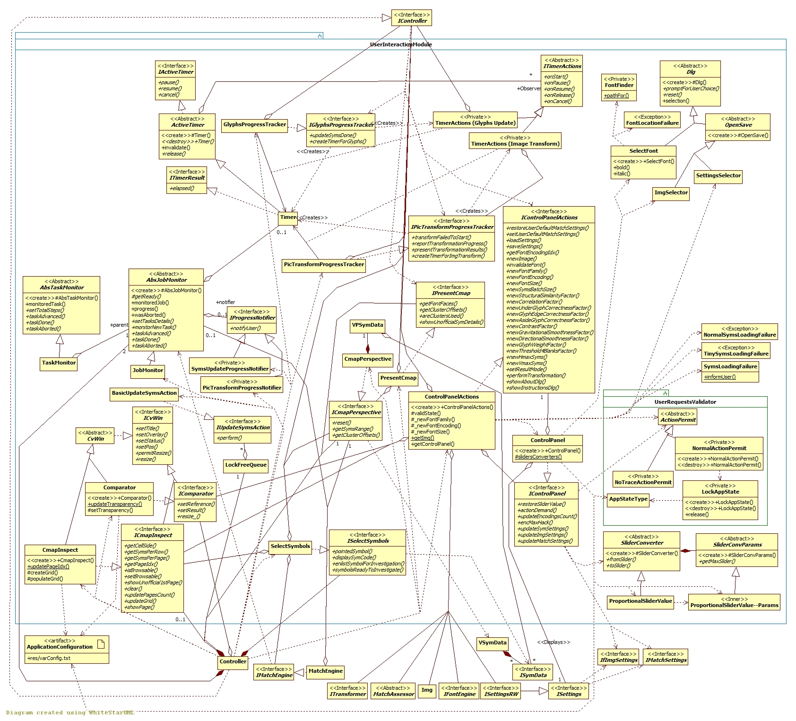

## User Interaction module

[Back to the Appendix](../appendix.md) or jump to the [start page](../../../../ReadMe.md)

-------

 
The ***Controller*** manages the dialog with the user through the following interfaces virtually extending ***IController***:
- ***IControlPanelActions*** \- methods to *address each action from [**Control Panel**][CtrlPanel]*
- ***IPresentCmap*** \- support for *displaying a page of glyphs from current charmap* and for *creating custom lists of symbols* to be used by the tests from Unit Testing
- ***IGlyphsProgressTracker*** \- *timing for loading and preprocessing* of a new / updated set of glyphs
- ***IPicTransformProgressTracker*** \- tracking the *progress during the picture approximation* process

The ***Controller*** is responsible also for prompting the user with ***SettingsSelector*** for a settings file to be loaded or saved.

***ControlPanel*** class configures and updates:
- the image to be transformed (see ***ImgSelector***)
- the font family (see ***SelectFont*** and ***FontFinder***)
- the sliders from the dialog

Its **actionDemand\(\)** method checks if a given user action is allowed. Allowed requests will return an ***ActionPermit*** from the method:
- user requests without any constraints (like displaying the *About dialog*) will return ***NoTraceActionPermit***, since their execution leaves no trace in the system
- user requests which are valid only in certain contexts will affect the state of the application (maintained in an instance of ***AppStateType***). These are the most frequent requests, so when they can proceed, a ***NormalActionPermit*** will be provided for them. A normal permit makes sure the state of the application gets restored once the requested action finishes. The access to the application state is guarded with a ***LockAppState*** while attempting to start an action and when the action finishes

***Comparator*** and ***CmapInspect*** share ***CvWin***&#39;s interface and provide support for *comparing original images with results*, and *displaying the symbols from a charmap*. ***CmapInspect*** will also attempt displaying an *early preview of a large charmap*, while this charmap is loading. Throughout the load process, the GUI is updated based on action requests (instantiations of ***IUpdateSymsAction***) added / consumed from a ***LockFreeQueue***.

*Timing* is provided by ***Timer*** class which has to be instructed what to do for each Timer event. ***ITimerActions*** offers support for that through its 2 realization classes:
- ***TimerActions_SymSetUpdate*** for timing the update of the symbol set \(triggered by ***IGlyphsProgressTracker***\)
- ***TimerActions_ImgTransform*** for timing image approximations \(triggered by ***IPicTransformProgressTracker***\)

In order to display the estimated current progress and estimated remaining time, several aspects must be considered:
- each timed *job* normally consists of several *tasks*
- the desired estimations must rely on some assumptions about the *tasks*. The simplest assumption is that finishing a certain *task* always consumes a given percentage from the time required by the whole *job*

The basic mechanism mentioned above was applied within the project (see classes around ***AbsJobMonitor***). 
Progress and estimated remaining time are valuable information for users, but they don't need to be accurate, so it is ok to observe fast progress during easier tasks and slower evolution for complex stages of the job.

-------
[Back to the Appendix](../appendix.md) or jump to the [start page](../../../../ReadMe.md)

[CtrlPanel]:../../CtrlPanel/CtrlPanel.md
