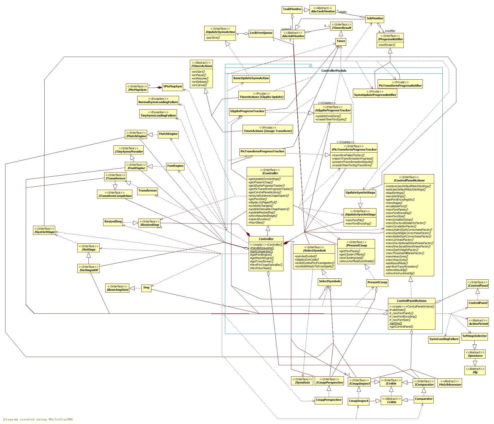

## The Controller module

[Back to the Appendix](../appendix.md) or jump to the [start page](../../../../ReadMe.md)

-------
 
The ***Controller*** manages the other modules partly through the following interfaces virtually extending ***IController***:
- ***IControlPanelActions*** \- methods to address each action from [**Control Panel**][CtrlPanel]
- ***IPresentCmap*** \- support for *displaying a page of glyphs from current charmap* (see ***CmapInspect***, ***UpdateSymsAction*** and ***LockFreeQueue***) and for *creating custom lists of symbols* to be used by the tests from Unit Testing
- ***IGlyphsProgressTracker*** \- *timing for loading and preprocessing* of a new / updated set of glyphs (see ***Timer***, ***TimerActions_SymSetUpdate*** and ***SymsUpdateProgressNotifier***)
- ***IPicTransformProgressTracker*** \- tracking the *progress during the picture approximation* process (see ***Timer***, ***TimerActions_ImgTransform*** and ***PicTransformProgressNotifier***)
- ***IUpdateSymSettings*** \- updates the symbol settings ***SymSettings*** with some new valid values

The ***Controller*** is responsible also for prompting the user with ***SettingsSelector*** for a settings file to be loaded or saved. 

It uses a job monitor for loading glyphs and another one for transforming images (see ***AbsJobMonitor***). The progress of these jobs is reported through ***IProgressNotifier***. 

The results from the image transformations can be evaluated within the ***Comparator*** window.

While loading a new symbol set, some of the initial effort is directed towards displaying a first page of symbols. This was implemented using an additional thread, while the initial thread updates the GUI by consuming any enlisted ***IUpdateSymsAction*** from a ***LockFreeQueue***. Possible action types:
- updating the status bar from the symbol set window to present the total count of glyphs from the set
- reporting current progress of the loading job
- displaying the first page of the set

Finally, the ***Controller*** orchestrates the interaction between ***MatchEngine***, ***FontEngine***, ***Transformer***, ***Img***, ***Settings*** and ***ResizedImg***.

-------
[Back to the Appendix](../appendix.md) or jump to the [start page](../../../../ReadMe.md)

[CtrlPanel]:../../CtrlPanel/CtrlPanel.md
