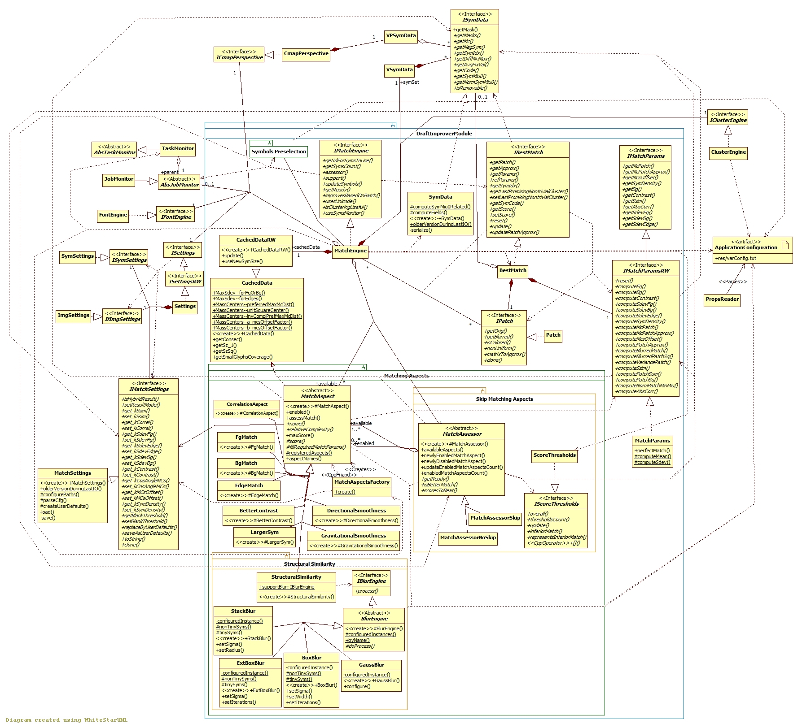

## Draft Improver module

[Back to the Appendix](../appendix.md) or jump to the [start page](../../../../ReadMe.md)

-------
 

***MatchEngine***:

- holds the (filtered) set of symbols to be used during the image approximation 
- similarly, it has some precomputed values for normal-size symbols (***CachedData***)
- keeps also the ***ClusterEngine***, which allows grouping the previously mentioned symbols in clusters, to reduce the count of compare operations between symbols and patches
- improves the drafts ***BestMatch*** for the <b><i>Patch</i></b>es based on normal-size fonts, as explained above. The best draft known for a given patch is stored in ***ApproxVariant***, together with the relevant parameters (***MatchParams***)
- collaborates with the submodule ***Symbols Preselection*** to respect the preselection mode
- reports draft improvement progress through a ***TaskMonitor*** to the ***AbsJobMonitor*** supervising the image transformation process
- uses several <b><i>MatchAspect</i></b>s (created by ***MatchAspectsFactory***) which are configurable from the [***Control Panel***][CtrlPanel] and reflected in ***MatchSettings***. The aspects whose sliders are on 0 are disabled and not used while transforming the image

Since the final score for comparing a certain symbol with a patch (approximating the patch by that symbol) is the product of the scores of each enabled ***MatchAspect***, a heuristic method to compute scores faster has been introduced:

1. the enabled <b><i>MatchAspect</i></b>s get rearranged in ascending order of their **specified complexity** and will be evaluated in this new sequence
2. the aspects are also aware of their **maximum score**
3. based on 1. and 2., each aspect can compute the **final maximum possible score** based on the product obtained by the evaluation of all previous aspects (it multiplies current product with the maximum scores of the remaining aspects)
4. if the final maximum possible score is less than the score of the current best match, there is no point further evaluating the remaining aspects, so there are some **skipped aspects**
5. since point 1. ensures complex aspects are evaluated last, **most skipped aspects are complex ones**

There is also one surprising consequence of this heuristic approach:

- *several simple aspects enabled along a few complex ones* might run **faster** than *enabling the complex aspects alone* when transforming an image with **rather coarse texture**. This is because the complex aspects can be skipped more frequently in the first case and less often in the second

The extra management of scores (**ScoreThresholds** class) brought by the heuristic is less productive on **finely-grained** patches. So the skip mechanism might be disabled altogether or just adjusted to start when there are more chances to be efficient (the classes derived from **MatchAssessor**).

Currently, the most complex **MatchAspect** is [***StructuralSimilarity***][Structural Similarity]. It produces aesthetic results, but it is also quite slow. It involves several image processing operations, among which there is also *blurring*. The recommended blur type is the Gaussian one. Profiling the application demonstrated that this blur operation is really expensive. Starting from this observation, several alternative blur algorithms were investigated and implemented. Any of them can be configured to be used in [**res/varConfig.txt**][varConfig]. 

***BlurEngine*** is the parent of following blur methods:

- ***GaussBlur*** wraps the original Gaussian blur from OpenCV (not the CUDA implementation)
- [***BoxBlur***][BoxBlur] wraps the box blur from OpenCV (not the CUDA implementation). This is an averaging blur, which is simpler and faster than the Gaussian blur. However, in order to deliver similar quality compared to the Gaussian blur, it must be applied several times and sometimes with various window widths. The number of iterations is currently hardcoded on 1, to let this method be faster than GaussianBlur, while loosing blur quality
- [***ExtBoxBlur***][ExtBoxBlur] is a more elaborated version of the BoxBlur, with increased accuracy as goal. It deals with the fact that the ideal blur window width is a floating point value, not an integer one. The number of iterations is currently hardcoded on 1. For these settings, it is slightly faster than *BoxBlur*.
- [***StackBlur***][StackBlur] is an adaptation of the (CPU-only and also CUDA) algorithms that can be found [here][StackBlurWithCUDA]

Current version of the project relies only on CPU power. In this context and for the reference window width and standard deviation prescribed for the Gaussian blur within ***StructuralSimilarity***, none of the presented alternatives and neither other investigated blurs were able to beat the Gaussian blur from OpenCV while also aiming for similar blur quality.

The [prototypesCUDA](../../../../prototypesCUDA/ReadMe.md) branch introduced implementations for the *Box* and *Stack* blur algorithms. 

-------
[Back to the Appendix](../appendix.md) or jump to the [start page](../../../../ReadMe.md)

[varConfig]:../../../../res/varConfig.txt
[CtrlPanel]:../../CtrlPanel/CtrlPanel.md
[Structural Similarity]:https://ece.uwaterloo.ca/~z70wang/research/ssim
[BoxBlur]:http://www.web.uwa.edu.au/__data/assets/file/0008/826172/filterdesign.pdf
[ExtBoxBlur]:http://www.mia.uni-saarland.de/Publications/gwosdek-ssvm11.pdf
[StackBlur]:http://www.codeproject.com/Articles/42192/Fast-Image-Blurring-with-CUDA
[StackBlurWithCUDA]:http://home.so-net.net.tw/lioucy