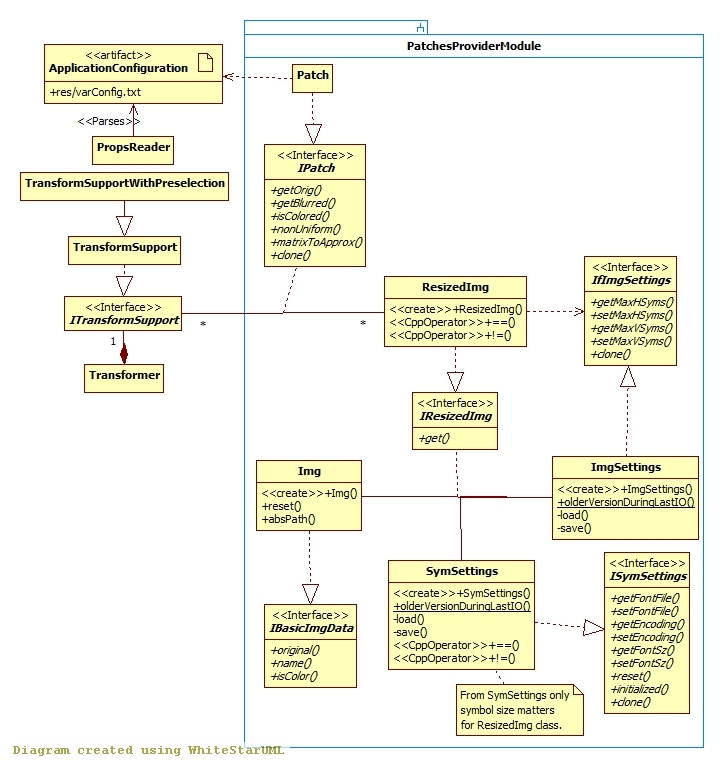

## Patches Provider module

[Back to the Appendix](../appendix.md) or jump to the [start page](../../../../ReadMe.md)

-------

 

An original image ***Img*** will be resized to ***(I)ResizedImg***, so that:

- its new size is less or equal to its initial size
- the resulted sides are multiples of the symbol size (obtained with _**(I)SymSettings::getFontSz()**_) and thus can be covered by square patches of the size of the glyphs
- the obtained count of patches per axis is not larger than the corresponding value imposed in ***(If)ImgSettings***

The image transformation requires:

- only the normal-size <b><i>(I)Patch</i></b>es (when preselection mode is off)
- normal-size and tiny versions of the <b><i>(I)Patch</i></b>es (when preselection mode is on)

The <b><i>(I)Patch</i></b>es are provided by the ***(I)TransformSupport(WithPreselection)*** object which is managed by ***IPreselManager*** (see the *SymbolsPreselection* submodule). All <b><i>(I)Patch</i></b>es are then reused until a new image is loaded.

The configuration file [**res/varConfig.txt**][varConfig] provides the option of transforming less noisy versions of images (based on this option, the approximations can consider only rather pronounced edges within the patches). The mentioned switch is off by default.

-------
[Back to the Appendix](../appendix.md) or jump to the [start page](../../../../ReadMe.md)

[varConfig]:../../../../res/varConfig.txt
