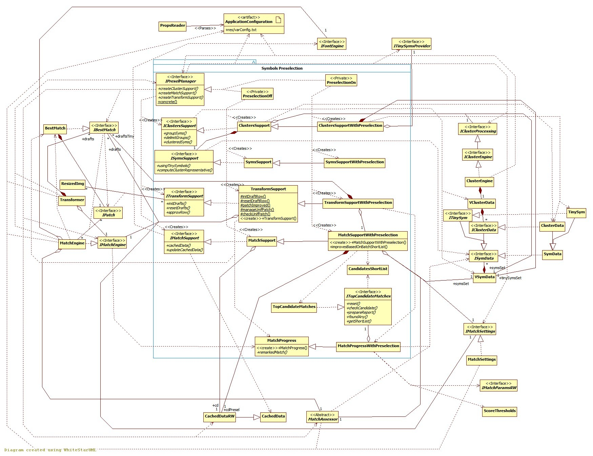

## Symbols Preselection module

[Back to the Appendix](../appendix.md) or jump to the [start page](../../../../ReadMe.md)

-------

 

The module ***Symbols Preselection*** tackles the feature with the same name, which is a heuristic for reducing the count of complex computations by splitting the transformation process in 2:

- the initial phase works with *tiny versions* of the symbols (***SymsSupportWithPreselection*** and ***ClustersSupportWithPreselection***) and of the patches (***TransformSupportWithPreselection***). It looks for several good symbols that approximate a certain patch (***MatchProgressWithPreselection*** and ***TopCandidateMatches***) and creates a &quot;**short list**&quot; from them (***CandidateShortList***)
- the final phase works with the normal-size versions of the symbols from the short list (***MatchSupportWithPreselection***). One of them could become the ***BestMatch*** known so far

Since **preselection** works much more on tiny symbols than on normal-size ones, theoretically it should be much faster. Practically:

- the larger the original symbols size is, the faster the transformation is. However, for small font sizes, the gain is less obvious, because:
- smaller resolution means that:
    - tiny symbols within large sets are harder to distinguish based on equally tiny binary masks, thus the small glyphs generally need additional computations performed on less data
    - matching accuracy drops - not all the features from a higher resolution can be reproduced in the tiny symbol versions and different font size also suffer from possibly different framing - slightly different shifts or crops

Here is what should be remembered about the **preselection** mechanism:

- it is good for larger font sizes
- it is less accurate

-------

[Back to the Appendix](../appendix.md) or jump to the [start page](../../../../ReadMe.md)
