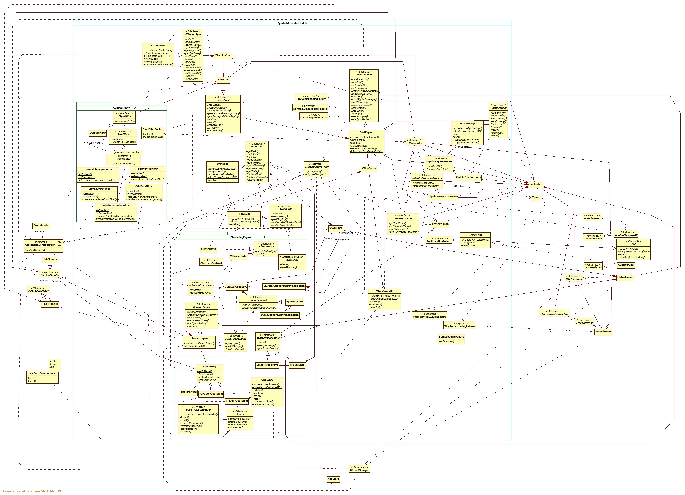

## Symbols Provider module

[Back to the Appendix](../appendix.md) or jump to the [start page](../../../../ReadMe.md)

-------

 

The ***ControlPanel*** uses the ***SelectFont*** to provide the symbols needed during image transformation. Whenever the data of a certain font type cannot be loaded / processed, exceptions like ***FontLocationFailure*** or ***SymsLoadingFailure*** are issued and handled.

***FontEngine***:

- (through the interfaces derived from ***IController***)
	- presents the pages of the symbol set (see ***IPresentCmap***)
	- reports the progress while loading a symbol set (see ***IGlyphsProgressTracker***)
	- demands a delegate to update the symbol settings ***SymSettings*** with some new valid values (see ***IUpdateSymSettings***)
- realizes interface ***ITinySymsProvider***, which means that for each font type it computes the relevant data for the tiny versions (***TinySym***) of those symbols. The data ***VTinySyms*** gets saved and afterwards reloaded (by ***VTinySymsIO***) each time it&#39;s requested
- has a container ***PmsCont*** with the symbols ***PixMapSym*** remaining after applying the chain of filters derived from ***ISymFilter***

Removing undesirable symbols from the symbol set (filtering) is a good idea because:

- image patches need to be compared against less glyphs
- the resulted approximation image is aesthetically-superior (contains better readable characters, with better contrast and less weird glyphs)

The mentioned filters might reuse data prepared in ***SymFilterCache***. Each of those filters can be separately enabled / disabled from [**res/varConfig.txt**][varConfig]. For observing the filtered symbols, set *PreserveRemovableSymbolsForExamination* on true in that file. 

Besides lots of **Heuristic Criteria**, the implementation of those filters covers techniques like **Morphological Operations**, **State Machines** and **2-D Discrete Fourier Transforms**. In some cases **Matlab** was used for experiments and for refining the prototypes of the algorithms. *Integral Images*, *Adaptive Thresholding*, *Distance Transforms* are some of the many other interesting **Image Processing** methods visited.

Depending on the context, apart from the pixels of a glyph and its code, the relevant data about a symbol also contains:

- density (the average pixel value) and mass-center (see ***PixMapSym*** - used mostly to display the symbol set)
- density, mass-center, plus pixel range and several masks (see ***SymData*** - necessary when approximating image patches or when comparing symbols to each other)
- the items from ***SymData***, plus several projections of the glyph (heuristics accelerating the clustering of <b><i>TinySym</i></b>s)

The symbol set is grouped by similarity (clustered). Each group of similar glyphs gets assigned a cluster representative (the average of the members - ***Cluster*** and ***ClusterData***). This reorganizing is beneficial during the image approximation process, since it allows skipping all members of a cluster whose representative is dissimilar to the currently analyzed patch.
The 2 available clustering algorithms (***PartitionClustering*** and ***TTSAS_Clustering*** derived from ***ClusterAlg***):

- use many constants configurable in [**res/varConfig.txt**][varConfig]
- save the generated permutation the first time a font type is clustered and afterwards they just reload it (with ***ClusterIO***) when demanded
- perform the regrouping by comparing ***TinySyms*** (provided by an ***ITinySymsProvider***) instead of the actual symbols, to quicken the process and to let the **same clustering be reused for any font size**. No matching aspects are involved here! Instead, there are some heuristics available, which can be disabled altogether - to be able to measure their performance impact

Setting a certain clustering algorithm can be configured in [**res/varConfig.txt**][varConfig]. 
Clustering can also be disabled (see ***NoClustering***). This option was quite handy for a couple of tests among the Unit Testing suites. 

***PartitionClustering*** uses *partition* function from **OpenCV**, which also provides other clustering techniques not helpful in current context:

- *kmeans*, which is unfortunately generating exactly **k** clusters (but **k** is not known beforehand here)
- *hierarchicalClustering*, which is more suitable for *Multi-Dimensional Spaces* (symbol clustering is a classic uni-variate problem, because the used heuristics are just **redundant views** of the **same** feature - the *distance* or the *similarity* between glyphs)

This ***PartitionClustering*** is **not an accurate clustering algorithm**, since it forms the groups in a greedy fashion:

- by placing a symbol directly in the first found similar cluster. Thus, the initial order of the glyphs has a high impact on the resulted clusters
- without looking for a more appropriate parent cluster
- without using an objective distance measure between a symbol to label and a potential parent cluster. Function *partition* uses instead just a boolean predicate that has to return true when a symbol might belong to a given cluster

However, ***PartitionClustering*** provides excellent results when setting the relevant thresholds from [**res/varConfig.txt**][varConfig] to values that require strong similarity between a candidate symbol and any potential parent cluster. 

Unfortunately, ***PartitionClustering*** won&#39;t be able to display the progress of the clustering process, since the work is performed by the mentioned OpenCV function. 

***TTSAS_Clustering*** is a customization of the [&quot;**Two-Threshold Sequential Algorithmic Scheme**&quot;][TTSAS] (see sections 3.1.2 and 5.2 from it). This technique is:

- less sensitive to the initial order of the glyphs
- is providing progress reports to a ***TaskMonitor*** (The clustering task is part of the glyphs loading job monitored by an ***AbsJobMonitor***)

It was customized to:

- maintain ***compact clusters*** (centroids remain close to each member, no matter the cluster size - fact proven by the [**Basel Series**][Basel]). This was realized by **accepting new cluster members only from a progressively smaller range around the centroid**
- look for the parent cluster within a ***minimum set of candidates*** (inspecting only new clusters plus the known neighbors who got updated)
- allow choosing either the ***first suitable parent cluster*** (similar to the *partition* function), or ***considering only the best paternal match*** (see ***ParentClusterFinder***)

There might be some additional improvements to this algorithm, like [**Using the Triangle Inequality to Accelerate TTSAS Cluster Algorithm**][improvedTTSAS].

The ***MatchEngine*** maintains the set of (filtered) normal-size symbols. The mechanism how to regroup these symbols (***ClusterEngine***) was included therefore here, as well. So, when the ***Controller***:

- updates the symbol set and lets the ***MatchEngine*** know that, clustering data gets updated, as well
- performs an image approximation, the candidate symbols for each image patch can be grouped and iterated by clusters

The ***ClusterEngine*** is helped by ***ClusterSupport*** and ***ClusterSupportWithPreselection*** (part of ***PreselManager***) to perform clustering on normal-size or tiny versions of the symbols, based on the preselection mode.

***CmapPerspective*** permits visualizing the glyphs grouped by clusters (largest groups first). Image transformations might use a different symbols order and even ignore clustering if the average cluster size is too low, to prevent inefficient symbols traversal.

-------
[Back to the Appendix](../appendix.md) or jump to the [start page](../../../../ReadMe.md)

[varConfig]:../../../../res/varConfig.txt
[Basel]:https://en.wikipedia.org/wiki/Basel_problem
[TTSAS]:https://www.niksula.hut.fi/~jkainula/pdfs/clustering.pdf
[improvedTTSAS]:http://dl.acm.org/citation.cfm?id=1911801
