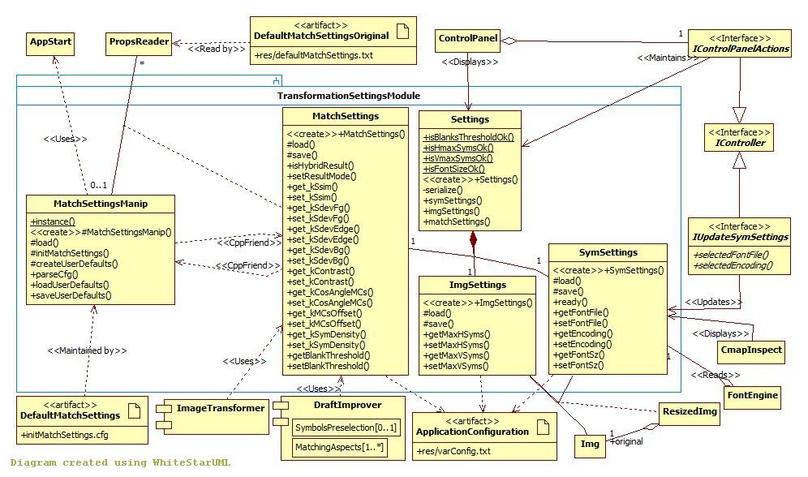

## Transformation Settings module

[Back to the Appendix](../appendix.md) or jump to the [start page](../../../../ReadMe.md)

-------

 
Apart from the image to be transformed, ***Settings*** provides the entire configuration for a transformation:
- ***ImgSettings*** sets the result size limits (original image ***Img*** needs to be resized as ***ResizedImg***, which has the same size as the result)
- ***SymSettings*** states which font family, style, encoding and size to use for the approximating symbols and is used mainly in ***FontEngine***
- ***MatchSettings*** establishes how important are each of the matching aspects during approximation. The modules ***ImageTransformer*** and ***DraftImprover*** depend on these values

Several transformation settings are configurable from [***res/varConfig.txt***][varConfig].

***MatchSettingsManip*** is used for:
- loading with the help of ***PropsReader*** the original default matching settings from **res/defaultMatchSettings.txt** whenever this file is updated and saving it to **initMatchSettings.cfg**, which will become the provider of the default values. The last file can be updated at runtime from within Pic2Sym, so that the next sessions of the application will use a different set of defaults for the matching settings. The location of the 2 mentioned files is relative to the *Pic2Sym.exe*&#39;s folder (provided by ***AppStart*** class)
- updating user defaults and reloading these defaults whenever needed

The [***Control Panel***][CtrlPanel] and the ***CmapInspect*** (symbol set window) present the values of the settings.
When loading some settings or when the user changes a particular one, ***IControlPanelActions*** and ***IUpdateSymSettings*** aspects of the ***Controller*** ensure the model will reflect the changes performed through the user interface.

-------
[Back to the Appendix](../appendix.md) or jump to the [start page](../../../../ReadMe.md)

[varConfig]:../../../../res/varConfig.txt
[CtrlPanel]:../../CtrlPanel/CtrlPanel.md
