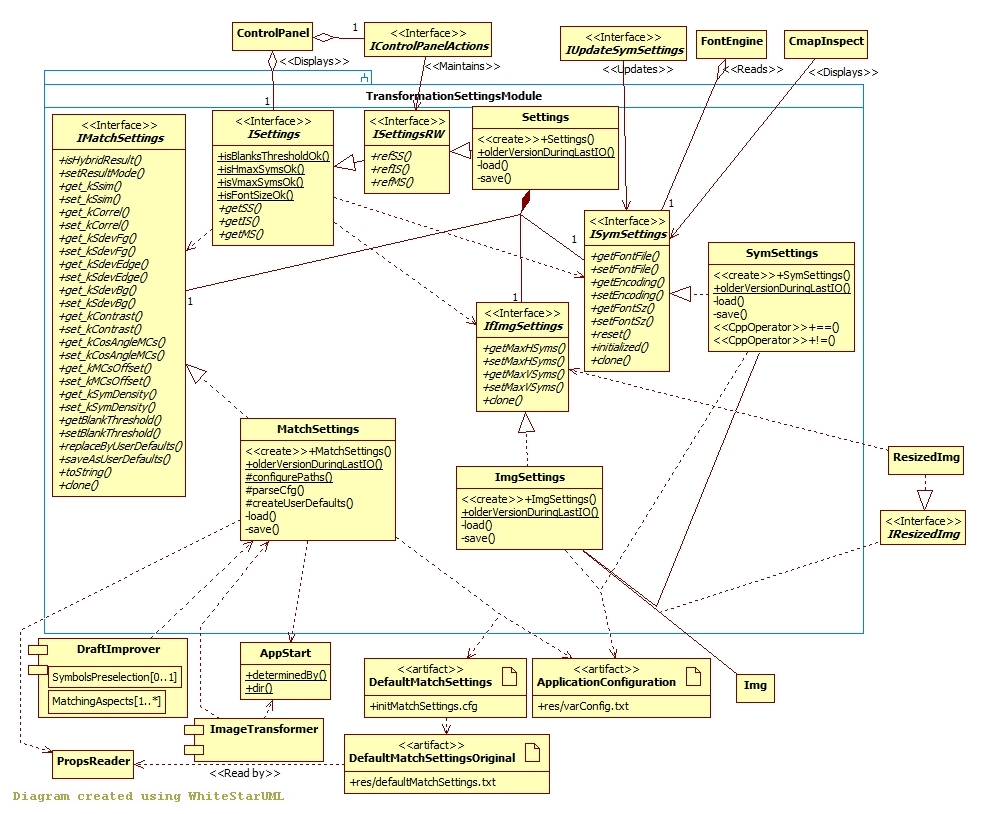

## Transformation Settings module

[Back to the Appendix](../appendix.md) or jump to the [start page](../../../../ReadMe.md)

-------

 
Apart from the image to be transformed, ***(I)Settings(RW)*** provides the entire configuration for a transformation:

- ***(If)ImgSettings*** sets the result size limits (original image ***Img*** needs to be resized as ***(I)ResizedImg***, which has the same size as the result)
- ***(I)SymSettings*** states which font family, style, encoding and size to use for the approximating symbols and is used mainly in ***FontEngine***. These fields can be cleared and then reset. Their initialization can be checked, as well
- ***(I)MatchSettings*** establishes how important are each of the matching aspects during approximation. The modules ***ImageTransformer*** and ***DraftImprover*** depend on these values. The user might prefer using regularly a certain combination of the matching aspects. Such a preference might be saved and reloaded (*saveAsUserDefaults* and *replaceByUserDefaults*), as explained below.

Several transformation settings are configurable from [***res/varConfig.txt***][varConfig].

By default, a certain combination of matching aspects will be used for image transformations. These original settings are loaded with the help of ***PropsReader*** from **res/defaultMatchSettings.txt**. The user might (re)set his/her own configuration of matching aspects, available in **initMatchSettings.cfg**, this time. The last file can be updated at runtime from within Pic2Sym, so that the next sessions of the application will use the custom set of matching settings. The location of the 2 mentioned files is relative to the *Pic2Sym.exe*&#39;s folder (provided by ***AppStart*** class).

The [***Control Panel***][CtrlPanel] and the ***CmapInspect*** (symbol set window) present the values of the settings.
When loading some settings or when the user changes a particular one, ***IControlPanelActions*** and ***IUpdateSymSettings*** ensure the model will reflect the changes performed through the user interface.

-------
[Back to the Appendix](../appendix.md) or jump to the [start page](../../../../ReadMe.md)

[varConfig]:../../../../res/varConfig.txt
[CtrlPanel]:../../CtrlPanel/CtrlPanel.md
