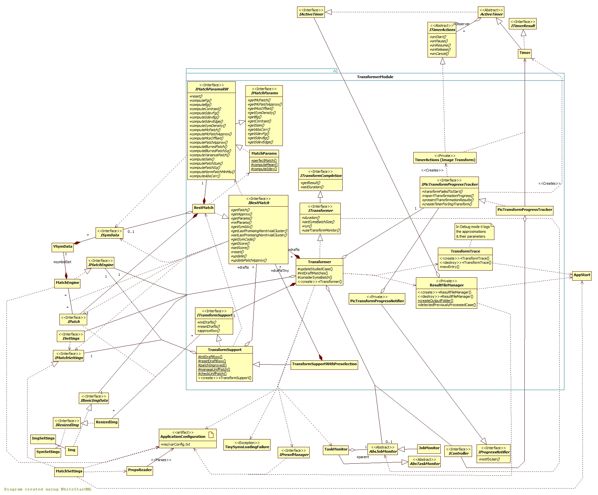

## Image Transformer module

[Back to the Appendix](../appendix.md) or jump to the [start page](../../../../ReadMe.md)

-------

 

When an image transformation is started, ***Transformer*** (realizer of ***ITransformer*** and ***ITransformCompletion***):

- starts a ***Timer***, configures the notifier ***PicTransformProgressNotifier*** and the actions ***TimerActions (Image Transform)*** for this timer

- ensures the image ***Img*** is resized appropriately (_**(I)ResizedImg**_, through _**(I)TransformSupport(WithPreselection)**_) and checks if it&#39;s not processed already under current settings with ***ResultFileManager*** (This class also tackles saving the results for completed / canceled transformations)

- initializes the values of the first draft result or just resets them when reprocessing same image under different settings. When **symbols preselection** is enabled, it applies the same initialization considering the tiny image and glyphs (***TransformSupportWithPreselection***)

- improves the draft (tiny and normal - depending on the preselection mode) with each new symbols batch (provided as a pair of indices within the symbol set)

- saves a ***TransformTrace*** (in Debug mode, if the transformation wasn&#39;t canceled) that displays several ***(I)MatchParams*** fields and a matching score for every approximated ***(I)Patch*** by a ***(I)BestMatch***

If the best found symbol among the batch improves the existing draft, the draft gets updated (*updatePatchApprox* of the ***BestMatch*** object). 

Every stage (task) of the approximation process (job) is monitored by a separate ***TaskMonitor*** and an unique ***JobMonitor***. 

-------

[Back to the Appendix](../appendix.md) or jump to the [start page](../../../../ReadMe.md)
