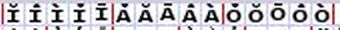
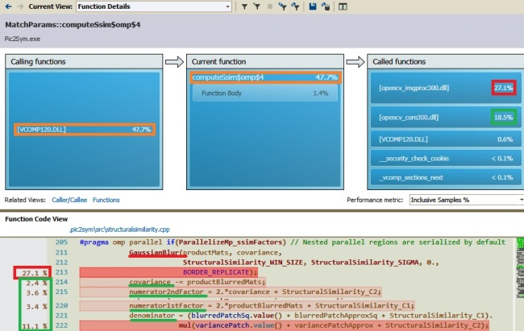
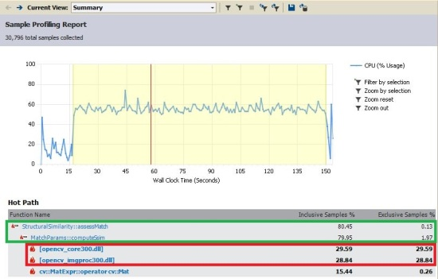
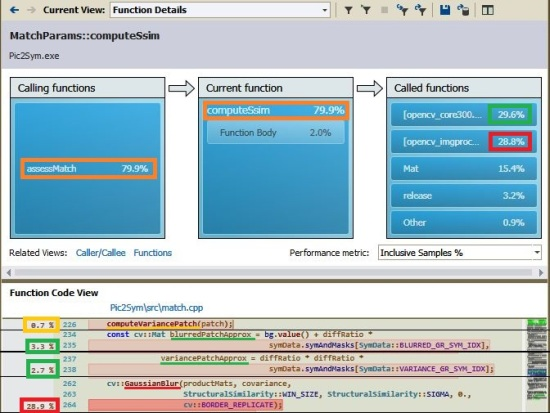
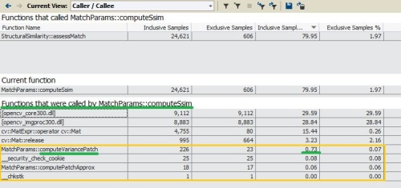

---
output:
  md_document:
    variant: markdown_github
---

```{r setup, include=F}
knitr::opts_chunk$set(
    echo=T,
    fig.path='./',       # Save figures to current dir
    fig.keep='last',     # Keep last generated figure built within a chunk
    fig.align='center',  # Center horizontally the figures
    fig.asp=0.5)         # Make figures half-width tall
```

### Topics

```{r md_is_a_generated_file, results='asis', echo=F, cache=T, cache.path="../../cache/performance/md_is_a_generated_file/", cache.comments=F}
# Section to be placed after first document item (Topics from above)
 
#cat("[//]: # Only the Rmd file needs to be edited. Do not change the corresponding md file!")   # This gets generated, but is removed from md file
cat("<a title = 'Only the Rmd file needs to be edited.",
    "Do not change the corresponding md file!'>")   # This reaches the md file

```

- [Performance Overview](#Overview)
- Analysis of Pic2Sym by version:
    - [2.0 - 2.1](#v2.0-v2.1)
        - [Skipping Matching Aspects Heuristic](#SkipAspects)
        - [Symbol Set Filtering](#SymsFiltering)
        - [Symbols Preselection](#SymsPreselection)
        - [Symbols Clustering](#SymsClustering)
        - [Alternative Blur Algorithms](#BlurAlgorithms)
    - [1.3](#v1.3),&nbsp;&nbsp;[1.2](#v1.2),&nbsp;&nbsp;[1.1](#v1.1) and [1.0](#v1.0)

[Back to start page](../../../ReadMe.md)

* * *

<a name = "Overview"></a>

### Performance Overview of existing versions of Pic2Sym

#### Considering the **quality and accuracy** of the produced results:

|   								| v1.0 	| v1.1 - v1.3   | v2.0, v2.1
---									|:-:	|:-:		    |:-:
*Can Avoid Undesirable Symbols*     | - 	| - 		    | **Yes**
*Smooth Results (Hybrid Mode)* 		| - 	| **Yes**    	| **Yes**
*Best Possible Matches*				| 100% 	| 100% 		    | <b><i>see (\*)</i></b>
*Skips Uniform Patches* 			| - 	| **Yes**   	| **Yes**    	

Explanations concerning the values within the table:

- <b><i>(\*)</i></b> refers to the &#39;*accuracy*&#39; of **v2.0** and **v2.1** (do they deliver the best possible matches?), which is 100% when all of their features are disabled or when only using the **Symbol Filters** feature. Otherwise it depends:
	* low clustering accuracy might let a patch be approximated with an unexpected symbol
	* using blur algorithms inferior to Gaussian blur (like Box blur) for the [Structural Similarity][] matching aspect might produce mismatches, too
	* using Symbols Preselection reduces match accuracy even more, since the Preselection phase is highly subjective

#### Existing versions compared by their **speed**:

- Version **2.1** reordered slightly the matching aspects (to reflect their actual costs) and brought a new matching aspect - the [Cross Correlation][] (Corr), which is much faster than [Structural Similarity][] (SS), plus their accuracy is similar. Thus, starting with v2.1, SS can be replaced by Corr or they can be used together (when the *Skipping Aspects* is enabled) to avoid computing SS aspect as often as possible. When *Skipping Aspects* is disabled and all 9 matching aspects are enabled (compared to just 8 prior to v2.1), the transformation needs an additional time for Corr

- Version **2.0** is typically superior to the previous versions. However, it can disable all its new features. In that case it will be slightly inferior to **v1.3**.

- Version **1.3** allows *visualizing drafts* and preserves the *most efficient multithreading switches* from *v1.2*. It performs better than **v1.2** as long as demanding only a few drafts. 

- Version **1.2** introduced *thread-parallelism* and provides maximum number of combinations involving parallelism. It&#39;s faster than **v1.1** on multi-core machines when parallelism is enabled

- Version **1.1** performs better than **v1.0** since it skips approximating uniform patches

- Version **1.0** might get close to the performance of **v1.1** on images with hardly any uniform patches


* * *

<a name = "v2.0-v2.1"></a>

### Performance of Pic2Sym v2.0 / v2.1

More details about the features below can be found in their corresponding [modules](../appendix/appendix.md#Modules).

One feature is allowing any number of user requests in parallel, as long as they are valid for a given state of the application. It belongs to the [**User Interaction**][UI] module.

Continuing with more relevant features from the application performance point of view.

<a name = "SkipAspects"></a>

I\) ***Skipping Matching Aspects Heuristic***

Its purpose is to identify poor matches as early and as cheap as possible. When patches are compared against the symbols using multiple matching aspects, poor matches might be spotted after evaluating only a few scores of those matching aspects. For that it is enough to know the total score of the best match found so far and the maximum score that can be obtained for the current pair: patch - symbol.

This feature belongs to the [**Draft Improver**][draftImprover] module.

The heuristic doesn&#39;t apply when using a single Matching Aspect. Besides, there are some entries within the configuration file to adjust (*EnableSkipAboveMatchRatio*) or disable the discussed feature (*UseSkipMatchAspectsHeuristic*). As explained below, the efficiency of the technique depends a lot on the image to approximate.

Next 2 images, both with the same size (27540 patches), are used during the following explanations:

| Image | Uniform Patches   | Patches to Process    | Texture               | Content |
:-:     | :-:               | :-:                   | :-:                   | :-
[I1][]  | 30.41%            | 19165 (69.59%)        | **mostly coarse**     | faces, shirts, glass walls, a ceiling
[I2][]  | 0.05%             | 27527 (99.95%)        | **finely grained**    | grass, fur, stones with irregular surface

> Uniform patches are just blurred and copied to the result image. Only the remaining patches must be matched against the entire symbols set.
>
> Typically, for coarse patches there are a few viable (good) match candidates among the symbols.
>
> Finely-grained patches rarely have good matches, thus the scores of their best matches are quite low. This means that the scores of the symbols are close to each other. Replacing the previous best match happens therefore rather easy and often. But such high frequency of best match replacement is costly.

Now let&#39;s observe the maximum count of matching aspects that can be skipped while transforming the 2 images based on:

- the configuration from [this example](../results/Example1_v1.3.jpg) (using 125 glyphs)
- *Parallelism* (2 threads)
- *EnableSkipAboveMatchRatio* set on 0
- no other features and without *generating drafts*

First, the measurements from v2.1:

| Matching Aspect name          | Complexity&nbsp;as<br>actual cost| Skipped<br>for [I1][]| Skipped<br>for [I2][]|
:-                              |-:         |-:                 |-:
*Prefer Larger Symbols* 	    | 3.52 		| - 	    		| -
*Foreground matching* 		    | 46.20 	| -     		    | -
*Background matching*		    | 59.40		| -      	    	| -
*Prefer Better Contrast* 	    | 67.66		| - 	    		| -
*Gravitational Smoothness* 	    | 68.21 	| 0.07% 	    	| 0.02%
*Directional Smoothness*	    | 69.31     | 0.07% 	    	| 0.02%
*[Cross Correlation][] (Corr)*  | 90.21     | 2.91%             | 1.20%
*Edges matching* 			    | 198.57    | 81.18% 	    	| 64.67%
*[Structural Similarity][] (SS)*| 1000.00   | 82.46% 	    	| 67.79%

The complexity of the aspects was set proportional to the time required to approximate image [I1][] using each aspect alone and using a font family with more than 7000 glyphs. The complexity of SS (the slowest one) is fixed to 1000, while the other shift proportionally to reflect a shorter duration.

For v2.0, the complexity of the aspects was based on times obtained using only font families with a modest number of glyphs. It appeared to confirm a certain intuitive order. So, the order of the aspects is different and the data looks like this:

| Matching Aspect name         | Expected<br>Complexity | Skipped<br>for [I1][]| Skipped<br>for [I2][]|
:-                             |-:          |-:                 |-:
*Prefer Larger Symbols*        | 0.001      | -                 | -
*Prefer Better Contrast*       | 2.000      | -                 | -
*Foreground matching*          | 3.100      | 11.11%            | 0.40%
*Background matching*          | 3.200      | 11.58%            | 0.43%
*Edges matching*               | 4.000      | 14.10%            | 0.61%
*Gravitational Smoothness*     | 15.000     | 15.64%            | 0.78%
*Directional Smoothness*       | 15.100     | 15.96%            | 0.80%
*[Structural Similarity][] (SS)*| 1000.000  | 44.40%            | 13.66%

> The 2 scenarios involved all *Matching Aspects* (available in their version), which are sorted in the table by their complexity, like the application itself does. First such aspect is always evaluated, but the following ones can be skipped sometimes. This order ensures that the most complex matching aspects are skipped most often.

In the presented cases, several least complex matching aspects had to be evaluated for all compare operations. Only after cumulating the scores from them it was possible to guarantee for some symbols that they cannot be better matches (for a given patch) than the best match found earlier. For those symbols, evaluating the rest of the matching aspects is therefore not necessary.

Apart from the substantial number of uniform patches, image [I1][] presents also many coarse-textured regions, which generally do have a few good matches among the symbols. Once found, such a match will have a score really difficult to compete against. Many of the remaining symbols will be rejected due to this fact soon after computing the scores for only a few matching aspects.

Comparing now the durations required to approximate the images either by all matching aspects (available in their version), or just by *[Structural Similarity][]* (SS - the most complex one) or by *[Cross Correlation][]* (Corr - the much faster alternative for SS):

|                                   | [I1][]    | [I2][] |
:-:                                 |:-:        |:-:
*Total Compare<br>operations*          | 2395625   | 3440875
*Required Time* (**v2.1**)<br>*using only Corr* | 3.4s   | 4.7s
*Required Time* (**v2.1**)<br>*using all 9 aspects* | 16s   | 32s
*Required Time* (**v2.0**)<br>*using all 8 aspects* | 37s   | 73s
*Required Time* (**v2.0**, **v2.1**)<br>*using only SS* | 43s   | 61s

The reported total compare operations are the products between the count of non\-uniform patches (the only image patches that get approximated) and the number of considered glyphs from the font family. Each such patch is compared against each symbol using the mentioned selection of matching aspects.

The times from the column for image [I1][] (which contains lots of coarse patches) are in ascending order - **SS only** is the slowest time, **Corr only** the fastest, while v2.0 skips some SS computations (around 45%) and ranks third, but skips still less of them than v2.1 (around 83%), which ranks second.

Corr gets assessed before SS in v2.1 and this allows skipping more SS computations.

For image I2, its finely-grained patches meant that the ranking among the competitor symbols (when all aspects were enabled) was established late, or only after computing also the *[Structural Similarity][]*. Because of that, there were extremely few skipped aspects, SS in particular. This is clear in v2.0 (skips only 14% of SS), but less so in v2.1, where almost 68% of the SS computations are dropped. That is the reason why v2.0 needs more time when it uses all its 8 matching aspects compared to the case when it uses only SS.

So, this feature is most valuable when transforming images with more frequent coarse patches.

To efficiently deal with all kind of patches, the heuristic starts getting used only when the score of the best match found so far is larger than a given threshold (*EnableSkipAboveMatchRatio*). In this way, the cost of frequent poor matches replacement is avoided.

The order of the symbols during investigation is relevant for this heuristic, as well. The sooner a good match is found, the more aspects are skipped for subsequent poor match symbols. The adopted compromise is appropriate for most matching aspects - traversing the symbols sorted in ascending order of their *density* (how much space they occupy from their square), while maintaining found clusters together. The matching aspect *Prefer Larger Symbols* clearly suffers because of this order, but this is the cheapest matching aspect to compute.

---

<a name = "SymsFiltering"></a>

II\) ***Symbol Set Filtering***

The duration of the image approximation process depends on how many symbols need to be compared to each image patch. Filtering can shrink the symbols set by removing undesired glyphs and will contribute in this way to shortening the image transformation time.

The feature belongs to the [**Symbols Provider**][symbolsProvider] module.

The implemented filters can be enabled / disabled separately.

The smaller the font size, the more symbols should get filtered out, because:

- such fonts become barely readable
- the processing time is proportional to the count of remaining symbols after filtration
- smaller fonts are the most likely symbols to be used for approximating images

For larger symbols, their remaining count is not that critical, since the number of patches to be approximated gets smaller at a quadratic rate and the transformation time decreases accordingly.

Let&#39;s see how various font families shrink after applying all implemented filters (font size is 10) and the times required to process image [I1][] when all features are enabled:

|Font Type|Initial<br>Symbols|Remaining<br>Symbols| Transformation<br>Time (v2.0)| Transformation<br>Time (v2.1)|
:-|-:|-:|-:|-:
```{r ResultsTable, echo=F, results='asis', cache=T, cache.path="../../cache/performance/ResultsTable/", cache.comments=F}
# Keeping observations grouped
times <- data.frame(FontType=c("BpMono_Bold_AppleRoman"), 
                      InitialSymbols=c(125), 
                      RemainingSymbols=c(58), 
                      TransformationTimeV20=c(15), 
                      TransformationTimeV21=c(10), stringsAsFactors=F)
times <- rbind(times, 
                 data.frame(FontType=c("ProFontWindows_Regular_AppleRoman"), 
                      InitialSymbols=c(201), 
                      RemainingSymbols=c(134), 
                      TransformationTimeV20=c(29), 
                      TransformationTimeV21=c(16), stringsAsFactors=F))
times <- rbind(times, 
                 data.frame(FontType=c("EnvyCode_Regular_AppleRoman"), 
                      InitialSymbols=c(220), 
                      RemainingSymbols=c(192), 
                      TransformationTimeV20=c(39), 
                      TransformationTimeV21=c(21), stringsAsFactors=F))
times <- rbind(times, 
                 data.frame(FontType=c("Consolas_Bold_Unicode"), 
                      InitialSymbols=c(2215), 
                      RemainingSymbols=c(1465), 
                      TransformationTimeV20=c(211), 
                      TransformationTimeV21=c(95), stringsAsFactors=F))
times <- rbind(times, 
                 data.frame(FontType=c("CourierNew_Bold_Unicode"), 
                      InitialSymbols=c(2846), 
                      RemainingSymbols=c(2064), 
                      TransformationTimeV20=c(237), 
                      TransformationTimeV21=c(139), stringsAsFactors=F))
times <- rbind(times, 
                 data.frame(FontType=c("DengXian_Regular_Unicode"), 
                      InitialSymbols=c(28541), 
                      RemainingSymbols=c(7247), 
                      TransformationTimeV20=c(1230), 
                      TransformationTimeV21=c(365), stringsAsFactors=F))
times <- rbind(times, 
                 data.frame(FontType=c("Osaka_Regular_Unicode"), 
                      InitialSymbols=c(14963), 
                      RemainingSymbols=c(7884), 
                      TransformationTimeV20=c(1526), 
                      TransformationTimeV21=c(495), stringsAsFactors=F))

observations <- dim(times)[1]

# Create the rows of the Markdown table
for(i in seq_len(observations)) {
    observation <- times[i,]
    cat(observation$FontType, " | ",
        observation$InitialSymbols, " | ",
        observation$RemainingSymbols, " | ",
        observation$TransformationTimeV20,  " | ",
        observation$TransformationTimeV21, "\n")
}
```

The processing time looks quasi-proportional to the count of (remaining) symbols used for approximating a certain image. See next *log-log* plots for the values from the previous table:<br>
```{r LinearModelForAnImg, echo=F, results='asis', cache=T, fig.keep='all', cache.path="../../cache/performance/LinearModelForAnImg/", cache.comments=F, dependson="ResultsTable", cache.rebuild=c(times, observations)}
colours <- c("black", "coral", "blue", "red",
             "darkgray", "brown", "green", "pink", "violet")
pchVals <- seq_len(observations)

versions <- c("v2.0", "v2.1")

library(stringr, verbose = F)
VERSIONS <- toupper(str_replace_all(versions, "\\.", ""))
transformationTimes <- lapply(VERSIONS, function(V)
    times[[sprintf("TransformationTime%s", V)]])

# Labels to show near the points
pointLabels <- lapply(transformationTimes,
                      function(transformationTimesForVersion) {
                          mapply(function(RemSymsCount, TransfDur) {
                              sprintf("%.0f symbols - %.0fs",
                                      RemSymsCount,TransfDur)
                             },
                             times$RemainingSymbols,
                             transformationTimesForVersion)
                        })

# Consolas_Bold_Unicode and CourierNew_Bold_Unicode are outliers
# since their large clusters let them obtain much better times
outliers <- c("Consolas_Bold_Unicode", "CourierNew_Bold_Unicode")
unbiasedTimes <- times[ ! times$FontType %in% outliers , ]

# Finding a line through the unbiased points in log-log space
lmObj <- lapply(VERSIONS, function(V) {
    logLogFormula <- as.formula(paste0(
        "log10(TransformationTime", V, ") ~ log10(RemainingSymbols)"
    ))
    lm(logLogFormula, unbiasedTimes)
})

# Position the labels of the points to the right (4) when in the left half and to the left in the right half
# The axis is logarithmic, thus the center is computed as below
xrange <- range(times$RemainingSymbols)
limX = 10^mean(c(log10(xrange[1]), log10(xrange[2]))) 
labelPositions <- sapply(times$RemainingSymbols, 
                         function(RemSymsCount) if(RemSymsCount < limX)
                                {4} # label to the right
                                else {2}) # label to the left

# Trimming from the white margins of the figure
par(mai = c(.9, .8, .4, .2)) # Bottom, left, top and right margins expressed in inches

# Using scatterplot from car for its feature that can represent all points differently
library(car, verbose = F)
for(verIdx in seq_len(length(versions))) {
    v <- versions[verIdx]
    V <- VERSIONS[verIdx]
    timesForSymsFormula <- as.formula(paste0("TransformationTime", V,
                                             " ~ RemainingSymbols"))
    scatterplot(timesForSymsFormula, times, log="xy",
                #groups=times$RemainingSymbols, # Separates the points as if they were different groups => a separate unwanted legend
                #labels=pointLabels, id.n=observations, id.cex=.6, id.location="lr", # produces stuff to console => spoils the md file
                main=paste0("Log-Log Plot: ",
                            "Timing the Transformation of an Image ",
                            "with various Font Types in ", v),
                xlab="Remaining Symbols after Filtering the Font Types",
                ylab="Transformation Duration (s)",
                cex.main=.9, cex.lab=.8, cex.axis=.7,
                regLine=F, # the regression line is fitted with abline below
                grid=T, col=colours, pch=pchVals, cex=.7,
                las=1, # tick values on vertical axis are displayed horizontally
                legend=F, # it's simpler to work separately with legend
                smooth=F, # it's simpler to draw the linear regression separately
                boxplots=F) # no need for boxplots
    par(new=T) # same plot for next items
    abline(coef(lmObj[[verIdx]]), col="cyan") # Linear approximation for the points
    text(times$RemainingSymbols,
         times[[paste0("TransformationTime",V)]],
         pointLabels[[verIdx]],
         cex=.6, pos=labelPositions, offset=.5, col=colours) # attaching labels to the points
    legend("topleft", legend=times$FontType,
           cex=.7,
           pch=pchVals,
           col=colours[1:observations],
           bty="n") # Show no rectangle around the legend
    cat('<br>')
}
```
So, when using **v2.0** and **v2.1** with all features enabled, the time required for the transformation of the image [I1][] could be approximated by the rules:

| Version | Duration formula |
:-:|:-:
```{r DisplayLinearModelForAnImg, echo=F, results='asis', cache=T, cache.path="../../cache/performance/DisplayLinearModelForAnImg/", cache.comments=F, dependson=c("ResultsTable", "LinearModelForAnImg"), cache.rebuild=c(versions, VERSIONS, unbiasedTimes)}
lmObj <- lapply(VERSIONS, function(V) {
    normalScaleFormula <- as.formula(paste0(
        "TransformationTime", V, " ~ RemainingSymbols"
    ))
    lm(normalScaleFormula, unbiasedTimes)
})

for(verIdx in seq_len(length(versions))) {
    thisLm <- lmObj[[verIdx]]
    slope <- thisLm$coefficients[2]
    intercept <- thisLm$coefficients[1]
    addOperatorStr <- "+"; if(intercept<0) addOperatorStr <- "-"
    cat(sprintf("%s | <i>%.3f * RemainingSymbols %s %.3f</i>\n",
                versions[verIdx], slope, addOperatorStr, abs(intercept)))
}
```

The resulted times for the fonts *Consolas_Bold_Unicode* and *CourierNew_Bold_Unicode* are clearly better than expected in v2.0 and this is because those font families can be **grouped in larger clusters** than the other font types, resulting in an even smaller count of remaining symbols (there will be just one representative symbol for each group of glyphs). These aspects are better explained within the [Symbols Clustering](#SymsClustering) section from below.

---

<a name = "SymsPreselection"></a>

III\) ***Symbols Preselection***

The goal of this feature is reducing the complexity of the operations involved when comparing a symbol against an image patch. This was realized by initially using tiny versions of the symbols and of the image patches - in a *preselection phase*, followed by comparing the normal size patches with only the most promising symbols from the *short list* resulted from the first phase.

This feature belongs to the [**Symbols Preselection**][preselection] module.

The performance of this mechanism depends on the count of symbols that may qualify to the final round after the *preselection phase*. This count is referred as the *Short List length*. The first phase deals with smaller symbols and patches, while the last phase handles normal size ones. Therefore:

- the briefer the short list, the quicker the transformation
- however, supplementing the short list might deliver better quality results

Additionaly, the larger the original font size, the higher the acceleration rate of processing images:

```{r PreselectionGainByFontSize, echo=F, results='asis', cache=T, cache.path="../../cache/performance/PreselectionGainByFontSize/", cache.comments=F}
Versions <- c("v2.0", "v2.1"); countVersions <- length(Versions)
Sizes <- seq(10, 40, by=5); countSizes <- length(Sizes)
Images <- c("I1", "I2"); countImages <- length(Images)
PreselectionModes <- c("NoPreselection", "WithPreselection"); countPresModes <- length(PreselectionModes)

times <- array(dim=c(countVersions, countSizes, countImages, countPresModes),
               dimnames = list(Versions, Sizes, Images, PreselectionModes))

times["v2.0", Sizes==10, "I1",] <- c(48.0545, 40.0705) # NoPreselection, WithPreselection
times["v2.0", Sizes==10, "I2",] <- c(68.4497, 59.7929)

times["v2.0", Sizes==15, "I1",] <- c(29.1859, 20.3496)
times["v2.0", Sizes==15, "I2",] <- c(36.1655, 27.6107)

times["v2.0", Sizes==20, "I1",] <- c(21.4702, 12.8974)
times["v2.0", Sizes==20, "I2",] <- c(25.0398, 16.0124)

times["v2.0", Sizes==25, "I1",] <- c(17.4542, 8.70842)
times["v2.0", Sizes==25, "I2",] <- c(19.2864, 10.2928)

times["v2.0", Sizes==30, "I1",] <- c(15.3054, 6.51361)
times["v2.0", Sizes==30, "I2",] <- c(16.5152, 7.88942)

times["v2.0", Sizes==35, "I1",] <- c(14.2804, 4.97021)
times["v2.0", Sizes==35, "I2",] <- c(15.1676, 5.57001)

times["v2.0", Sizes==40, "I1",] <- c(13.2808, 4.06441)
times["v2.0", Sizes==40, "I2",] <- c(13.8092, 4.51981)

times["v2.1", Sizes==10, "I1",] <- c(51.8993, 44.8839)
times["v2.1", Sizes==10, "I2",] <- c(74.3165, 66.4285)

times["v2.1", Sizes==15, "I1",] <- c(31.5807, 22.7172)
times["v2.1", Sizes==15, "I2",] <- c(40.0505, 29.3565)

times["v2.1", Sizes==20, "I1",] <- c(24.4696, 13.845)
times["v2.1", Sizes==20, "I2",] <- c(29.7133, 17.3414)

times["v2.1", Sizes==25, "I1",] <- c(21.3884, 9.48062)
times["v2.1", Sizes==25, "I2",] <- c(24.8762, 11.1774)

times["v2.1", Sizes==30, "I1",] <- c(20.2642, 7.15561)
times["v2.1", Sizes==30, "I2",] <- c(22.7522, 8.15162)

times["v2.1", Sizes==35, "I1",] <- c(19.8994, 5.40001)
times["v2.1", Sizes==35, "I2",] <- c(22.269, 5.90121)

times["v2.1", Sizes==40, "I1",] <- c(20.4318, 4.42221)
times["v2.1", Sizes==40, "I2",] <- c(22.0954, 4.94501)

# % gain from Preselection:
gains <- 100 * times[,,,"NoPreselection"]/times[,,,"WithPreselection"]

xrange <- range(Sizes); yrange <- range(gains)

colours <- c("red", "black", "magenta", "blue") # v2.0-I1, v2.0-I2, v2.1-I1, v2.1-I2
cexVal <- .8 # Resize factor for various items

# Trimming from the white margins of the figure
par(mai = c(.8, .8, .4, .1)) # Bottom, left, top and right margins expressed in inches

# Plotting the series for v2.0-I1
plot(Sizes, gains["v2.0",, "I1"], xlim=xrange, ylim=yrange, cex=cexVal,
     type="p", pch=1, # using a symbol for the plotted points
     col=colours[1],  # using a certain color for the plotted points & lines
     xlab='Font Size', ylab="Gain from Preselection (%)", cex.lab=cexVal, cex.axis=cexVal,
     main="Image Transformation Acceleration based on Symbols Preselection", cex.main=cexVal,
     las=1) # tick values on vertical axis are displayed horizontally
grid()

# Plotting the series for v2.0-I2
par(new=TRUE) # Use same plot
plot(Sizes, gains["v2.0",, "I2"], xlim=xrange, ylim=yrange, cex=cexVal,
     type="p", pch=2, # use a different symbol for its plotted points
     col=colours[2],  # use a different color for its plotted points & lines
     xlab='', ylab='', axes=F, xaxt="n", yaxt="n") # inhibit any axis information

# Plotting the series for v2.1-I1
par(new=TRUE) # Use same plot
plot(Sizes, gains["v2.1",, "I2"], xlim=xrange, ylim=yrange, cex=cexVal,
     type="p", pch=3, # use a different symbol for its plotted points
     col=colours[3],  # use a different color for its plotted points & lines
     xlab='', ylab='', axes=F, xaxt="n", yaxt="n") # inhibit any axis information

# Plotting the series for v2.1-I2
par(new=TRUE) # Use same plot
plot(Sizes, gains["v2.1",, "I2"], xlim=xrange, ylim=yrange, cex=cexVal,
     type="p", pch=4, # use a different symbol for its plotted points
     col=colours[4],  # use a different color for its plotted points & lines
     xlab='', ylab='', axes=F, xaxt="n", yaxt="n") # inhibit any axis information

legend("topleft",
       legend=c("Gain for Image I1 (v2.0)", "Gain for Image I2 (v2.0)",
                "Gain for Image I1 (v2.1)", "Gain for Image I2 (v2.1)"),
       cex=cexVal,
       pch=seq_len(countVersions * countImages),
       col=colours,
       bty="n") # Show no rectangle around the legend

interpolateLocation <- seq(xrange[1], xrange[2], 5)
lines(predict(smooth.spline(Sizes, gains["v2.0",, "I1"]), interpolateLocation), col=colours[1])
lines(predict(smooth.spline(Sizes, gains["v2.0",, "I2"]), interpolateLocation), col=colours[2])
lines(predict(smooth.spline(Sizes, gains["v2.1",, "I1"]), interpolateLocation), col=colours[3])
lines(predict(smooth.spline(Sizes, gains["v2.1",, "I2"]), interpolateLocation), col=colours[4])

```

The values from the graph are computed like this: <i>(timingWithoutPreselection / timingWithPreselection) &#42; 100%</i>

The images [I1][] and [I2][] were mentioned earlier in different studies. The times for the ratios presented in the chart were obtained based on the configuration from [this example](../results/Example1_v1.3.jpg) (in v2.1, the slider for the additional **Correlation** matching aspect needs to be at 100%). *Parallelism* was enabled while *Drafts generation* and all other features were ***OFF***. *Short List length* was 2.

In v2.1, the gain is much higer than in v2.0 for larger symbols because of the use of the **Correlation** matching aspect whose computation time depends quadratically on the font size. The *Preselection* performs computations for the full size only for the items in the *Short List*.

The quality of the result is a subjective matter. One could not even notice how this feature provides poor matches for some patches. However, the [Unit Tests][UnitTests] demonstrated a significant drop of the accuracy for approximations using the Preselection mode.

---

<a name = "SymsClustering"></a>

IV\) ***Symbols Clustering***

Typically, the symbol sets contain several groups of similar glyphs. When such a group is not similar to a given patch, it is more efficient to compare just the representative of the group against the patch and then move to other symbols. When the representative appears quite similar to the patch all the members of the group need to be compared with the patch, to find the best match among them.

This feature belongs to the [**Symbols Provider**][symbolsProvider] module.

Most of the scenarios from the [results][] page induce the wrong idea that *Clustering the Symbols* might be useless most of the time (apart from [*Scenarios 7*](../results/results.md#Scenario7) and [*8*](../results/results.md#Scenario8), all the other ones show no performance gain when clustering the glyph set).

Here are 2 transformations that might redeem this feature (please ignore the durations reported in the images - current version is faster, as the table below will illustrate):

- [first one](6_Consolas_Unicode_Bold_10_SmallSet_1462.jpg) based on the font type *Consolas Bold Unicode*
- [the second](6_CourierNew_Unicode_Bold_10_SmallSet_2062.jpg) using *Courier New Bold Unicode*

All features were enabled for a first measurement, then the clustering was disabled for getting the second measurement. Below are the results:

| | Average Cluster Size  | Using all Features | All Features except Clustering | Gain from Clustering |
:-|:-:|:-:|:-:|:-:
*Consolas Bold Unicode*|1.28|v2.0: 211s<br>v2.1: 95s|v2.0: 211s<br>v2.1: 107s|v2.0: 1.23 x faster<br>v2.1: 1.12 x faster
*Courier New Bold Unicode*|1.32|v2.0: 237s<br>v2.1: 139s|v2.0: 293s<br>v2.1: 167s|v2.0: 1.24 x faster<br>v2.1: 1.2 x faster

The *average cluster size = acs* represents how large the existing clusters are, on average. It gets reported in the *console window* each time a font type is loaded.

Typically, there is a threshold average cluster size (*MinAverageClusterSize*) under which the clustering mechanism would slow the transformation. This threshold is around 1.12 when using 2 threads.

The application has been configured to use Clustering only when *acs* is above *MinAverageClusterSize*. When ignored, the displayed clusters are separated with interrupted lines (dashes), instead of continuous red lines.

The symbols are not compared against patches in the order presented by the Symbols View. The traversal order is always determined only by glyph density (keeping clusters together when they don&#39;t get ignored).

Several points on *clustering quality*:

- clusters are formed by comparing the *tiny versions* of the actual symbols (to graciously deal with a clustering algorithm with **O**($N^2$) ). Besides, all fonts get *reframed* in a square, so they undergo operations like resize, hint, antialias, baseline shift and crop. Same symbol can be handled differently when considering various font sizes. Thus, sometimes the 2 versions of a symbol are clearly different.<br>The image  shows 3 clusters, all containing vertically shifted outlier items. Of course, their tiny versions were all aligned when the clusters were generated
- there are 2 clustering algorithms, each with several control parameters adjustable from the [configuration][] file. The settings from there cannot deliver perfect clusters for all font types. So, just some guidelines about changing those values:
    - if only a few small groups get generated, clustering doesn&#39;t help (happens for a bad configuration or for too distinct symbols)
    - when there are too many large groups, with lots of unnatural and overinflated clusters, the configuration is too loose. Cluster representatives need to resemble with the members of those clusters. Otherwise it leads the matching algorithm on a wrong path for all such unnatural groups. It brings also poor image transformation accuracy and the processing time might be longer
- *TTSAS* clustering algorithm was [adapted in my implementation](../appendix/modules/symbolsProvider.md#TTSAS) to ensure that *every expanding cluster maintains all its previous members within a certain radius from its migrating centroid* 

Clustering is the longest task performed when loading a new symbol set. The great news is that it needs to be performed only once. Afterwards the saved results are reused for all possible font sizes and no matter the filtering configuration.

Here are some orientative times for loading a symbols set for the first time (using clustering with the default-configured TTSAS):

- 4s for loading 2500 symbols
- 90s for loading the largest tested font family - DengXian Unicode with more than 28000 glyphs

These times were achieved only after introducing a heuristic method for computing the distance between a cluster (representative) and a symbol searching for a parent cluster (The noticed gain was around 10 times. *FastDistSymToClusterComputation* from the [configuration][] file could be changed to observe the difference).

In v2.1, the loading of the font families needs slightly more time since the (newly introduced) **Cross Correlation** matching aspect was implemented to reuse some data related to the fonts that can be stored directly on the symbols data, so loading the fonts means also computing the extra information about each glyph.

---

<a name = "BlurAlgorithms"></a>

V\) ***Alternative Blur Algorithms***

One possible *Matching Aspect* to be used during image approximation is *[Structural Similarity][]*. It relies heavily on *Gaussian blurring*, whose implementation is already optimized in OpenCV for a sequential run. However, `GaussianBlur` function is the most time-consuming operation during image approximation when using the previously mentioned *Matching Aspect*.

Several alternatives for the Gaussian blur algorithm were investigated and some were integrated in the project.

These blur algorithms belong to the [**Draft Improver**][draftImprover] module.

For the typical standard deviation of 1.5, `GaussianBlur` from OpenCV still remains the fastest when compared to other tested sequential innovative algorithms:

- *Young \& van Vliet* (implementation from [CImg library](http://cimg.eu/))
- *Deriche* (implementation from [CImg library](http://cimg.eu/))
- [*Stacked Integral Image*](http://dev.ipol.im/~getreuer/code/doc/gaussian_20131215_doc/group__sii__gaussian.html)
- *Stack blur* (adaptation of [this sequential algorithm](http://www.codeproject.com/Articles/42192/Fast-Image-Blurring-with-CUDA))

All those competitor algorithms are less accurate than *Extended Box Blur* configured with just 2 repetitions.<br>
When applied only once, sequential *Box-based blur* techniques can be 1.5 - 3 times faster than `GaussianBlur` from OpenCV.<br>
However, basic *Box blurring* with no repetitions has poor quality, while *Extended Box blurring* incurs additional time costs for an improved quality.

[Here](http://dev.ipol.im/~getreuer/code/doc/gaussian_20131215_doc/group__ebox__gaussian.html) is one implementation of the *Extended Box blurring*. This project contains its own implementation of this blur technique (**ExtBoxBlur**).

The project includes following blur algorithms:

- **GaussBlur** - the reference blur, delegating to sequential `GaussianBlur` from OpenCV
- **BoxBlur** - for its versatility: quickest for no repetitions and slower, but increasingly accurate for more repetitions
  (Every repetition delegates to `blur` from OpenCV)
- **ExtBoxBlur** - for its accuracy, even for only a few repetitions
- **StackBlur** - because it also provides a reference CUDA implementation that was improved and adapted for Pic2Sym

When the *[Structural Similarity][]* is enabled and the application uses **BoxBlur** (which is configured to use a single iteration) the image transformation performs around 1.17 times faster compared to the **GaussBlur**. **ExtBoxBlur** with a single iteration is slightly faster than **BoxBlur** under the same assumptions.

*OpenCV* provides CUDA implementations for the *Gaussian* (`cv::cuda::createGaussianFilter`) and the *Box* filters (`cv::cuda::createBoxFilter`). Unfortunately, both of them were around 30 times slower than their non-CUDA versions on the [GPU available for testing](https://www.notebookcheck.net/NVIDIA-GeForce-9600M-GS.9450.0.html) (which appears to be at least 8 times slower than other newer GPU-s - the execution times of several sample programs reported on various discussion threads are much better for those GPU-s).

Similar poor performance on the same GPU (20 times worse than non-CUDA implementations) obtain my **Box** and **Stack** blurring solutions from the [prototypesCUDA](../../../../prototypesCUDA/ReadMe.md) branch.

On modern GPU-s, all these CUDA implementations might still outperform the corresponding CPU-only algorithms after careful parameter tunning.

* * *

<a name = "v1.3"></a>

### Considerations on Pic2Sym v1.3

This version has put emphasis on *application responsiveness* and *efficiency*. The user was placed in charge of *how often to get feedback* from the application. For that:

- it implemented <i>charmap **dynamic** partitioning</i> with a better draft generated for every new batch of symbols from the entire set. The user might adjust on the spot the size of next batches, thus the draft frequency.
- it delivers an *early preview of large charmaps* while they are loaded
- it removed any *optional nested parallelism from image approximation code from v1.2*

Outcome (compared to *v1.2*):

- **faster transformation** if the user requires no drafts, or only a few. This is because there was a lot of OpenMP code involved in the removed *optional nested parallelism*
- drafts computed based on charmap partitioning required holding a matrix of previous best matches, so this means **larger memory footprint**

* * *

<a name = "v1.2"></a>

### Analysis for Pic2Sym version 1.2

**Version 1.2** uses **OpenMP** for parallelism (*Visual C++ implementation of OpenMP version 2.0 from March 2002*).

The code from *version <b>1.1</b>* required some *minor rearranging and adjustments* to accomodate the *pragma clauses providing concurrency support*:

- most adaptations dealt with *loops* that previously were using *iterators* and had to switch to loop counters
- the introduced pragma clauses transformed into *code for managing eventual requests to perform in parallel any following code*

Outcome:

- around a ***5 \- 15% time penalty*** for *handling possible parallelism requests, even when there are none*.
	That&#39;s why *version 1.2 is slower than v1.1 on single\-core machines or when the parallelism is disabled*
- on multi\-core machines and when transforming consecutive rows of patches in parallel, version 1.2 needs *less than 65% image transformation time* compared to v1.1.
	Selecting other regions for parallelism or increasing the cores count would generate different durations

Below I&#39;ll present **most time\-consuming functions** while performing image transformation with *2 threads tackling consecutive rows of image patches*:<br>
<br>
Most time is spent in `MatchEngine::assessMatch` (98.1%). Largest chunk of the previous percent is consumed by `StructuralSimilarity::assessMatch` (79.5%). Next one is `EdgeMatch::assessMatch` (8.6%).

Therefore it&#39;s worth investigating **StructuralSimilarity**:<br>
<br>
From the 79.5% observed earlier, 47.7% is required by the block:<br>
`#pragma omp parallel if(ParallelizeMp_ssimFactors)` \- transformed into `MatchParams::computeSsim$omp$4` (**4\-th** active ***omp parallel*** clause from `MatchParams::computeSsim`)

**Red** marks the *most expensive call*: `GaussianBlur` from *opencv_imgproc.dll* (27.1%).<br>
**Green** covers the remaining 18.5% spent performing ***basic matrix operations*** from *opencv_core.dll*.

So, `GaussianBlur` calls alone (27.1%) represent **1/4 of total transformation time** and consume more time than evaluating *all other match aspects together* (&#126;19%).

* * *

<a name = "v1.1"></a>

### Discussion on Pic2Sym version 1.1

The changes in **version 1.1** of Pic2Sym impact the performance as follows:

- Using the **Hybrid Result** mode incurs *additional cost*:
	- first deciding *which is a better approximation* of the patch: *a selected symbol* or *the blurred version of that patch*
	- secondly \- *combining the 2 versions* based on the *weights resulted from previous step*
- **Uniform patches** are *approximated by their blurred form*, instead of the normal transformation process from version 1.0. This extra logic generally **reduces overall processing time**, except for the case when there are very few uniform patches. It also means it&#39;s more difficult to provide accurate time-estimation formulae
- **Refactorization incurred minor penalty** for *splitting old classes*, *runtime allocations and handling of some (more / larger / polymorphic) objects*

Based on these [notations][], the cost of the <b>hybrid mode</b> for a <i>color image</i> is: <i>(9d<sup>2</sup> + 12)(p - up)</i>.

Since the changes don&#39;t affect the matching aspects, the analysis for version 1.0 from below should be still mostly valid.

* * *

<a name = "v1.0"></a>

### Analysis for Pic2Sym version 1.0

Profiling results show that during image approximation under default settings, 80% from the time the processor is busy computing [Structural Similarity][] (`StructuralSimilarity::assessMatch` \-\> `MatchParams::computeSsim`):<br>
<br>
The 2 dll\-s from the image are **imgproc**, which provides an *image blur* function, and **core**, used for *basic matrix operations*, like addition and element\-wise multiplication.

The emphasis of next ideas will be on **imgproc**, as the next capture might suggest:<br>
<br>
This *Function Details* view presents the operations from `MatchParams::computeSsim` together with the percent of the total time required by each. The lines not relevant here were removed from the *Function Code View*.

The red rectangles tackle the mentioned image blur (`GaussianBlur`) from **imgproc** dll. The overall duration for the blur is 28.9% (28.8% is displayed in the top\-right red rectangle, probably because it ignores call costs).

The variables `blurredPatchApprox` (line 234) and `variancePatchApprox` (line 237) do actually require each same `GaussianBlur` computation method.
However, their actual evaluation in the implemented optimized algorithm <i>needs **\>8 x less time** each</i>.
Lines 241-257 from the code check in Debug mode that the computations are the same when using normal and optimized methods.

The call to `computeVariancePatch` on line 226 involves also 2 other sub\-calls to `GaussianBlur`, but they are performed only once per patch.
Despite the fact its single\-time workload is distributed among all the symbols compared with the given patch, `computeVariancePatch` still averages to 0.7% from the total time and it is categorized as ***Other*** (0.9%) in ***Called functions***. This is perhaps more evident in the view below:<br>
<br>
The transformation time for the non-optimized algorithm would be around 57% longer than for the implemented version (100% + 2*28.8% = ~157%).

When disabling [Structural Similarity][], there are fewer differences among the remaining matching aspects. Smoothness and contour match aspects require a bit more time than the rest.

All matching aspects share the values that normally would be recomputed. First one who needs such a value will evaluate it; the next ones will simply use it.
The total approximation effort is split in 3:

1.	Symbol\-specific data preparation - various masks, a negative, a blurred version and others, all obtained when the glyph is loaded and resized
2.	Transformation\-specific values computation - patch area, some limits and others, all generated at the start of the transformation
3.	Actual approximation of each patch

Below I&#39;ll compute first the overall transformation complexity, ignoring (1) and (2) from above. Then I&#39;ll enumerate the distinct contribution of each matching aspect, without the part when they compute/read shared data.
For simplicity I won&#39;t count compare, saturation casts and loop index increment operations and I assume that all arithmetic operations will need the same time.
The expressions make use of **these [notations][]**.

Here are the estimations for employed OpenCv functions:

- ***countNonZero*** : $d^2/2$   (on average, half of the mask elements might be 0)
- ***mean*** : $d^2 + 1$   (with mask parameter)
- ***meanStdDev*** :  $2.5d^2 + 3$   (with mask parameter)
- ***GaussianBlur*** : $2 w * d^2$   (for a separable kernel method; otherwise it would be $(w*d)^2$ ;   For related details, see [this](http://www.mathworks.com/matlabcentral/fileexchange/28238-kernel-decomposition)\)

**Overall transformation complexity** for a *color* image:<br>
$$p (s (d^2 (2w +29.5) + 61 )   +   d^2 (4w+30)   +   4d   +   8)$$

**Separately** and **without the parts computing/reading of shared data**, each match aspect contributes as follows:

- ***[Structural Similarity][]*** : $p (s (d^2 (2w+19) + 6)   +   d^2 (4w+3) )$
- ***Fit under*** : $3p*s$
- ***Fit edge*** : $(2.5d^2 + 7) p*s$
- ***Fit aside*** : $3p*s$
- ***Contrast*** : $1.5p*s$
- ***Gravity*** : $4p*s$
- ***Direction*** : $6p*s$
- ***Larger symbols*** : $3p*s$
- ***Blank threshold*** : $4p*s$

For **p**=27540, **s**=125, **d**=10 and **w**=11 (values used for the profiled transformation), the ratio of the complexities of *[Structural Similarity][]* and the *Overall Transformation* is <i>**0.78617**, which is close to **79.95%** reported by the profiler</i>.
The last discussed image demonstrates that the measured Structural Similarity computations concern almost entirely only Structural Similarity \- below the underlined `computeVariancePatch`, only 0.06% of the time is spent in shared values management (the call to `computePatchApprox`).

The **memory required by the transformation process** is ***O***($(s+p)d^2$) where **p** is typically much larger than **s**.
For the scenario mentioned above, *maximum reported memory* was less than *114 MB*.

-----------
[Back to start page](../../../ReadMe.md)

[Structural Similarity]:https://ece.uwaterloo.ca/~z70wang/research/ssim
[Cross Correlation]:https://en.wikipedia.org/wiki/Cross-correlation#Zero-normalized_cross-correlation_(ZNCC)
[notations]:notations.md
[UnitTests]:../UnitTesting/UnitTesting.md
[configuration]:../../../res/varConfig.txt
[results]:../results/results.md
[Appendix]:../appendix/appendix.md
[I1]:../../examples/6.jpg
[I2]:../../examples/15.jpg
[symbolsProvider]:../appendix/modules/symbolsProvider.md
[draftImprover]:../appendix/modules/draftImprover.md
[transformer]:../appendix/modules/transformer.md
[preselection]:../appendix/modules/symbolsPreselection.md
[UI]:../appendix/modules/UI.md
