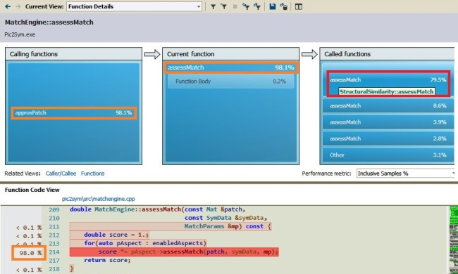

```{r setup, include=F}
knitr::opts_chunk$set(
    echo=T,
    fig.path='./',       # Save figures to current dir
    fig.keep='last',     # Keep last generated figure built within a chunk
    fig.align='center',  # Center horizontally the figures
    fig.asp=0.5)         # Make figures half-width tall
```

### Topics

```{r md_is_a_generated_file, results='asis', echo=F, cache=T, cache.path="../../cache/performance/md_is_a_generated_file/", cache.comments=F}
# Section to be placed after first document item (Topics from above)
 
#cat("[//]: # Only the Rmd file needs to be edited. Do not change the corresponding md file!")   # This gets generated, but is removed from md file
cat("<a title = 'Only the Rmd file needs to be edited. Do not change the corresponding md file!'>")   # This reaches the md file

```

- [Performance Overview](#Overview)
- Analysis of Pic2Sym by version:
    - [2.0](#v2.0)
        - [Skipping Matching Aspects Heuristic](#SkipAspects)
        - [Symbol Set Filtering](#SymsFiltering)
        - [Symbols Preselection](#SymsPreselection)
        - [Symbols Clustering](#SymsClustering)
        - [Alternative Blur Algorithms](#BlurAlgorithms)
    - [1.3](#v1.3),&nbsp;&nbsp;[1.2](#v1.2),&nbsp;&nbsp;[1.1](#v1.1) and [1.0](#v1.0)

[Back to start page](../../../ReadMe.md)

* * *

<a name = "Overview"></a>

### Performance Overview of existing versions of Pic2Sym

#### Considering the quality and accuracy of the produced results:

|   								| v1.0 	| v1.1 - v1.3   | v2.0
---									|:-:	|:-:		    |:-:
*Can Avoid Undesirable Symbols*     | - 	| - 		    | **Yes**
*Smooth Results (Hybrid Mode)* 		| - 	| **Yes**    	| **Yes**
*Best Possible Matches*				| 100% 	| 100% 		    | <b><i>see (\*)</i></b>
*Skips Uniform Patches* 			| - 	| **Yes**   	| **Yes**    	

Explanations concerning the values within the table:

- <b><i>(\*)</i></b> refers to the &#39;*accuracy*&#39; of **v2.0** (does it deliver the best possible matches?), which is 100% when all its features are disabled or when only using the **Symbol Filters** feature. Otherwise it depends:
	* low clustering accuracy might let a patch be approximated with an unexpected symbol
	* using blur algorithms inferior to Gaussian blur (like Box blur) for the [Structural Similarity][] matching aspect might produce mismatches, too
	* using Symbols Preselection reduces match accuracy even more, since the Preselection phase is highly subjective

#### Existing versions compared by their speed:

- Version **2.0** is typically superior to the previous versions. However, it can disable all its features except *Skipping Matching Aspects Heuristic*. In that case it will be slightly inferior to **v1.1 - v1.3** when the *[Structural Similarity][]* Matching Aspect isn&#39;t enabled along with a few other aspects.

- Version **1.3** allows *visualizing drafts* and preserves the *most efficient multithreading switches* from *v1.2*. It performs better than **v1.2** as long as demanding only a few drafts. 

- Version **1.2** introduced *thread-parallelism* and provides maximum number of combinations involving parallelism. It&#39;s faster than **v1.1** on multi-core machines when parallelism is enabled

- Version **1.1** performs better than **v1.0** since it skips approximating uniform patches

- Version **1.0** might get close to the performance of **v1.1** on images with hardly any uniform patches


* * *

<a name = "v2.0"></a>

### Performance of Pic2Sym v2.0

The newly introduced elements are described in their corresponding [modules](../appendix/appendix.md#Modules). These host modules are mentioned below for each feature.

One new feature is allowing any number of user requests in parallel, as long as they are valid for a given state of the application. It belongs to the [**User Interaction**][UI] module.

Continuing with more relevant features from the application performance point of view.

<a name = "SkipAspects"></a>

I\) ***Skipping Matching Aspects Heuristic***

It belongs to the [**Draft Improver**][draftImprover] module.

This is the only new feature that gets disabled not by changing the configuration file, but by using a single Matching Aspect for transforming an image. In that case, when no other feature is enabled, **v2.0** is slower than **v1.3** because of the introduced infrastructure ready to support all those new features.

Below is a table reporting the count of matching aspects that were skipped while transforming 2 images ([I1][] and [I2][]) based on the configuration from [this example](../results/Example1_v1.3.jpg). *Parallelism* was enabled while *Drafts generation* and all other features were ***OFF***. The scenarios involved all *Matching Aspects*, which are sorted in the table by their complexity, like the application itself does. First such aspect is always evaluated, but the following ones can be skipped sometimes. This order ensures that the most complex matching aspects are skipped most often:

| Matching Aspect name 		| Complexity 	| Skipped for [I1][]| Skipped for [I2][]|
---							|-:				|-:				    |-:
*Prefer Larger Symbols* 	| 0.001 		| 0.00%	    		| 0.00%
*Prefer Better Contrast* 	| 2.000 		| 0.00%	    		| 0.00%
*Foreground matching* 		| 3.100 		| 11.24%    		| 0.41%
*Background matching*		| 3.200 		| 11.72% 	    	| 0.44%
*Edges matching* 			| 4.000			| 14.31% 	    	| 0.64%
*Gravitational Smoothness* 	| 15.000 		| 15.90% 	    	| 0.83%
*Directional Smoothness*	| 15.100		| 16.23% 	    	| 0.85%
*[Structural Similarity][] (SS)*| 1000.000 	| 44.20% 	    	| 13.66%

In the presented cases, the 2 least complex matching aspects (*Prefer Larger Symbols* and *Prefer Better Contrast*) had to be evaluated for all compare operations. Only after cumulating the scores from both of them it was possible to guarantee for some symbols that they cannot be better matches (for a given patch) than the best match found earlier. For those symbols, evaluating the rest of the matching aspects is therefore not necessary.

The first image ([I1][]) contains many coarse-textured regions (faces, shirts, glass walls and a ceiling), which allow quite early approximations by large symbols. Trying to find a better match among the remaining smaller symbols will normally generate more skipped matching aspects. This is because those smaller glyphs typically obtain an inferior cumulative score from the first 2 matching aspects.

The second image ([I2][]) is, on the other hand, mostly finely-grained (grass, fur, stones with irregular surface). This prevents any early matches with large symbols.

That was the reason for the significant difference between the percentages from the 2 columns.

Comparing now the durations required to approximate the images either by all Matching Aspects, or just by *[Structural Similarity][]* (SS - the most complex one):

|                                   | [I1][]    | [I2][] |
:-:                                 |:-:        |:-:
*Required Time - all aspects ON*    | 32.429s   | 74.060s
*Required Time - only SS set ON*    | 42.558s   | 61.689s
*Total Compare operations*          | 2394770   | 3440100

The durations from the table show that using all enabled aspects can be around 1.3 times faster than transforming those images based only on SS.

The caveat - in certain conditions **v2.0** might perform worse than **v1.3** (as it results from comparing the diagrams below the [*Scenario 4*](../results/results.md#Scenario4) and [*5*](../results/results.md#Scenario5) from the [Results][] page):

- when most of the features from **v2.0** stay disabled
- and when all matching aspects are enabled except the *[Structural Similarity][]* (SS) 

In such cases, the complexity of the skip mechanism (and also of the entire new infrastructure) overcomes the gain obtained by skipping a modest number of unsophisticated computations.

Luckily, those cases run much (around 4 times) faster already, compared to when [Structural Similarity][] is the only enabled Matching Aspect.

So, ***this feature is valuable as long as skipping many evaluations of the Structural Similarity Matching aspect***.

---

<a name = "SymsFiltering"></a>

II\) ***Symbol Set Filtering***

It belongs to the [**Symbols Provider**][symbolsProvider] module.

The implemented filters can be enabled / disabled separately.

The smaller the font size, the more symbols should get filtered out, because:

- such fonts become barely readable
- the processing time is proportional to the count of remaining symbols after filtration
- smaller fonts are the most likely symbols to be used for approximating images

For larger symbols, their remaining count is not that critical, since the number of patches to be approximated gets smaller at a quadratic rate and the transformation time decreases accordingly.

Let&#39;s see how various font families shrink after applying all implemented filters (font size is 10) and the times required to process image [I1][] when all features are enabled:

|Font Type|Initial Symbols|Remaining Symbols| Transformation Time|
---|-:|-:|-:
```{r ResultsTable, echo=F, results='asis', cache=T, cache.path="../../cache/performance/ResultsTable/", cache.comments=F}
# Keeping observations grouped
times <- data.frame(FontType=c("BpMono_Bold_AppleRoman"), 
                      InitialSymbols=c(125), 
                      RemainingSymbols=c(58), 
                      TransformationTime=c(16), stringsAsFactors=F)
times <- rbind(times, 
                 data.frame(FontType=c("ProFontWindows_Regular_AppleRoman"), 
                      InitialSymbols=c(201), 
                      RemainingSymbols=c(134), 
                      TransformationTime=c(30), stringsAsFactors=F))
times <- rbind(times, 
                 data.frame(FontType=c("EnvyCode_Regular_AppleRoman"), 
                      InitialSymbols=c(220), 
                      RemainingSymbols=c(192), 
                      TransformationTime=c(40), stringsAsFactors=F))
times <- rbind(times, 
                 data.frame(FontType=c("Consolas_Bold_Unicode"), 
                      InitialSymbols=c(2215), 
                      RemainingSymbols=c(1462), 
                      TransformationTime=c(332), stringsAsFactors=F))
times <- rbind(times, 
                 data.frame(FontType=c("CourierNew_Bold_Unicode"), 
                      InitialSymbols=c(2846), 
                      RemainingSymbols=c(2062), 
                      TransformationTime=c(444), stringsAsFactors=F))
times <- rbind(times, 
                 data.frame(FontType=c("DengXian_Regular_Unicode"), 
                      InitialSymbols=c(28541), 
                      RemainingSymbols=c(7248), 
                      TransformationTime=c(1299), stringsAsFactors=F))
times <- rbind(times, 
                 data.frame(FontType=c("Osaka_Regular_Unicode"), 
                      InitialSymbols=c(14963), 
                      RemainingSymbols=c(7889), 
                      TransformationTime=c(1607), stringsAsFactors=F))

observations <- dim(times)[1]

# Create the rows of the Markdown table
for(i in seq_len(observations)) {
    observation <- times[i,]
    cat(observation$FontType, " | ", observation$InitialSymbols, " | ", observation$RemainingSymbols, " | ", observation$TransformationTime, "\n")
}
```

As stated before, the processing time should be proportional to the count of symbols used for approximating a certain image. Next *log-log* plot confirms this statement:<br>
```{r LinearModelForAnImg, echo=F, results='asis', cache=T, cache.path="../../cache/performance/LinearModelForAnImg/", cache.comments=F, dependson="ResultsTable", cache.rebuild=c(times, observations)}
colours <- c("black", "coral", "blue", "red", "darkgray", "brown", "green", "pink", "violet")
pchVals <- seq_len(observations)

# Labels to show near the points
pointLabels <- mapply(function(RemSymsCount, TransfDur) sprintf("%.0f symbols - %.0fs",RemSymsCount,TransfDur), 
                      times$RemainingSymbols, times$TransformationTime)

# Finding a line through the points in log-log space
lmObj <- lm(log10(TransformationTime) ~ log10(RemainingSymbols), times)

# Position the labels of the points to the right (4) when in the left half and to the left in the right half
# The axis is logarithmic, thus the center is computed as below
xrange <- range(times$RemainingSymbols)
limX = 10^mean(c(log10(xrange[1]), log10(xrange[2]))) 
labelPositions <- sapply(times$RemainingSymbols, 
                         function(RemSymsCount) if(RemSymsCount < limX)
                                {4} # label to the right
                                else {2}) # label to the left

# Trimming from the white margins of the figure
par(mai = c(.9, .8, .4, .2)) # Bottom, left, top and right margins expressed in inches

# Using scatterplot from car for its feature that can represent all points differently
library(car, verbose = F)
scatterplot(TransformationTime ~ RemainingSymbols, times, log="xy",
            groups=times$RemainingSymbols, # Separates the points as if they were different groups
            #labels=pointLabels, id.n=observations, id.cex=.6, id.location="lr", # produces stuff to console => spoils the md file
            main="Log-Log Plot: Timing the Transformation of an Image with various Font Types",
            xlab="Remaining Symbols after Filtering the Font Types", ylab="Transformation Duration (s)",
            cex.main=.9, cex.lab=.8, cex.axis=.7, 
            grid=T, col=colours, pch=pchVals, cex=.7,
            las=1, # tick values on vertical axis are displayed horizontally
            legend.plot=F, # it's simpler to work separately with legend
            smooth=F, # it's simpler to draw the linear regression separately
            boxplots=F) # no need for boxplots
par(new=T) # same plot for next items
abline(coef(lmObj), col="cyan") # Linear approximation for the points
text(times$RemainingSymbols, times$TransformationTime, pointLabels,
     cex=.6, pos=labelPositions, offset=.5, col=colours) # attaching labels to the points
legend("topleft", legend=times$FontType,
       cex=.7,
       pch=pchVals,
       col=colours[1:observations],
       bty="n") # Show no rectangle around the legend

```

So, when using **Pic2Sym v2.0** with all features enabled, the time required for the transformation of the image [I1][] could be approximated by the rule:<br>
```{r DisplayLinearModelForAnImg, echo=F, results='asis', cache=T, cache.path="../../cache/performance/DisplayLinearModelForAnImg/", cache.comments=F, dependson="ResultsTable", cache.rebuild=c(times, observations)}
lmObj <- lm(TransformationTime ~ RemainingSymbols, times)
slope <- lmObj$coefficients[2]
intercept <- lmObj$coefficients[1]
addOperatorStr <- "+"; if(intercept<0) addOperatorStr <- "-"
cat(sprintf("<i>Duration = %.3f * RemainingSymbols %s %.3f</i>\n", slope, addOperatorStr, abs(intercept)))
```

---

<a name = "SymsPreselection"></a>

III\) ***Symbols Preselection***

This feature interacts with several modules, but affects mostly the following 2: [Draft Improver][draftImprover] and [Image Transformer][transformer].

The performance of this mechanism depends on the count of symbols that may qualify to the final round after the *preselection phase*. This count is referred as the *Short List length*. The first phase deals with smaller symbols and patches, while the last phase handles normal size ones. Therefore:

- the briefer the short list, the quicker the transformation
- however, supplementing the short list might deliver better quality results

Additionaly, the larger the original font size, the higher the acceleration rate of processing images:

```{r PreselectionGainByFontSize, echo=F, results='asis', cache=T, cache.path="../../cache/performance/PreselectionGainByFontSize/", cache.comments=F}
Sizes <- c(10, 15, 20, 40); countSizes <- length(Sizes)
Images <- c("I1", "I2"); countImages <- length(Images)
PreselectionModes <- c("NoPreselection", "WithPreselection"); countPresModes <- length(PreselectionModes)

times <- array(dim=c(countSizes, countImages, countPresModes),
               dimnames = list(Sizes, Images, PreselectionModes))

times[Sizes==10, "I1",] <- c(32.4285, 29.5625) # NoPreselection, WithPreselection
times[Sizes==10, "I2",] <- c(74.0598, 60.6363)

times[Sizes==15, "I1",] <- c(22.3585, 16.1548)
times[Sizes==15, "I2",] <- c(40.1211, 27.9493)

times[Sizes==20, "I1",] <- c(17.3176, 10.3302)
times[Sizes==20, "I2",] <- c(27.6953, 16.4234)

times[Sizes==40, "I1",] <- c(10.2172, 3.65681)
times[Sizes==40, "I2",] <- c(15.2218, 4.83221)

# % gain from Preselection:
gains <- 100 * times[,,"NoPreselection"]/times[,,"WithPreselection"]

xrange <- range(Sizes); yrange <- range(gains)

colours <- c("black", "coral") # I1, I2
cexVal <- .8 # Resize factor for various items

# Trimming from the white margins of the figure
par(mai = c(.8, .8, .4, .1)) # Bottom, left, top and right margins expressed in inches

# Plotting the series for I1
plot(Sizes, gains[, "I1"], xlim=xrange, ylim=yrange, cex=cexVal,
     type="p", pch=1, # using a symbol for the plotted points
     col=colours[1],  # using a certain color for the plotted points & lines
     xlab='Font Size', ylab="Gain from Preselection (%)", cex.lab=cexVal, cex.axis=cexVal,
     main="Image Transformation Acceleration based on Symbols Preselection", cex.main=cexVal,
     las=1) # tick values on vertical axis are displayed horizontally
grid()

# Plotting the series for I2
par(new=TRUE) # Use same plot
plot(Sizes, gains[, "I2"], xlim=xrange, ylim=yrange, cex=cexVal,
     type="p", pch=2, # use a different symbol for its plotted points
     col=colours[2],  # use a different color for its plotted points & lines
     xlab='', ylab='', axes=F, xaxt="n", yaxt="n") # inhibit any axis information

legend("topleft", legend=sapply(Images, function(Img) sprintf("Gain for Image %s", Img)),
       cex=cexVal,
       pch=seq_len(countImages),
       col=colours,
       bty="n") # Show no rectangle around the legend

interpolateLocation <- seq(xrange[1], xrange[2], 5)
lines(predict(smooth.spline(Sizes, gains[, "I1"]), interpolateLocation), col=colours[1])
lines(predict(smooth.spline(Sizes, gains[, "I2"]), interpolateLocation), col=colours[2])

```

The images [I1][] and [I2][] were mentioned earlier in different studies. The times for the ratios presented in the chart were obtained based on the configuration from [this example](../results/Example1_v1.3.jpg). *Parallelism* was enabled while *Drafts generation* and all other features were ***OFF***. *Short List length* was 2.

The quality of the result is a subjective matter. One could not even notice how this feature provides poor matches for some patches. However, the [Unit Tests][UnitTests] demonstrated a significant drop of the accuracy for approximations using the Preselection mode.

---

<a name = "SymsClustering"></a>

IV\) ***Symbols Clustering***

It belongs to the [**Symbols Provider**][symbolsProvider] module.

Most of the scenarios from the [results][] page induce the wrong idea that *Clustering the Symbols* might just slow the transformation process (apart from [*Scenarios 7*](../results/results.md#Scenario7) and [*8*](../results/results.md#Scenario8), all the other show worse performance when clustering the glyph set).

Here are 2 transformations that might redeem this feature:

- [first one](6_Consolas_Unicode_Bold_10_SmallSet_1462.jpg) based on the font type *Consolas Bold Unicode*
- [the second](6_CourierNew_Unicode_Bold_10_SmallSet_2062.jpg) using *Courier New Bold Unicode*

All features were enabled for a first measurement, then the clustering was disabled for getting the second measurement. Below are the results:

|                           | Average Cluster Size  | Transformation using Clustering   | Transformation without Clustering | Gain from Clustering |
---                         |:-:                    |:-:                                |:-:                                |:-:
*Consolas Bold Unicode*     | 1.28                  | 332s                              | 394s                              | 118% (1.18 x faster)
*Courier New Bold Unicode*  | 1.32                  | 444s                              | 556s                              | 125% (1.25 x faster)

The *average cluster size = acs* represents how large the existing clusters are, on average. It gets reported in the *console window* each time a font type is loaded.

Using this notion, I&#39;ve analyzed its value for the scenarios from the [results][] page:

- [*Scenarios 7*](../results/results.md#Scenario7) presents a Preselection mode with 4s faster than not using that mode. The *acs* was 1.18
- [*Scenarios 8*](../results/results.md#Scenario8) is in favor of the Preselection mode. 2s is the difference between the 2 modes. The *acs* was 1.13
- all other scenarios are against the Preselection mode. Their *acs* values were below 1.12

So I reckon there is a ***threshold*** *average cluster size* around 1.12:

- for values below it, clustering will typically perform worse
- for values above it, it *might be faster if the generated clusters are of superior quality*

Several points on *clustering quality*:

- clusters are formed by comparing the *tiny versions* of the actual symbols (to graciously deal with a clustering algorithm with **O**($N^2$) ). Besides, all fonts get *reframed* in a square, so they undergo operations like resize, hint, antialias, baseline shift and crop. Same symbol can be handled differently when considering various font sizes. Thus, sometimes the 2 versions of a symbol are clearly different.<br>The image  shows 3 clusters, all containing vertically shifted outlier items. Of course, their tiny versions were all aligned when the clusters were generated
- there are 2 clustering algorithms, each with several control parameters adjustable from the [configuration][] file. The settings from there cannot deliver perfect clusters for all font types. So, just some guidelines about changing those values:
    - if only a few small groups get generated, clustering doesn&#39;t help (happens for a bad configuration or for too distinct symbols)
    - when there are too many large groups, with lots of unnatural and overinflated clusters, the configuration is too loose. Cluster representatives need to resemble with the members of those clusters. Otherwise it leads the matching algorithm on a wrong path for all such unnatural groups. It brings also poor image transformation accuracy and the processing time might be longer
- *TTSAS* clustering algorithm was [adapted in my implementation](../appendix/modules/symbolsProvider.md#TTSAS) to ensure that *every expanding cluster maintains all its previous members within a certain radius from its migrating centroid* 

Clustering is the longest task performed when loading a new symbol set. The great news is that it needs to be performed only once. Afterwards the saved results are reused for all possible font sizes and no matter the filtering configuration.

Here are some orientative times for loading a symbols set for the first time (using clustering with the default-configured TTSAS):

- 4s for loading 2500 symbols
- 90s for loading the largest tested font family - DengXian Unicode with more than 28000 glyphs

These times were achieved only after introducing a heuristic method for computing the distance between a cluster (representative) and a symbol searching for a parent cluster (The noticed gain was around 10 times. *FastDistSymToClusterComputation* from the [configuration][] file could be changed to observe the difference).

---

<a name = "BlurAlgorithms"></a>

V\) ***Alternative Blur Algorithms***

They belong to the [**Draft Improver**][draftImprover] module.

One possible *Matching Aspect* to be used during image approximation is *[Structural Similarity][]*. It relies heavily on *Gaussian blurring*, whose implementation is already optimized in OpenCV for a sequential run. However, `GaussianBlur` function is the most time-consuming operation
during image approximation when using the previously mentioned *Matching Aspect*.

For the typical standard deviation of 1.5, `GaussianBlur` from OpenCV still remains the fastest when compared to other tested sequential innovative algorithms:

- *Young \& van Vliet* (implementation from [CImg library](http://cimg.eu/))
- *Deriche* (implementation from [CImg library](http://cimg.eu/))
- [*Stacked Integral Image*](http://dev.ipol.im/~getreuer/code/doc/gaussian_20131215_doc/group__sii__gaussian.html)
- *Stack blur* (adaptation of [this sequential algorithm](http://www.codeproject.com/Articles/42192/Fast-Image-Blurring-with-CUDA))

All those competitor algorithms are less accurate than *Extended Box Blur* configured with just 2 repetitions.<br>
When applied only once, sequential *Box-based blur* techniques can be 1.5 - 3 times faster than `GaussianBlur` from OpenCV.<br>
However, basic *Box blurring* with no repetitions has poor quality, while *Extended Box blurring* incurs additional time costs for an improved quality.

[Here](http://dev.ipol.im/~getreuer/code/doc/gaussian_20131215_doc/group__ebox__gaussian.html) is one implementation of the *Extended Box blurring*.<br>
This project contains its own implementation of this blur technique (**ExtBoxBlur**).

The project includes following blur algorithms:

- **GaussBlur** - the reference blur, delegating to sequential `GaussianBlur` from OpenCV
- **BoxBlur** - for its versatility: quickest for no repetitions and slower, but increasingly accurate for more repetitions
  (Every repetition delegates to `blur` from OpenCV)
- **ExtBoxBlur** - for its accuracy, even for only a few repetitions. The sequential algorithm is *highly parallelizable*
- **StackBlur** - for its provided CUDA version that shows terrific time improvement compared to the sequential algorithm

When the *[Structural Similarity][]* is enabled and the application uses **BoxBlur** (which is configured to use a single iteration) the image transformation performs around 1.17 times faster compared to the **GaussBlur**. Better speed could be achieved with algorithms making use of any accelerator devices from the system.

* * *

<a name = "v1.3"></a>

### Considerations on Pic2Sym v1.3

This version has put emphasis on *application responsiveness* and *efficiency*. The user was placed in charge of *how often to get feedback* from the application. For that:

- it implemented <i>charmap **dynamic** partitioning</i> with a better draft generated for every new batch of symbols from the entire set. The user might adjust on the spot the size of next batches, thus the draft frequency.
- it delivers an *early preview of large charmaps* while they are loaded
- it removed any *optional nested parallelism from image approximation code from v1.2*

Outcome (compared to *v1.2*):

- **faster transformation** if the user requires no drafts, or only a few. This is because there was a lot of OpenMP code involved in the removed *optional nested parallelism*
- drafts computed based on charmap partitioning required holding a matrix of previous best matches, so this means **larger memory footprint**

* * *

<a name = "v1.2"></a>

### Analysis for Pic2Sym version 1.2

**Version 1.2** uses **OpenMP** for parallelism (*Visual C++ implementation of OpenMP version 2.0 from March 2002*).

The code from *version <b>1.1</b>* required some *minor rearranging and adjustments* to accomodate the *pragma clauses providing concurrency support*:

- most adaptations dealt with *loops* that previously were using *iterators* and had to switch to loop counters
- the introduced pragma clauses transformed into *code for managing eventual requests to perform in parallel any following code*

Outcome:

- around a ***5 \- 15% time penalty*** for *handling possible parallelism requests, even when there are none*.
	That&#39;s why *version 1.2 is slower than v1.1 on single\-core machines or when the parallelism is disabled*
- on multi\-core machines and when transforming consecutive rows of patches in parallel, version 1.2 needs *less than 65% image transformation time* compared to v1.1.
	Selecting other regions for parallelism or increasing the cores count would generate different durations

Below I&#39;ll present **most time\-consuming functions** while performing image transformation with *2 threads tackling consecutive rows of image patches*:<br>
<br>
Most time is spent in `MatchEngine::assessMatch` (98.1%). Largest chunk of the previous percent is consumed by `StructuralSimilarity::assessMatch` (79.5%). Next one is `EdgeMatch::assessMatch` (8.6%).

Therefore it&#39;s worth investigating **StructuralSimilarity**:<br>
<br>
From the 79.5% observed earlier, 47.7% is required by the block:<br>
`#pragma omp parallel if(ParallelizeMp_ssimFactors)` \- transformed into `MatchParams::computeSsim$omp$4` (**4\-th** active ***omp parallel*** clause from `MatchParams::computeSsim`)

**Red** marks the *most expensive call*: `GaussianBlur` from *opencv_imgproc.dll* (27.1%).<br>
**Green** covers the remaining 18.5% spent performing ***basic matrix operations*** from *opencv_core.dll*.

So, `GaussianBlur` calls alone (27.1%) represent **1/4 of total transformation time** and consume more time than evaluating *all other match aspects together* (&#126;19%).

* * *

<a name = "v1.1"></a>

### Discussion on Pic2Sym version 1.1

The changes in **version 1.1** of Pic2Sym impact the performance as follows:

- Using the **Hybrid Result** mode incurs *additional cost*:
	- first deciding *which is a better approximation* of the patch: *a selected symbol* or *the blurred version of that patch*
	- secondly \- *combining the 2 versions* based on the *weights resulted from previous step*
- **Uniform patches** are *approximated by their blurred form*, instead of the normal transformation process from version 1.0. This extra logic generally **reduces overall processing time**, except for the case when there are very few uniform patches. It also means it&#39;s more difficult to provide accurate time-estimation formulae
- **Refactorization incurred minor penalty** for *splitting old classes*, *runtime allocations and handling of some (more / larger / polymorphic) objects*

Based on these [notations][], the cost of the <b>hybrid mode</b> for a <i>color image</i> is: <i>(9d<sup>2</sup> + 12)(p - up)</i>.

Since the changes don&#39;t affect the matching aspects, the analysis for version 1.0 from below should be still mostly valid.

* * *

<a name = "v1.0"></a>

### Analysis for Pic2Sym version 1.0

Profiling results show that during image approximation under default settings, 80% from the time the processor is busy computing [Structural Similarity][] (`StructuralSimilarity::assessMatch` \-\> `MatchParams::computeSsim`):<br>
<br>
The 2 dll\-s from the image are **imgproc**, which provides an *image blur* function, and **core**, used for *basic matrix operations*, like addition and element\-wise multiplication.

The emphasis of next ideas will be on **imgproc**, as the next capture might suggest:<br>
<br>
This *Function Details* view presents the operations from `MatchParams::computeSsim` together with the percent of the total time required by each. The lines not relevant here were removed from the *Function Code View*.

The red rectangles tackle the mentioned image blur (`GaussianBlur`) from **imgproc** dll. The overall duration for the blur is 28.9% (28.8% is displayed in the top\-right red rectangle, probably because it ignores call costs).

The variables `blurredPatchApprox` (line 234) and `variancePatchApprox` (line 237) do actually require each same `GaussianBlur` computation method.
However, their actual evaluation in the implemented optimized algorithm <i>needs **\>8 x less time** each</i>.
Lines 241-257 from the code check in Debug mode that the computations are the same when using normal and optimized methods.

The call to `computeVariancePatch` on line 226 involves also 2 other sub\-calls to `GaussianBlur`, but they are performed only once per patch.
Despite the fact its single\-time workload is distributed among all the symbols compared with the given patch, `computeVariancePatch` still averages to 0.7% from the total time and it is categorized as ***Other*** (0.9%) in ***Called functions***. This is perhaps more evident in the view below:<br>
<br>
The transformation time for the non-optimized algorithm would be around 57% longer than for the implemented version (100% + 2*28.8% = ~157%).

When disabling [Structural Similarity][], there are fewer differences among the remaining matching aspects. Smoothness and contour match aspects require a bit more time than the rest.

All matching aspects share the values that normally would be recomputed. First one who needs such a value will evaluate it; the next ones will simply use it.
The total approximation effort is split in 3:

1.	Symbol\-specific data preparation - various masks, a negative, a blurred version and others, all obtained when the glyph is loaded and resized
2.	Transformation\-specific values computation - patch area, some limits and others, all generated at the start of the transformation
3.	Actual approximation of each patch

Below I&#39;ll compute first the overall transformation complexity, ignoring (1) and (2) from above. Then I&#39;ll enumerate the distinct contribution of each matching aspect, without the part when they compute/read shared data.
For simplicity I won&#39;t count compare, saturation casts and loop index increment operations and I assume that all arithmetic operations will need the same time.
The expressions make use of **these [notations][]**.

Here are the estimations for employed OpenCv functions:

- ***countNonZero*** : $d^2/2$   (on average, half of the mask elements might be 0)
- ***mean*** : $d^2 + 1$   (with mask parameter)
- ***meanStdDev*** :  $2.5d^2 + 3$   (with mask parameter)
- ***GaussianBlur*** : $2 w * d^2$   (for a separable kernel method; otherwise it would be $(w*d)^2$ ;   For related details, see [this](http://www.mathworks.com/matlabcentral/fileexchange/28238-kernel-decomposition)\)

**Overall transformation complexity** for a *color* image:<br>
$$p (s (d^2 (2w +29.5) + 61 )   +   d^2 (4w+30)   +   4d   +   8)$$

**Separately** and **without the parts computing/reading of shared data**, each match aspect contributes as follows:

- ***[Structural Similarity][]*** : $p (s (d^2 (2w+19) + 6)   +   d^2 (4w+3) )$
- ***Fit under*** : $3p*s$
- ***Fit edge*** : $(2.5d^2 + 7) p*s$
- ***Fit aside*** : $3p*s$
- ***Contrast*** : $1.5p*s$
- ***Gravity*** : $4p*s$
- ***Direction*** : $6p*s$
- ***Larger symbols*** : $3p*s$
- ***Blank threshold*** : $4p*s$

For **p**=27540, **s**=125, **d**=10 and **w**=11 (values used for the profiled transformation), the ratio of the complexities of *[Structural Similarity][]* and the *Overall Transformation* is <i>**0.78617**, which is close to **79.95%** reported by the profiler</i>.
The last discussed image demonstrates that the measured Structural Similarity computations concern almost entirely only Structural Similarity \- below the underlined `computeVariancePatch`, only 0.06% of the time is spent in shared values management (the call to `computePatchApprox`).

The **memory required by the transformation process** is ***O***($(s+p)d^2$) where **p** is typically much larger than **s**.
For the scenario mentioned above, *maximum reported memory* was less than *114 MB*.

-----------
[Back to start page](../../../ReadMe.md)

[Structural Similarity]:https://ece.uwaterloo.ca/~z70wang/research/ssim
[notations]:notations.md
[UnitTests]:../UnitTesting/UnitTesting.md
[configuration]:../../../res/varConfig.txt
[results]:../results/results.md
[Appendix]:../appendix/appendix.md
[I1]:../../examples/6.jpg
[I2]:../../examples/15.jpg
[symbolsProvider]:../appendix/modules/symbolsProvider.md
[draftImprover]:../appendix/modules/draftImprover.md
[transformer]:../appendix/modules/transformer.md
[UI]:../appendix/modules/UI.md
