```{r setup, include=F}
knitr::opts_chunk$set(
    echo=T,
    fig.path='./',       # Save figures to current dir
    fig.keep='last',     # Keep last generated figure built within a chunk
    fig.align='center',  # Center horizontally the figures
    fig.asp=0.5)         # Make figures half-width tall
```

```{r shared, include=F, cache=T, cache.path="../../cache/results/shared/", cache.comments=F}
versions <- c("v1.0", "v1.1", "v1.2", "v1.3", "v2.0")  # x axis

# Monitored evolution criteria from version to version
criteria <- c("1 Thread, Basic", 
              "2 Threads, Basic",
              "2 Threads, Box Blur (BB)",
              "2 Threads, Clustering (Cl)",
              "2 Threads, Filters (Fil)",
              "2 Threads, Preselection (Pre)",
              "2 Threads, Skip Aspects (SA)",
              "2 Threads, BB+Cl+Fil+Pre+SA")

versionsCount <- length(versions)
criteriaCount <- length(criteria)
xrange <- c(1, versionsCount)

cexVal <- 0.7 # Resize factor for plot title, symbols and legend

#colours <- rainbow(criteriaCount, alpha=0.75)      # Didn't provide colors distinct enough
colours <- c("black", "coral", "blue", "red", "darkgray", "brown", "green", "violet", "pink") # Added a few more

# Initializes the values (NA) from the series of times (versionsCount rows by criteriaCount columns)
initValues <- function() {
    return(matrix(NA, versionsCount, criteriaCount,
                  dimnames = list(versions, criteria)))
}

# Displays the series of times (versionsCount rows by criteriaCount columns) by version
renderValues <- function(times, legendPos = "topright") {
    yrange <- range(times, na.rm=T) # Ensure all times fit in the displayed y range of the y axis
    
    # Trimming from the white margins of the figure
    par(mai = c(.5, .8, .4, .2)) # Bottom, left, top and right margins expressed in inches
    
    # First plotted criterion displays the title and the times from the y axis
    plot(times[, "1 Thread, Basic"], xlim=xrange, ylim=yrange, cex=cexVal,
         type="b", pch=1, # using a symbol for the plotted points
         col=colours[1],  # using a certain color for the plotted points & lines
         xlab='', ylab="Duration (s)", cex.lab=cexVal,
         main="Duration for Transforming this Image with each Pic2Sym Version", cex.main=cexVal,
         las=1, # tick values on vertical axis are displayed horizontally
         xaxt="n") #inhibits showing x axis values
    axis(1, at=seq_len(versionsCount), labels=versions) # placing the Pic2Sym versions instead of the x axis values
    grid()

    # Plotting the rest of the criteria
    for(i in 2 : criteriaCount) {
        par(new=TRUE) # Use same plot
        plot(times[, criteria[i]], xlim=xrange, ylim=yrange, cex=cexVal,
             type="b", pch=i, # Each criterion uses a different symbol for its plotted points
             col=colours[i],  # Each criterion uses a different color for its plotted points & lines
             xlab='', ylab='', axes=F, xaxt="n", yaxt="n") # inhibit any axis information
    }
    
    criteriaIndices <- seq_len(criteriaCount)
    validCriteriaIndices <- criteriaIndices[sapply(criteriaIndices, function(idx) F%in%is.na(times[,idx]))]
    
    legend(legendPos, legend=criteria[validCriteriaIndices],
           cex=cexVal,
           pch=validCriteriaIndices,
           col=colours[validCriteriaIndices],
           bty="n") # Show no rectangle around the legend
}
```

## Results generated by versions of Pic2Sym up to v2.0

```{r md_is_a_generated_file, results='asis', echo=F, cache=T, cache.path="../../cache/results/md_is_a_generated_file/", cache.comments=F}
# Section to be placed after first document item ('Results generated ...' from above)
 
#cat("[//]: # Only the Rmd file needs to be edited. Do not change the corresponding md file!")   # This gets generated, but is removed from md file
cat("<a title = 'Only the Rmd file needs to be edited. Do not change the corresponding md file!'>")   # This reaches the md file

```

[Back to start page](../../../ReadMe.md)

The original images and the results for the cases presented on this page can be found in the folder [doc/examples][examples]. Clicking on the snapshots from below will open the full\-size results.

The name of each result file is prefixed by the name of the image before transformation. For instance:

- **7g.jpg** is an original image that was approximated
- **7g_Consolas_Italic_APPLE_ROMAN_10_1_2.5_0_0_0_0_0_0_0_0_1350_2030.jpg** is one of the approximations of **7g.jpg**

-----

The rest of the page covers these topics:

- [Several Satisfactory Results](#BetterSuitedCases)
- [Illustrating the &#39;Hybrid Results&#39; feature](#HybridModeDemo)
- [Effects of the &#39;Hybrid Results&#39; mode on Problematic Images](#ChallengingCases)
- [Handling Large Font Families](#LargeFontFamilies)
- [A few Conclusions](#Conclusions)

-----

<a name = "BetterSuitedCases"></a>

### Satisfactory results and their settings

**Scenario 1:**

27540 patches to approximate using 220 symbols (*Envy_Code_R_Regular_APPLE_ROMAN_10*):<br>
[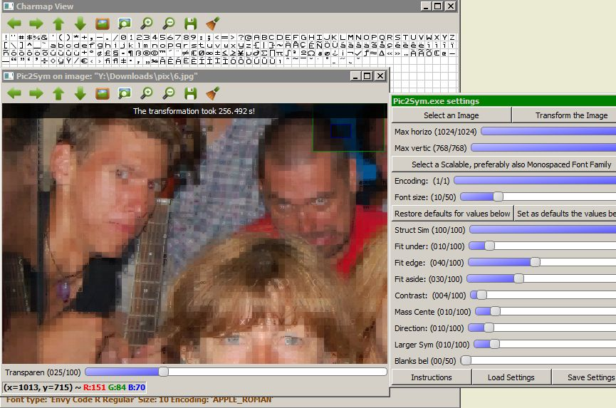](../../examples/6_Envy Code R_Regular_APPLE_ROMAN_10_2.5_0.25_1_0.75_0.1_0.2_0.2_0.1_0_2040_1350.jpg)<br>
The necklace, the guitar tail and some of the eyes look still ok.<br>
The aspect is quite blurry, as a consequence of not using a bold font.

Some of the glyphs used here are quite similar, in the sense they have just different accents. Such differences have almost no impact on the result, except the longer time required generating it.

```{r Example2_ObtainedTimes, echo=FALSE, cache=T, cache.path="../../cache/results/Example2_ObtainedTimes/", cache.comments=F, dependson="shared", cache.rebuild=c(initValues, renderValues, colours, cexVal, xrange, criteria, criteriaCount, versions, versionsCount)}
times <- initValues()

times[c("v1.0", "v1.1", "v1.2", "v1.3", "v2.0"), "1 Thread, Basic"] <-
    c(256, 150, 174, 154, 158)

times[c("v1.2", "v1.3", "v2.0"), "2 Threads, Basic"] <-
    c(93, 82, 83)

times["v2.0", c("2 Threads, Box Blur (BB)",
                "2 Threads, Clustering (Cl)",
                "2 Threads, Filters (Fil)",
                "2 Threads, Preselection (Pre)",
                "2 Threads, Skip Aspects (SA)",
                "2 Threads, BB+Cl+Fil+Pre+SA")] <-
    c(70, 83, 73, 67, 63, 39)

renderValues(times, "bottomleft")
```

_ _ _


**Scenario 2:**

27540 patches to approximate using 201 symbols (*ProFontWindows_Regular_APPLE_ROMAN_10*):<br>
[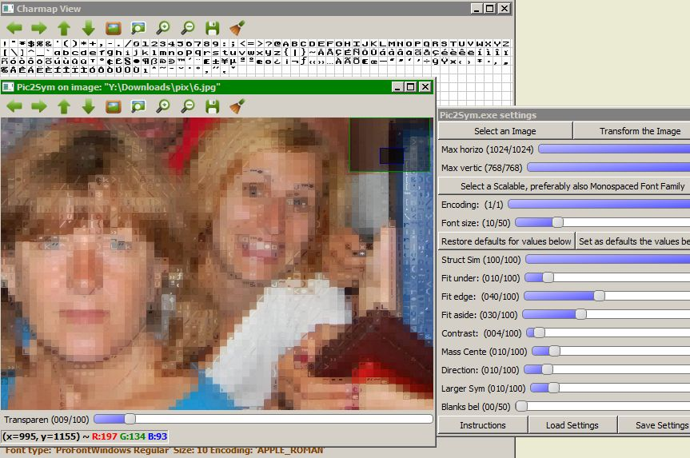](../../examples/6_ProFontWindows_Regular_APPLE_ROMAN_10_2.5_0.25_1_0.75_0.1_0.2_0.2_0.1_0_2040_1350.jpg)<br>
Approximated eyebrows, eyes, face contours and hairs have a fair\-enough appearance.

Although declared as *Regular*, the symbols look bold\-ish.

```{r Example3_ObtainedTimes, echo=FALSE, cache=T, cache.path="../../cache/results/Example3_ObtainedTimes/", cache.comments=F, dependson="shared", cache.rebuild=c(initValues, renderValues, colours, cexVal, xrange, criteria, criteriaCount, versions, versionsCount)}
times <- initValues()

times[c("v1.0", "v1.1", "v1.2", "v1.3", "v2.0"), "1 Thread, Basic"] <-
    c(240, 138, 158, 142, 149)

times[c("v1.2", "v1.3", "v2.0"), "2 Threads, Basic"] <-
    c(82, 74, 76)

times["v2.0", c("2 Threads, Box Blur (BB)",
                "2 Threads, Clustering (Cl)",
                "2 Threads, Filters (Fil)",
                "2 Threads, Preselection (Pre)",
                "2 Threads, Skip Aspects (SA)",
                "2 Threads, BB+Cl+Fil+Pre+SA")] <-
    c(65, 77, 52, 63, 54, 29)

renderValues(times, "bottomleft")
```

_ _ _


**Scenario 3:**

27540 patches to approximate using 214 symbols (*Anonymous_Pro_Bold_APPLE_ROMAN_10*):<br>
[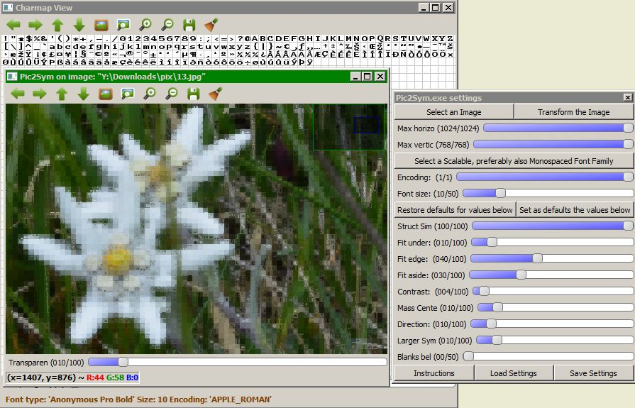](../../examples/13_Anonymous Pro_Bold_APPLE_ROMAN_10_2.5_0.25_1_0.75_0.1_0.2_0.2_0.1_0_2040_1350.jpg)<br>
Objects thinner than the font size normally can&#39;t maintain their aspect.<br>
Their background decides how clear they remain.

```{r Example4_ObtainedTimes, echo=FALSE, cache=T, cache.path="../../cache/results/Example4_ObtainedTimes/", cache.comments=F, dependson="shared", cache.rebuild=c(initValues, renderValues, colours, cexVal, xrange, criteria, criteriaCount, versions, versionsCount)}
times <- initValues()

times[c("v1.0", "v1.1", "v1.2", "v1.3", "v2.0"), "1 Thread, Basic"] <-
    c(250, 209, 234, 213, 218)

times[c("v1.2", "v1.3", "v2.0"), "2 Threads, Basic"] <-
    c(129, 111, 116)

times["v2.0", c("2 Threads, Box Blur (BB)",
                "2 Threads, Clustering (Cl)",
                "2 Threads, Filters (Fil)",
                "2 Threads, Preselection (Pre)",
                "2 Threads, Skip Aspects (SA)",
                "2 Threads, BB+Cl+Fil+Pre+SA")] <-
    c(99, 116, 89, 98, 108, 62)

renderValues(times, "bottomleft")
```

_ _ _


<a name = "Scenario4"></a>

**Scenario 4:**

[Structural Similarity][] disabled; 27405 patches to approximate using 191 symbols (*BPmono_Bold_UNICODE_10*):<br>
[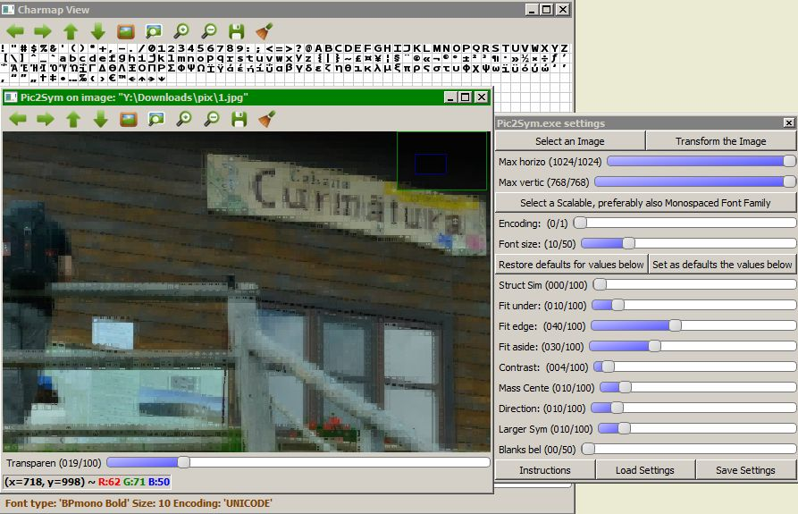](../../examples/1_BPmono_Bold_UNICODE_10_0_0.25_1_0.75_0.1_0.2_0.2_0.1_0_2030_1350.jpg)<br>
The thin lines on the quasi\-uniform wall are well approximated.<br>
Besides that, disabling [Structural Similarity][] produced the result several times faster. However, the disabled method shouldn&#39;t be underestimated.

```{r Example5_ObtainedTimes, echo=FALSE, cache=T, cache.path="../../cache/results/Example5_ObtainedTimes/", cache.comments=F, dependson="shared", cache.rebuild=c(initValues, renderValues, colours, cexVal, xrange, criteria, criteriaCount, versions, versionsCount)}
times <- initValues()

times[c("v1.0", "v1.1", "v1.2", "v1.3", "v2.0"), "1 Thread, Basic"] <-
    c(30, 23, 27, 25, 26)

times[c("v1.2", "v1.3", "v2.0"), "2 Threads, Basic"] <-
    c(18, 13, 13)

times["v2.0", c("2 Threads, Clustering (Cl)",
                "2 Threads, Filters (Fil)",
                "2 Threads, Preselection (Pre)",
                "2 Threads, Skip Aspects (SA)",
                "2 Threads, BB+Cl+Fil+Pre+SA")] <-
    c(13, 7, 11, 18, 8)

renderValues(times, "bottomleft")
```

_ _ _


<a name = "Scenario5"></a>

**Scenario 5:**

Using only [Structural Similarity][], this time; 27405 patches to approximate using 191 symbols (*BPmono_Bold_UNICODE_10*):<br>
[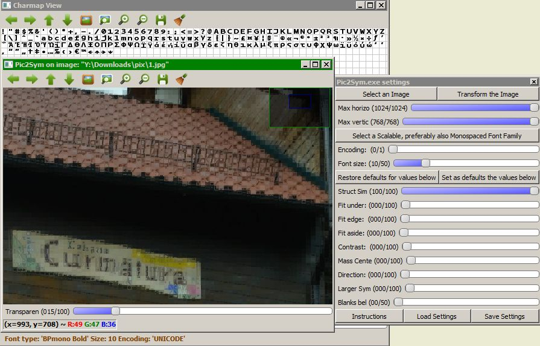](../../examples/1_BPmono_Bold_UNICODE_10_2.5_0_0_0_0_0_0_0_0_2030_1350.jpg)<br>
[Structural Similarity][] took more than 5 times the duration required by all the other techniques. Still, it captures additional subtleties when comparing the letters on the board and many more.

```{r Example6_ObtainedTimes, echo=FALSE, cache=T, cache.path="../../cache/results/Example6_ObtainedTimes/", cache.comments=F, dependson="shared", cache.rebuild=c(initValues, renderValues, colours, cexVal, xrange, criteria, criteriaCount, versions, versionsCount)}
times <- initValues()

times[c("v1.0", "v1.1", "v1.2", "v1.3", "v2.0"), "1 Thread, Basic"] <-
    c(172, 129, 137, 128, 132)

times[c("v1.2", "v1.3", "v2.0"), "2 Threads, Basic"] <-
    c(103, 67, 69)

times["v2.0", c("2 Threads, Box Blur (BB)",
                "2 Threads, Clustering (Cl)",
                "2 Threads, Filters (Fil)",
                "2 Threads, Preselection (Pre)",
                "2 Threads, BB+Cl+Fil+Pre+SA")] <-
    c(59, 69, 32, 58, 25)

renderValues(times, "bottomleft")
```

_ _ _


**Scenario 6a:**

27540 patches to approximate with 125 symbols (*BPmono_Bold_APPLE_ROMAN_10*):<br>
[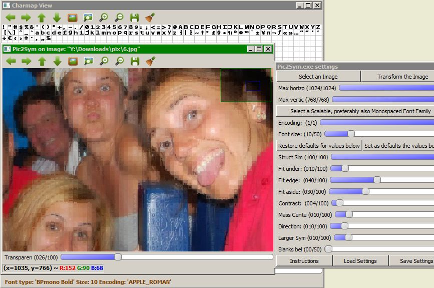](../../examples/6_BPmono_Bold_APPLE_ROMAN_10_2.5_0.25_1_0.75_0.1_0.2_0.2_0.1_0_2040_1350.jpg)

It marks high in the following parts: eyes, eyebrows, wrinkles, some contours and texture of the shiny blue object in the close plane.<br>
The grid splits incur some unnatural transitions.

The bold symbols of the Apple Roman encoding of [BpMono](http://www.dafont.com/bpmono.font) font family usually produce pretty results. (The font is free and provided also in the [res](../../../res/) folder. To be visible to Pic2Sym, *it needs to be installed*.)

This scenario shares its times with the case from below. The only differnce between them is the way &#39;Hybrid Results&#39; is configured (not available here and **ON** in the next configuration).

* * *

<a name = "HybridModeDemo"></a>

### Using Pic2Sym v1.3 to illustrate &#39;Hybrid Results&#39; (feature introduced in v1.1):

**Scenario 6b** - using the scenario right from above with Hybrid Result mode enabled:<br>
[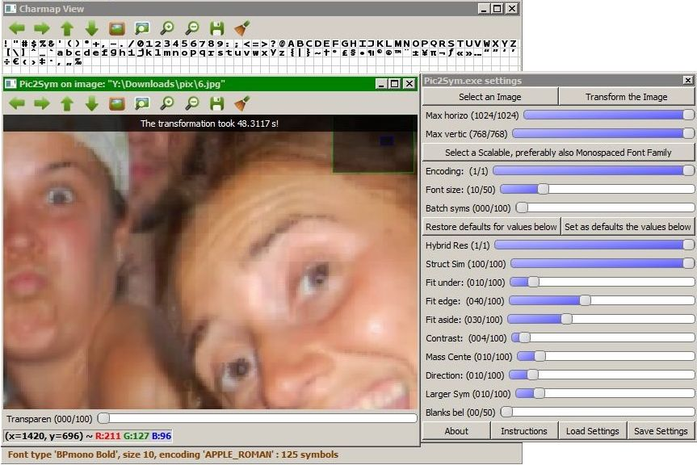](../../examples/6_BPmono_Bold_APPLE_ROMAN_10_1_2.5_0.25_1_0.75_0.1_0.2_0.2_0.1_0_2040_1350.jpg)<br>
Notice how the **symbols avoid imposing themselves** and are **more visible only where they are more naturally suited**. Use **Hybrid mode** for such **discreet approximations**.

```{r Example1_ObtainedTimes, echo=FALSE, cache=T, cache.path="../../cache/results/Example1_ObtainedTimes/", cache.comments=F, dependson="shared", cache.rebuild=c(initValues, renderValues, colours, cexVal, xrange, criteria, criteriaCount, versions, versionsCount)}
times <- initValues()

times[c("v1.0", "v1.1", "v1.2", "v1.3", "v2.0"), "1 Thread, Basic"] <-
    c(153, 88, 101, 91, 93)

times[c("v1.2", "v1.3", "v2.0"), "2 Threads, Basic"] <-
    c(57, 48, 48)

times["v2.0", c("2 Threads, Box Blur (BB)",
                "2 Threads, Clustering (Cl)",
                "2 Threads, Filters (Fil)",
                "2 Threads, Preselection (Pre)",
                "2 Threads, Skip Aspects (SA)",
                "2 Threads, BB+Cl+Fil+Pre+SA")] <-
    c(42, 49, 24, 40, 37, 15)

renderValues(times, "bottomleft")
```

* * *

<a name = "ChallengingCases"></a>

### Less satisfactory results and their settings (with and without the Hybrid Result mode)

<a name = "Scenario7"></a>

**Scenario 7a:**

Using only [Structural Similarity][]; 27540 patches to approximate using 341 symbols (*Monaco_Regular_UNICODE_10*):<br>
[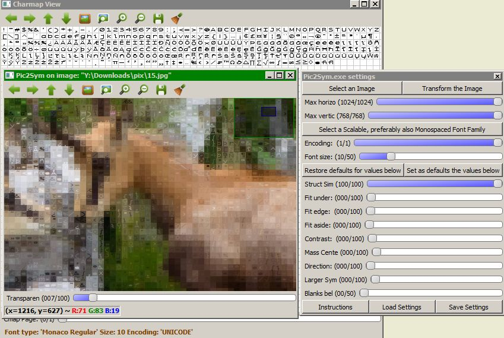](../../examples/15_Monaco_Regular_UNICODE_10_2.5_0_0_0_0_0_0_0_0_2040_1350.jpg)<br>
The chamois seem quite blurred and the background seriously competes for viewer&#39;s attention, more than it should, in my opinion.

**Scenario 7b** - *Hybrid approximation* from below isn&#39;t affected by these concerns:<br>
[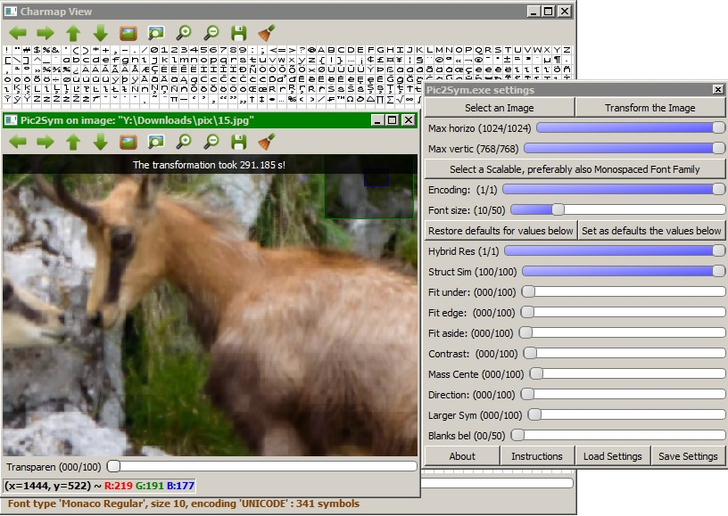](../../examples/15_Monaco_Regular_UNICODE_10_1_2.5_0_0_0_0_0_0_0_0_2040_1350.jpg)<br>

```{r Example7_ObtainedTimes, echo=FALSE, cache=T, cache.path="../../cache/results/Example7_ObtainedTimes/", cache.comments=F, dependson="shared", cache.rebuild=c(initValues, renderValues, colours, cexVal, xrange, criteria, criteriaCount, versions, versionsCount)}
times <- initValues()

times[c("v1.0", "v1.1", "v1.2", "v1.3", "v2.0"), "1 Thread, Basic"] <-
    c(385, 291, 314, 299, 305)

times[c("v1.2", "v1.3", "v2.0"), "2 Threads, Basic"] <-
    c(180, 159, 160)

times["v2.0", c("2 Threads, Box Blur (BB)",
                "2 Threads, Clustering (Cl)",
                "2 Threads, Filters (Fil)",
                "2 Threads, Preselection (Pre)",
                "2 Threads, BB+Cl+Fil+Pre+SA")] <-
    c(137, 140, 134, 136, 87)

renderValues(times, "bottomleft")
```

_ _ _


<a name = "Scenario8"></a>

**Scenario 8a:**

Still using only [Structural Similarity][]; 27405 patches to approximate using 219 symbols (*Consolas_Italic_APPLE_ROMAN_10*):<br>
[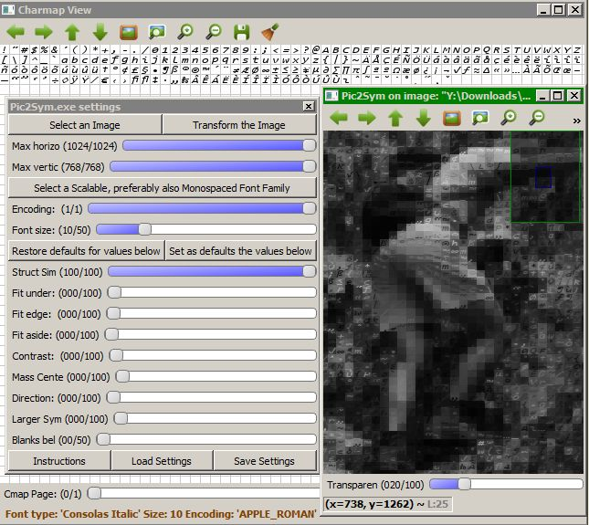](../../examples/7g_Consolas_Italic_APPLE_ROMAN_10_2.5_0_0_0_0_0_0_0_0_1350_2030.jpg)<br>
*Italic* fonts cannot tackle top\-left corners well\-enough.<br>
There are just a few parts that looks like one would expect from an approximation.<br>
A reason might be that there are many large background differences among neighbor patches.

**Scenario 8b** - *Hybrid approximation* seems better:<br>
[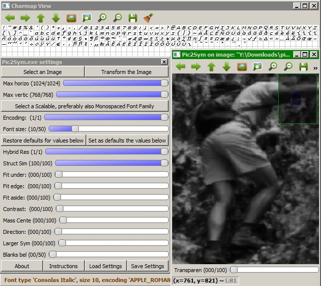](../../examples/7g_Consolas_Italic_APPLE_ROMAN_10_1_2.5_0_0_0_0_0_0_0_0_1350_2030.jpg)<br>

```{r Example8_ObtainedTimes, echo=FALSE, cache=T, cache.path="../../cache/results/Example8_ObtainedTimes/", cache.comments=F, dependson="shared", cache.rebuild=c(initValues, renderValues, colours, cexVal, xrange, criteria, criteriaCount, versions, versionsCount)}
times <- initValues()

times[c("v1.0", "v1.1", "v1.2", "v1.3", "v2.0"), "1 Thread, Basic"] <-
    c(186, 188, 198, 191, 195)

times[c("v1.2", "v1.3", "v2.0"), "2 Threads, Basic"] <-
    c(106, 101, 101)

times["v2.0", c("2 Threads, Box Blur (BB)",
                "2 Threads, Clustering (Cl)",
                "2 Threads, Filters (Fil)",
                "2 Threads, Preselection (Pre)",
                "2 Threads, BB+Cl+Fil+Pre+SA")] <-
    c(87, 92, 95, 88, 65)

renderValues(times, "bottomleft")
```

_ _ _

**Scenario 9a:**

[Structural Similarity][] disabled; 625 patches to approximate using 218 symbols (*Courier_New_Bold Italic_APPLE_ROMAN_10*):<br>
[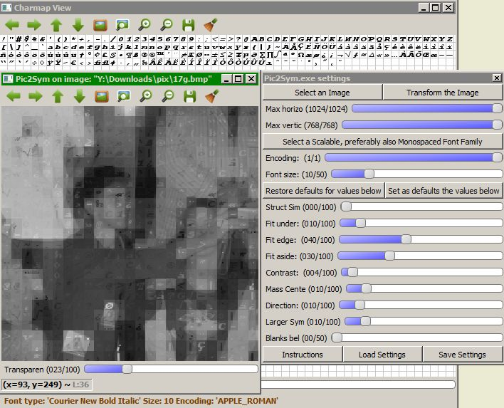](../../examples/17g_Courier New_Bold Italic_APPLE_ROMAN_10_0_0.25_1_0.75_0.1_0.2_0.2_0.1_0_250_250.jpg)<br>
***Bold Italic*** fonts don&#39;t serve well when patches contain vertical texture, like the pajama of the man from top\-right corner.

**Scenario 9b** - *Hybrid approximation* appears better:<br>
[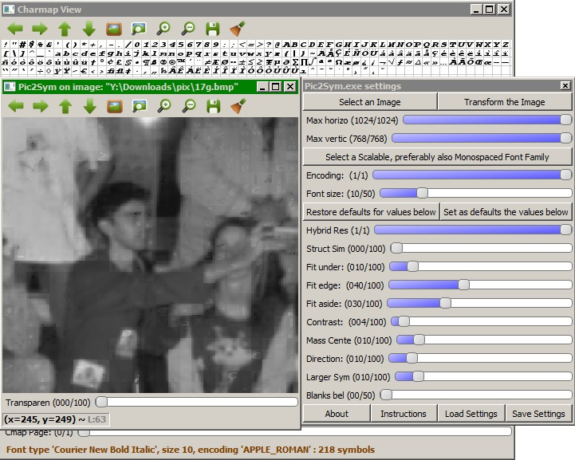](../../examples/17g_Courier New_Bold Italic_APPLE_ROMAN_10_1_0_0.25_1_0.75_0.1_0.2_0.2_0.1_0_250_250.jpg)<br>
Duration: less than **2 s** for all versions.

* * *

<a name = "LargeFontFamilies"></a>

### Handling large symbol sets

The following cases:

- used all available Matching Aspects
- didn&#39;t generate Draft Results (*Batch syms* on 0)
- enabled all the features available in their version, among which:
    - using Parallelism (only 2 threads)
    - Symbols Filtering, which reduces the number of symbols

---

Filtering shrank the font family *Osaka Regular Unicode* from 14963 symbols to less than 7900.<br>
So, 27540 patches to approximate using around 7900 symbols require 1526s (around 26 minutes) in *v2.0* (better than in the screenshot below):<br>
[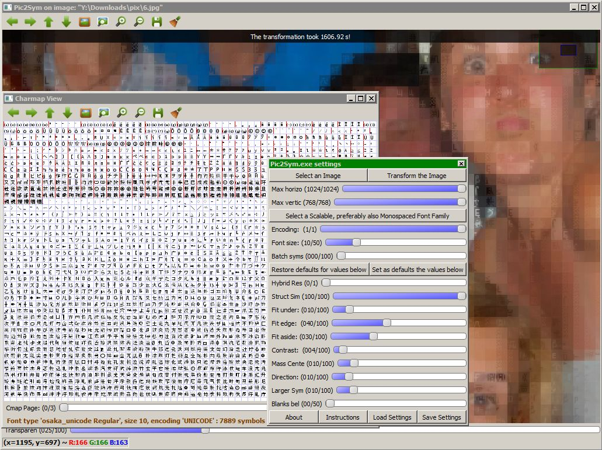](../../examples/6_osaka_unicode_Regular_UNICODE_10_0_2.5_0.25_1_0.75_0.1_0.2_0.2_0.1_0_2040_1350.jpg)<br>
Here the *Hybrid Result* mode was not used, to be able to inspect the result better.<br>
The amount of required memory was around 330MB.

---

Filtering shrank the font family *DengXian Regular Unicode* from 28541 symbols to less than 7250.<br>
So, 27540 patches to approximate using around 7250 symbols require 1230s (around 21 minutes) in *v2.0* (better than in the screenshot below):<br>
[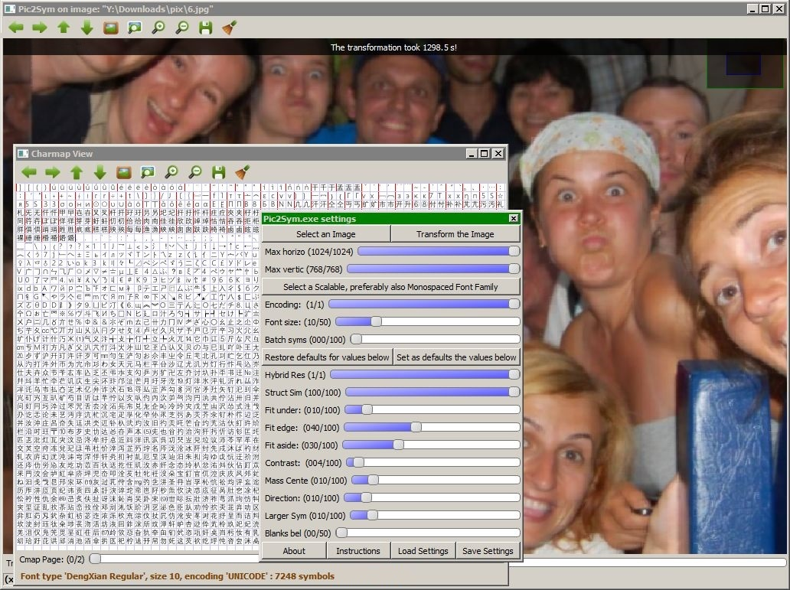](../../examples/6_DengXian_Regular_UNICODE_10_1_2.5_0.25_1_0.75_0.1_0.2_0.2_0.1_0_2040_1350.jpg)<br>
This time, the *Hybrid Result* mode was enabled.

---

Both cases show that Clustering the Symbols here couldn&#39;t help much during the transformations, because there were so few clusters.

The times would be longer when enabling just the *Strunctural Similarity* Matching Aspect or when applying the transformations on images with a more finely-grained texture. See the [Performance Considerations](../performance/performance.md) about that.

* * *

<a name = "Conclusions"></a>

### Several conclusions:

**Hybrid result mode** introduced in **version 1.1** *preserves image meaningfulness* **no matter the patch and its context**. However, the generated image won&#39;t deliver same impression as non\-hybrid results. Instead, such transformations *appear to be an interesting way of hiding symbols within pictures*.

*Non-hybrid transformations* of images are **more suitable** when:

- the images have *large\-enough uniform regions* and *clear contours* (***more clarity***)
- the *irrelevant parts from the scene are sufficiently dark and/or uniform* (***less focus shift***)
- the *symbols approximating the image* are:
	* *bold* (approximation is ***more than a grid of blurred cells***)
	* *of a small\-enough size* (***better accuracy***)

Cases **to avoid**:

- pictures with *lots of random context changes between patches* (they generate ***odd mosaics*** in **non-Hybrid mode**)
- *symbol sets* which:
	* contain more than 400 glyphs (***incurred time costs; little perceived difference on result***)
	* have a *size much too small* to distinguish them
	* have *lots of almost identical glyphs* (***large time\-penalty for little quality improvement***)
	* are *italic* when there are many regions with textures tilted differently
	* contain *glyphs filling almost solid their square* (such symbols are very likely to approximate ambiguous patches and ***they appear rigid, despite they are correctly selected***)

**Hybrid Results** mode, **Symbols Filtering, Clustering, Preselection** and **Skipping Matching Aspects** are now able to tackle most of these problematic contexts.

For optimal configuration of the application, please refer to the [Control Panel](../CtrlPanel/CtrlPanel.md) and [Appendix](../appendix/appendix.md) materials.

- - -

Versions newer than or equal to **1.3** provide the ***Drafts Generation*** feature, which lets the user visualize several intermediary steps of the approximation process. For the diagrams from this page, this feature was disabled (***Batch Syms*** was set on 0 from the start). To understand how these drafts slow the application, I&#39;ll review the scenario from &quot;[Illustrating the &#39;Hybrid Results&#39; feature](#HybridModeDemo)&quot; when using *Pic2Sym v1.3*:

- the configuration from there produced *no drafts* and took 48s
- when setting a *Batch Size* of 25 (and not changing its value during the transformation process) 53s were required 

Image transformation duration depends on the performance of the machine executing the job, so all reported times are orientative.

The obtained times from the enumerated diagrams are discussed on the [Performance page](../performance/performance.md).

* * *

#### Note:

*For exemplifying the conversions performed by the project, I&#39;ve applied the transformations on several images provided by 3 friends with well\-developed artistic abilities, all of us sharing the love for nature. So, many thanks to [Trifa Carina](https://www.facebook.com/trifa.carina), [Muntean Flavia](https://www.facebook.com/darkfavy) and [Rosca Adrian](https://www.facebook.com/rosca.adrian.9). If you need those beautiful pictures or similar ones, please contact them.*

----------
[Back to start page](../../../ReadMe.md)

[examples]:../../examples/
[Structural Similarity]:https://ece.uwaterloo.ca/~z70wang/research/ssim
