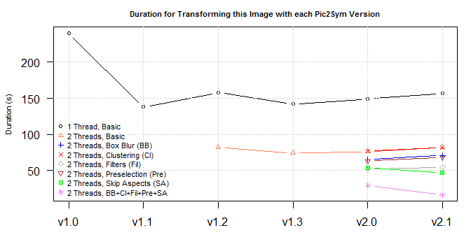
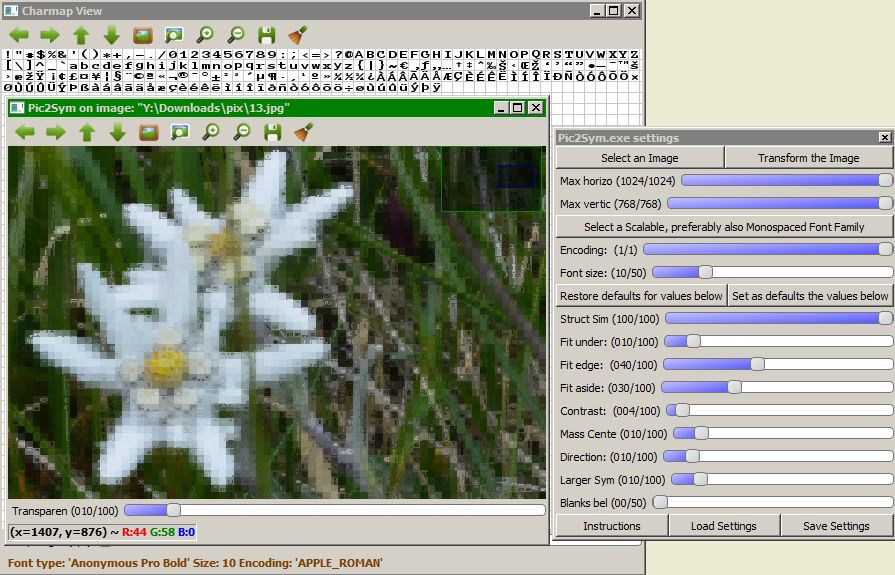
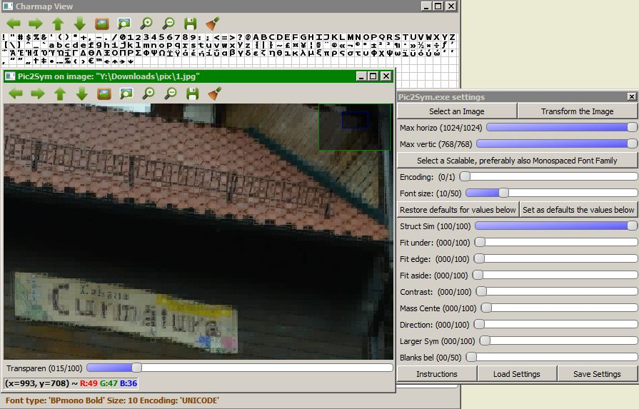
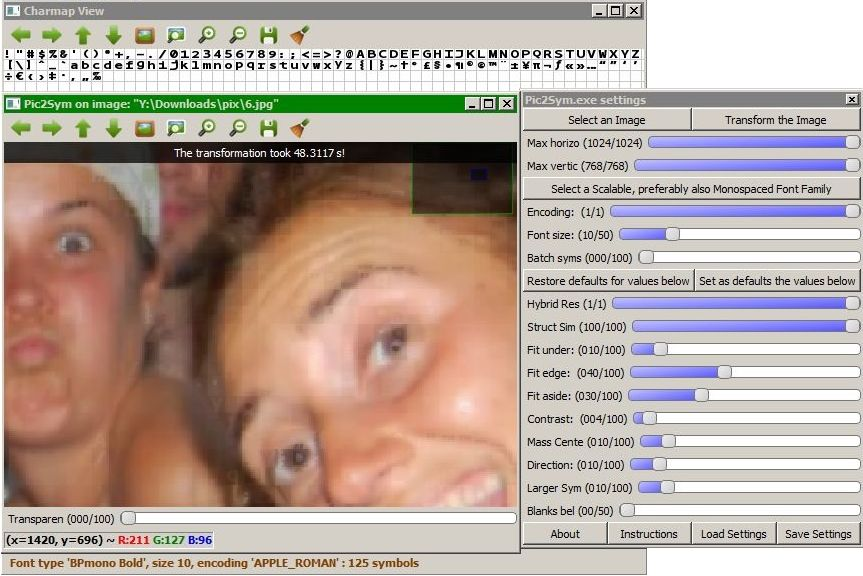
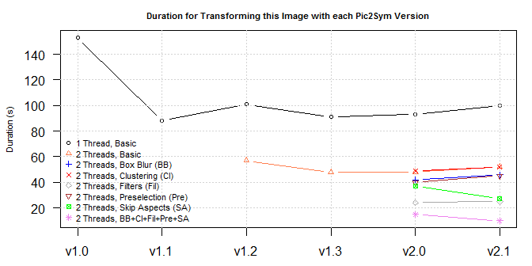
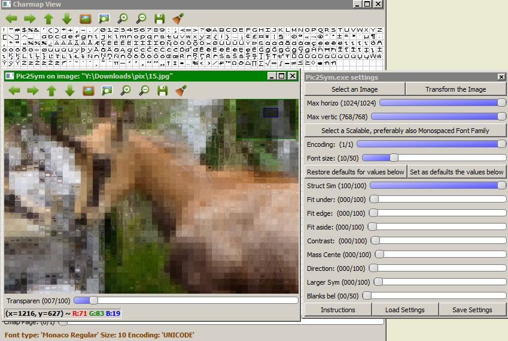
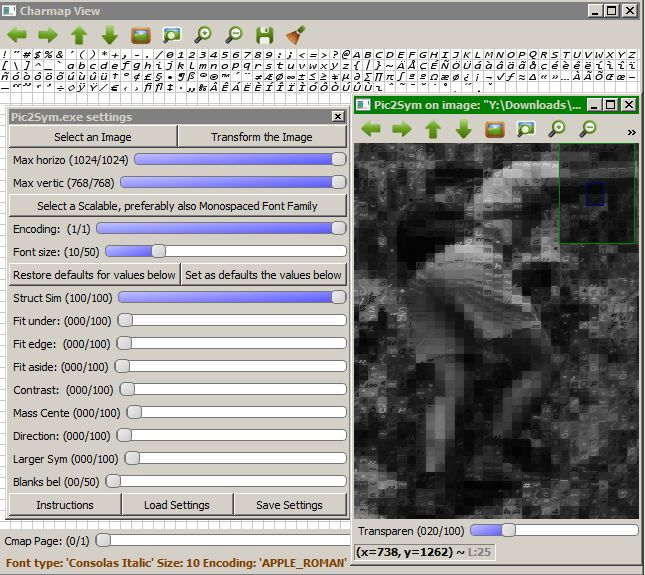
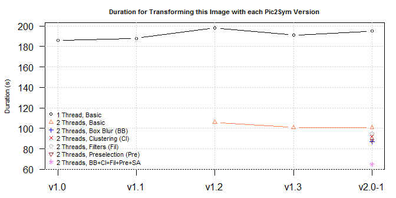

Results generated by versions of Pic2Sym up to v2.1
---------------------------------------------------

<a title = 'Only the Rmd file needs to be edited. Do not change the corresponding md file!'>

[Back to start page](../../../ReadMe.md)

The original images and the results for the cases presented on this page can be found in the folder [doc/examples](../../examples/). Clicking on the snapshots from below will open the full-size results.

The name of each result file is prefixed by the name of the image before transformation. For instance:

-   **7g.jpg** is an original image that was approximated
-   **7g\_Consolas\_Italic\_APPLE\_ROMAN\_10\_1\_2.5\_0\_0\_0\_0\_0\_0\_0\_0\_1350\_2030.jpg** is one of the approximations of **7g.jpg**

------------------------------------------------------------------------

The rest of the page covers these topics:

-   [Several Satisfactory Results](#BetterSuitedCases)
-   [Illustrating the 'Hybrid Results' feature](#HybridModeDemo)
-   [Effects of the 'Hybrid Results' mode on Problematic Images](#ChallengingCases)
-   [Handling Large Font Families](#LargeFontFamilies)
-   [A few Conclusions](#Conclusions)

------------------------------------------------------------------------

### Satisfactory results and their settings

**Scenario 1:**

27540 patches to approximate using 220 symbols (*Envy\_Code\_R\_Regular\_APPLE\_ROMAN\_10*):    The necklace, the guitar tail and some of the eyes look still ok.  The aspect is quite blurry, as a consequence of not using a bold font.

Some of the glyphs used here are quite similar, in the sense they have just different accents. Such differences have almost no impact on the result, except the longer time required generating it.

------------------------------------------------------------------------

**Scenario 2:**

27540 patches to approximate using 201 symbols (*ProFontWindows\_Regular\_APPLE\_ROMAN\_10*):    Approximated eyebrows, eyes, face contours and hairs have a fair-enough appearance.

Although declared as *Regular*, the symbols look bold-ish.

------------------------------------------------------------------------

**Scenario 3:**

27540 patches to approximate using 214 symbols (*Anonymous\_Pro\_Bold\_APPLE\_ROMAN\_10*):    Objects thinner than the font size normally can't maintain their aspect.  Their background decides how clear they remain.

------------------------------------------------------------------------

**Scenario 4:**

[Structural Similarity](https://ece.uwaterloo.ca/~z70wang/research/ssim) disabled; 27405 patches to approximate using 191 symbols (*BPmono\_Bold\_UNICODE\_10*):    The thin lines on the quasi-uniform wall are well approximated.  Besides that, disabling [Structural Similarity](https://ece.uwaterloo.ca/~z70wang/research/ssim) produced the result several times faster. However, the disabled method shouldn't be underestimated.

------------------------------------------------------------------------

**Scenario 5:**

Using only [Structural Similarity](https://ece.uwaterloo.ca/~z70wang/research/ssim), this time; 27405 patches to approximate using 191 symbols (*BPmono\_Bold\_UNICODE\_10*):    [Structural Similarity](https://ece.uwaterloo.ca/~z70wang/research/ssim) took more than 5 times the duration required by all the other techniques. Still, it captures additional subtleties when comparing the letters on the board and many more.

------------------------------------------------------------------------

**Scenario 6a:**

27540 patches to approximate with 125 symbols (*BPmono\_Bold\_APPLE\_ROMAN\_10*):  

It marks high in the following parts: eyes, eyebrows, wrinkles, some contours and texture of the shiny blue object in the close plane.  The grid splits incur some unnatural transitions.

The bold symbols of the Apple Roman encoding of [BpMono](http://www.dafont.com/bpmono.font) font family usually produce pretty results. (The font is free and provided also in the [res](../../../res/) folder. To be visible to Pic2Sym, *it needs to be installed*.)

This scenario shares its times with the case from below. The only differnce between them is the way 'Hybrid Results' is configured (not available here and **ON** in the next configuration).

------------------------------------------------------------------------

### Using Pic2Sym v1.3 to illustrate 'Hybrid Results' (feature introduced in v1.1):

**Scenario 6b** - using the scenario right from above with Hybrid Result mode enabled:    Notice how the **symbols avoid imposing themselves** and are **more visible only where they are more naturally suited**. Use **Hybrid mode** for such **discreet approximations**.

------------------------------------------------------------------------

### Less satisfactory results and their settings (with and without the Hybrid Result mode)

**Scenario 7a:**

Using only [Structural Similarity](https://ece.uwaterloo.ca/~z70wang/research/ssim); 27540 patches to approximate using 341 symbols (*Monaco\_Regular\_UNICODE\_10*):    The chamois seem quite blurred and the background seriously competes for viewer's attention, more than it should, in my opinion.

**Scenario 7b** - *Hybrid approximation* from below isn't affected by these concerns:   

------------------------------------------------------------------------

**Scenario 8a:**

Still using only [Structural Similarity](https://ece.uwaterloo.ca/~z70wang/research/ssim); 27405 patches to approximate using 219 symbols (*Consolas\_Italic\_APPLE\_ROMAN\_10*):    *Italic* fonts cannot tackle top-left corners well-enough.  There are just a few parts that looks like one would expect from an approximation.  A reason might be that there are many large background differences among neighbor patches.

**Scenario 8b** - *Hybrid approximation* seems better:   

------------------------------------------------------------------------

**Scenario 9a:**

[Structural Similarity](https://ece.uwaterloo.ca/~z70wang/research/ssim) disabled; 625 patches to approximate using 218 symbols (*Courier\_New\_Bold Italic\_APPLE\_ROMAN\_10*):    ***Bold Italic*** fonts don't serve well when patches contain vertical texture, like the pajama of the man from top-right corner.

**Scenario 9b** - *Hybrid approximation* appears better:    Duration: less than **2 s** for all versions.

------------------------------------------------------------------------

### Handling large symbol sets

The table below provides the results for [this image](../../examples/6.jpg) (27540 patches) when using 2 font families under Pic2Sym v2.0 and v2.1 (the latter comes with an additional *Cross Correlation* (**Corr**) matching aspect). All cases share these settings:

-   no *Draft Results* are generated (*Batch syms* on 0)
-   the *Hybrid Result* mode was not used, to be able to inspect the results better
-   all available *Matching Aspects* are used and they are set in [this way](CtrlPanelLargeFontFamilies.jpg)
-   all the features available in their version are enabled:
    -   using *Parallelism* (only *2 threads*, but worthy)
    -   *Symbols Filtering*, which reduces the number of symbols (see Used versus Total symbols), so clearly helpful
    -   *Skipping Aspects*, which ensures that even when using 8 (in v2.0) / 9 (in v2.1) matching aspects, the duration of the transformation is smaller than when using only the *Structural Similarity* (**SS**) matching aspect
    -   the cheaper *Box blur* substitute of the Gaussian blur, needed when evaluating the *Structural Similarity* (**SS**) matching aspect
    -   *Preselection* mechanism, which has just marginal benefits for small initial font sizes (10, in this case)
    -   *Symbols Clustering*, which does not help when the average cluster size is as small as for the 2 used font families. The feature disables itself in such contexts

<table style="width:12%;">
<colgroup>
<col width="4%" />
<col width="4%" />
<col width="4%" />
</colgroup>
<thead>
<tr class="header">
<th align="left"><em>Font Family</em></th>
<th align="left"><em>Osaka Regular Unicode</em>   </th>
<th align="left"><em>DengXian Regular Unicode</em></th>
</tr>
</thead>
<tbody>
<tr class="odd">
<td align="left"><strong>Total symbols</strong></td>
<td align="left">14963</td>
<td align="left">28541</td>
</tr>
<tr class="even">
<td align="left"><strong>Used symbols</strong></td>
<td align="left"><strong>7884</strong></td>
<td align="left"><strong>7247</strong></td>
</tr>
<tr class="odd">
<td align="left"><strong>Time required in v2.0</strong>   </td>
<td align="left"><strong>1526</strong>s (~26min) 81% from <strong>SS</strong> alone</td>
<td align="left"><strong>1226</strong>s (~21min) 72% from <strong>SS</strong> alone</td>
</tr>
<tr class="even">
<td align="left"><strong>Time required in v2.1</strong>   </td>
<td align="left"><strong>495</strong>s (~8min) 26% from <strong>SS</strong> alone 3 times longer than <strong>Corr</strong> alone</td>
<td align="left"><strong>365</strong>s (~6min) 22% from <strong>SS</strong> alone 2.4 times longer than <strong>Corr</strong> alone</td>
</tr>
<tr class="odd">
<td align="left"><strong>Resulted images</strong></td>
<td align="left"><a href="../../examples/6_osaka_unicode_Regular_UNICODE_10_0_2.5_0.25_1_0.75_0.1_0.2_0.2_0.1_0_2040_1350.jpg">v2.0</a>, <a href="../../examples/6_osaka_unicode_Regular_UNICODE_10_0_2.5_1_0.25_1_0.75_0.1_0.2_0.2_0.1_0_2040_1350.jpg">v2.1</a></td>
<td align="left"><a href="../../examples/6_DengXian_Regular_UNICODE_10_0_2.5_0.25_1_0.75_0.1_0.2_0.2_0.1_0_2040_1350.jpg">v2.0</a>, <a href="../../examples/6_DengXian_Regular_UNICODE_10_0_2.5_1_0.25_1_0.75_0.1_0.2_0.2_0.1_0_2040_1350.jpg">v2.1</a></td>
</tr>
</tbody>
</table>

The times from v2.1 seem to be around a third of those from v2.0. This is due to the introduction of the **Cross Correlation** matching aspect, which has similar accuracy to **SS**, but works around 11 times faster than **SS**.

The times would be longer when applying the transformations on images with a more finely-grained texture. See the [Performance Considerations](../performance/performance.md) about that.

The amount of required memory was around 330MB.

------------------------------------------------------------------------

### Several conclusions:

**Hybrid result mode** introduced in **version 1.1** *preserves image meaningfulness* **no matter the patch and its context**. However, the generated image won't deliver same impression as non-hybrid results. Instead, such transformations *appear to be an interesting way of hiding symbols within pictures*.

*Non-hybrid transformations* of images are **more suitable** when:

-   the images have *large-enough uniform regions* and *clear contours* (***more clarity***)
-   the *irrelevant parts from the scene are sufficiently dark and/or uniform* (***less focus shift***)
-   the *symbols approximating the image* are:
    -   *bold* (approximation is ***more than a grid of blurred cells***)
    -   *of a small-enough size* (***better accuracy***)

Cases **to avoid**:

-   pictures with *lots of random context changes between patches* (they generate ***odd mosaics*** in **non-Hybrid mode**)
-   *symbol sets* which:
    -   contain more than 400 glyphs (***incurred time costs; little perceived difference on result***)
    -   have a *size much too small* to distinguish them
    -   have *lots of almost identical glyphs* (***large time-penalty for little quality improvement***)
    -   are *italic* when there are many regions with textures tilted differently
    -   contain *glyphs filling almost solid their square* (such symbols are very likely to approximate ambiguous patches and ***they appear rigid, despite they are correctly selected***)

**Hybrid Results** mode, **Symbols Filtering, Clustering, Preselection** and **Skipping Matching Aspects** are now able to tackle most of these problematic contexts.

The *reasons* behind the **patterns concerning the times from v2.0 and v2.1** (as observed on the graphs) are:

-   when applied alone, *Structural Similarity* (SS) matching aspect provides the same times within v2.0 and v2.1, since there is nothing different involved in this context
-   *Clustering* (Cl) and *Basic* values do overlap because clustering disables itself for font families with very few and very small clusters, as clustering would imply an additional computational cost
-   *Basic*, *Preselection* (Pre), *Box Blur* (BB) and *Filtering* (Fil) need more time in v2.1 because of the additional *Cross Correlation* (Corr) matching aspect, introduced in this version. Each patch needs to be assessed by 9 matching aspects, instead of 8, as it was in v2.0. Roughly, the time difference should be the duration required to perform the matching using only the *Cross Correlation* aspect
-   *All* (Cl, Pre, BB, Fil, SA) reflects mainly the advantages from *Skip Aspects*, described below
-   *Skip Aspects* (SA) evidences the improvement delivered with v2.1:

    -   the evaluation order of the matching aspects was slightly changed in v2.1, to reflect their actual cost
    -   the newly introduced *Cross Correlation* (Corr) aspect precedes *Structural Similarity* during the assessment, since it is around 11 times faster compared to SS
    -   Corr does decide often enough that *Structural Similarity* cannot improve the matching score to beat a given previous match, so SS is skipped plenty of times, thus there will be many cheap Corr computations and only a few expensive SS

For optimal configuration of the application, please refer to the [Control Panel](../CtrlPanel/CtrlPanel.md) and [Appendix](../appendix/appendix.md) materials.

------------------------------------------------------------------------

Versions newer than or equal to **1.3** provide the ***Drafts Generation*** feature, which lets the user visualize several intermediary steps of the approximation process. For the diagrams from this page, this feature was disabled (***Batch Syms*** was set on 0 from the start). To understand how these drafts slow the application, I'll review the scenario from "[Illustrating the 'Hybrid Results' feature](#HybridModeDemo)" when using *Pic2Sym v1.3*:

-   the configuration from there produced *no drafts* and took 48s
-   when setting a *Batch Size* of 25 (and not changing its value during the transformation process) 53s were required

Image transformation duration depends on the performance of the machine executing the job, so all reported times are orientative.

The obtained times from the enumerated diagrams are discussed on the [Performance page](../performance/performance.md).

------------------------------------------------------------------------

#### Note:

*For exemplifying the conversions performed by the project, I've applied the transformations on several images provided by 3 friends with well-developed artistic abilities, all of us sharing the love for nature. So, many thanks to [Trifa Carina](https://www.facebook.com/trifa.carina), [Muntean Flavia](https://www.facebook.com/darkfavy) and [Rosca Adrian](https://www.facebook.com/rosca.adrian.9). If you need those beautiful pictures or similar ones, please contact them.*

------------------------------------------------------------------------

[Back to start page](../../../ReadMe.md)
