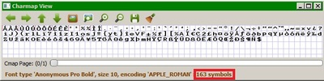

## Testing Pic2Sym v2.0 (*64\-bit Windows only*) ##

[Back to start page](../../../ReadMe.md)

It&#39;s *recommended* to read first the ***Conclusions*** from the ***[examples page][examples]***, to see *what to expect* and understand *what images and font types are more suitable for the transformation*.

Font families with a moderate number of symbols let Pic2Sym produce its results faster. In any case, as soon as the result appears satisfactory-enough, or when the estimated remaining transformation time is not acceptable, the user can cancel the process while provided with a saved version of the last generated draft result.

The **optional** *free* font ***BpMono bold*** with less than 200 symbols can be installed (with *administrator rights*) from [here][BpMonoBold] or from **[res/][ResFolder]** folder in order to be visible while running the application. *Installing* fonts requires just double-clicking the font file and then pressing **Install** button. *Uninstalling* steps: press ; type &quot;**%windir%\\fonts**&quot;; right click on the desired font and choose **Delete**.

Now the steps for testing Pic2Sym (**no administrative privileges required**):

<table style="width:100%; margin-left:0; margin-right:0" border="0" cellpadding="0" cellspacing="5">
	<tr valign="center" style="vertical-align:center">
		<td width="60%" align="justify" style="text-align:justify; padding-left:0; padding-right:0">
			1. Download <b><a href="../../../bin/Pic2Sym.msi">bin/Pic2Sym.msi</a></b> and double-click it to install the application.
			

			The installer:
			<ul>
				<li>allows choosing the directory for the installation</li>
				<li>can create Desktop Shortcut, Quick-Launch and Start Menu items</li>
				<li>will create an entry within installed programs which looks like the image from the right</li>
			</ul>
		</td>
		<td>
			</img>
		</td>
	</tr>
	<tr valign="center" style="vertical-align:center">
		<td align="justify" style="text-align:justify; padding-left:0; padding-right:0">
			2. Launch <b>Pic2Sym.exe</b>, then activate the <i><a href="../CtrlPanel/CtrlPanel.md">Control Panel</a></i> from the <i>main window</i> by:
			<ul>
				<li>either pressing <b>Ctrl+P</b></li>
				<li>or by clicking the tool marked with red within the toolbar</li>
			</ul>
		</td>
		<td>
			</img>
		</td>
	</tr>
	<tr valign="center" style="vertical-align:center">
		<td align="justify" style="text-align:justify; padding-left:0; padding-right:0">
			3. Adjust the settings for a <i>first <b>rapid</b></i> transformation based on the highlighted controls from the right:
			<ul>
				<li>select a <b>small image</b> to transform</li>
				<li>select a <i>font family</i> preferably with <b>less than 400 symbols</b>. The <i>symbols window</i> should provide information about the size of the loaded font family: 
					</img></li>
				<li>bring <b><a href="https://ece.uwaterloo.ca/~z70wang/research/ssim">Structural Similarity</a> slider to 0</b> (less accuracy, but faster)</li>
				<li><i>optionally</i> change <b>Batch syms</b> slider value to instruct the transformation how often to display <i>draft results</i> (A new draft is delivered after each processed batch of symbols. The slider configures the arity of the batches):
				<ul>
					<li><b>small (non-zero) slider value</b> means low-arity batches, thus frequently updated drafts and lengthier transformation</li>
					<li><b>larger slider value</b> accelerates the transformation, but delivers only a few drafts</li>
					<li><b>slider value on 0</b> means no drafts, rather than 0-arity batches. This should execute the fastest, but will display just a final result, without intermediary drafts</li>
				</ul>
				</li>
			</ul>
		</td>
		<td>
			</img>
		</td>
	</tr>
	<tr>
		<td colspan="2" align="justify" style="text-align:justify; padding-left:0; padding-right:0">
			4. Finally hit <b>Transform the Image</b>. The approximation process can be <b>canceled</b> at any time by <b>pressing ESC</b>. At the end of the transformation you&#39;ll be able to <i>inspect the result</i> with the <i>Transparency slider</i> and the <i>Zoom feature</i> from the main window
		</td>
	</tr>
</table>

To leave the application, press **ESC**.

--------
[Back to start page](../../../ReadMe.md)

[ResFolder]:../../../res/
[BpMonoBold]:http://www.dafont.com/bpmono.font
[examples]:../results/results.md#Conclusions
[CtrlPanel]:../CtrlPanel/CtrlPanel.md
[msvcp120.dll]:http://files.dllworld.org/msvcp120.dll-12.0.21005.1-64bit_3075.zip
[msvcr120.dll]:http://files.dllworld.org/msvcr120.dll-12.0.21005.1-64bit_3122.zip
[vcomp120.dll]:http://down-dll.com/index.php?file-download=vcomp120.dll&arch=64bit&version=12.0.21005.1&dsc=Microsoft%AE-C/C++-OpenMP-Runtime#
[comdlg32.dll]:http://files.dllworld.org/comdlg32.dll-6.1.7601.17514-64bit_181.zip
[advapi32.dll]:http://files.dllworld.org/advapi32.dll-6.3.9600.17031-64bit.zip
[Structural Similarity]:https://ece.uwaterloo.ca/~z70wang/research/ssim