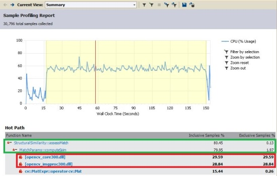
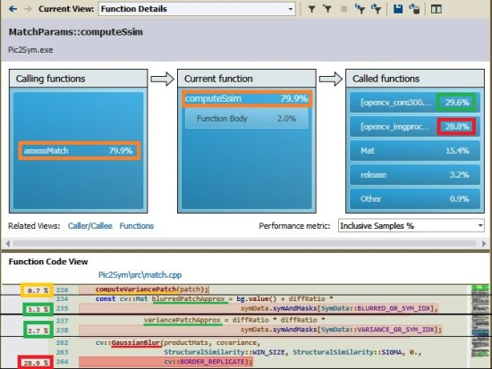
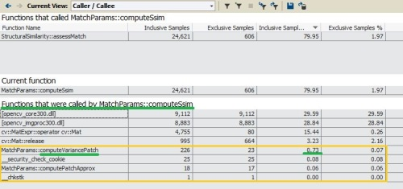

[Back to start page](../ReadMe.md)

#### Notations
Some of the performance indicators used on this page depend on the following variables:
- **s** \- the size of the (square) symbols used during image approximation process
- **n** \- the total number of these available symbols
- **c** \- the count of patches to approximate (during image transformation, the image is viewed as a grid of patches)
- **w** \- the size of the blur window (one matching aspect needs also blurred versions of the patches and symbols)

* * *

## Performance of Pic2Sym v1.0 ##

Profiling results show that during image approximation under default settings, 80% from the time the processor is busy computing [structural similarity][] (*StructuralSimilarity::assessMatch* \-\> *MatchParams::computeSsim*): 
 
The 2 dll\-s from the image are **imgproc**, which provides an *image blur* function, and **core**, used for *basic matrix operations*, like addition and element\-wise multiplication.

The emphasis of next ideas will be on **imgproc**, as the next capture might suggest: 
 
This *Function Details* view presents the operations from **MatchParams::computeSsim** together with the percent of the total time required by each. The lines not relevant here were removed from the *Function Code View*.

The red rectangles tackle the mentioned image blur (*GaussianBlur*) from **imgproc** dll. The overall duration for the blur is 28.9% (28.8% is displayed in the top\-right red rectangle, probably because it ignores call costs).

The variables *blurredPatchApprox* (line 234) and *variancePatchApprox* (line 237) do actually require each same *GaussianBlur* computation method.
However, their actual evaluation in the implemented optimized algorithm _needs **\>8 x less time** each_.
Lines 241-257 from the code check in Debug mode that the computations are the same when using normal and optimized methods.

The call to *computeVariancePatch* on line 226 involves also 2 other sub\-calls to *GaussianBlur*, but they are performed only once per patch.
Despite the fact its single\-time workload is distributed among all the symbols compared with the given patch, *computeVariancePatch* still averages to 0.7% from the total time and it is categorized as ***Other*** (0.9%) in ***Called functions***. This is perhaps more evident in the view below: 
 
The transformation time for the non-optimized algorithm would be around 57% longer than for the implemented version (100% + 2*28.8% = ~157%).

When disabling [Structural Similarity][], there are fewer differences among the remaining matching aspects. Smoothness and contour match aspects require a bit more time than the rest.

* * *

All matching aspects share the values that normally would be recomputed. First one who needs such a value will evaluate it; the next ones will simply use it.
The total approximation effort is split in 3:

1.	Symbol\-specific data preparation - various masks, a negative, a blurred version and others, all obtained when the glyph is loaded and resized
2.	Transformation\-specific values computation - patch area, some limits and others, all generated at the start of the transformation
3.	Actual approximation of each patch

Below I&#39;ll compute first the overall transformation complexity, ignoring (1) and (2) from above. Then I&#39;ll enumerate the distinct contribution of each matching aspect, without the part when they compute/read shared data.
For simplicity I won&#39;t count compare, saturation casts and loop index increment operations and I assume that all arithmetic operations will need the same time.
The expressions make use of the notations introduced at the top of the page.

Here are the estimations for employed OpenCv functions:
- ***countNonZero*** : 0.5\*s^2   (on average, half of the mask elements might be 0)
- ***mean*** : s^2 + 1   (with mask parameter)
- ***meanStdDev*** :  2.5\*s^2 + 3   (with mask parameter)
- ***GaussianBlur*** : 2\*w \* s^2   (for a separable kernel method; otherwise it would be (w\*s)^2 ;   For related details, see [this](http://www.mathworks.com/matlabcentral/fileexchange/28238-kernel-decomposition)\)

**Overall transformation complexity** for a *color* image: &nbsp;&nbsp;&nbsp;&nbsp;&nbsp;&nbsp;&nbsp;&nbsp;&nbsp;&nbsp;c \* { n \* [s^2 \* (2\*w +29.5) + 61 ]   +   s^2 \* (4\*w+30)   +   4\*s   +   8 }.

**Separately** and **without the parts computing/reading of shared data**, each match aspect contributes as follows:
- ***[Structural Similarity][]*** : c \* { n \* [s^2 \* (2\*w+19) + 6 ]   +   s^2 \* (4\*w+3) }
- ***Fit under*** : 3\*c\*n
- ***Fit edge*** : (2.5\*s^2 + 7) \* c\*n
- ***Fit aside*** : 3\*c\*n
- ***Contrast*** : 1.5\*c\*n
- ***Gravity*** : 4\*c\*n
- ***Direction*** : 6\*c\*n
- ***Larger symbols*** : 3\*c\*n
- ***Blank threshold*** : 4\*c\*n

For **c**=27540, **n**=125, **s**=10 and **w**=11 (values used for the profiled transformation), the ratio of the complexities of *[Structural Similarity][]* and the *Overall Transformation* is _**0.78617**, which is close to **79.95%** reported by the profiler_.
The last discussed image demonstrates that the measured Structural Similarity computations concern almost entirely only Structural Similarity \- below the underlined computeVariancePatch, only 0.06% of the time is spent in shared values management (the call to *computePatchApprox*).

The **memory required by the transformation process** is ***O***((n+c)\*s^2) where **c** is typically much larger than **n**.
For the scenario mentioned above, *maximum reported memory* was less than *114 MB*.

-----------
[Back to start page](../ReadMe.md)

[structural similarity]:https://ece.uwaterloo.ca/~z70wang/research/ssim