## Example results generated by Pic2Sym &#60;&#61; v1.3 ##
[Back to start page](../ReadMe.md)

Below are some results, which can also be found in [doc/examples](examples/) folder. The mentioned directory contains the originals as well. Each result file is prefixed by the name of the processed image.

Clicking on the presented cases will open the full\-size results from [doc/examples](examples/).

Version **1.3** should be the version to choose for **multi\-core processors** or when aspects like **cancelable transformation** and **drafts visualization** are desired. It is *version 1.2* with *nested parallelization* removed from the image transformation code. *Parallelization* in **v1.3** can be *enabled selectively* or *disabled completely* from [res/varConfig.txt](../res/varConfig.txt) (*no recompilation necessary when changed*). When parallelization is enabled, each *row of image patches* is processed by the *next available core*. There are many other parallelization switches (see the [Appendix](appendix.md) for details).

Some of the cases from below were tested also with version 1.3.

##### Illustrating &#39;Hybrid Results&#39; (introduced in version 1.1):

Using a scenario with Hybrid Result mode enabled and 27540 patches to approximate with 125 symbols (*BPmono_Bold_APPLE_ROMAN_10*): 
[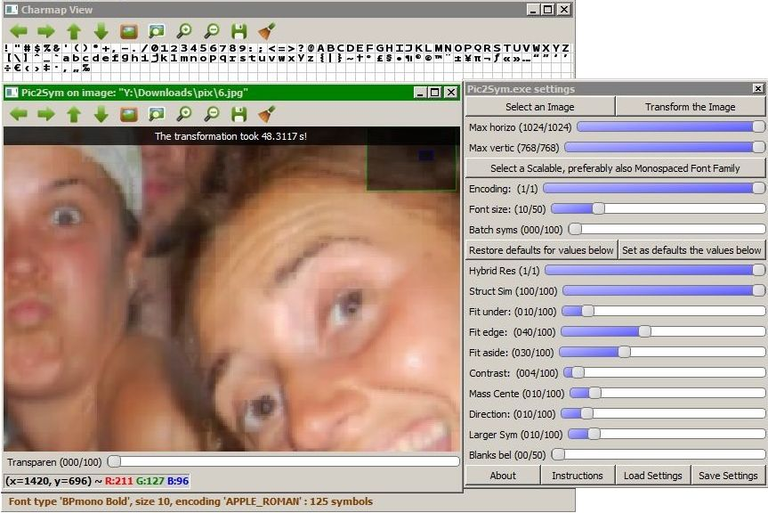](examples/6_BPmono_Bold_APPLE_ROMAN_10_1_2.5_0.25_1_0.75_0.1_0.2_0.2_0.1_0_2040_1350.jpg) 
Notice how the **symbols avoid imposing themselves** and are **more visible only where they are more naturally suited**. Use **Hybrid mode** for such **discrete approximations**.

Obtained **durations**:
- _v1.3 (using **2 threads**)_:
	- **48 s** (_with **symbol batching disabled**_ : slider **&#39;Batch syms&#39;** set on **0** from the image below)
	- **53 s** (_using **batches of 25 symbols**_)
- _v1.2_:
	- **57 s** (_using **2 threads**_)
	- **101 s** (_using **1 thread**_)
- _v1.1_: **88 s**

*Versions starting from 1.1 skip approximating uniform patches* and that&#39;s why *processing times are smaller for this image compared to version 1.0* (see below).

* * *

##### Satisfactory results and their settings (no Hybrid Result mode)

Same picture and settings from above (but no **Hybrid Result**) generate the following result in **153 s** in *version* **1.0**: 
[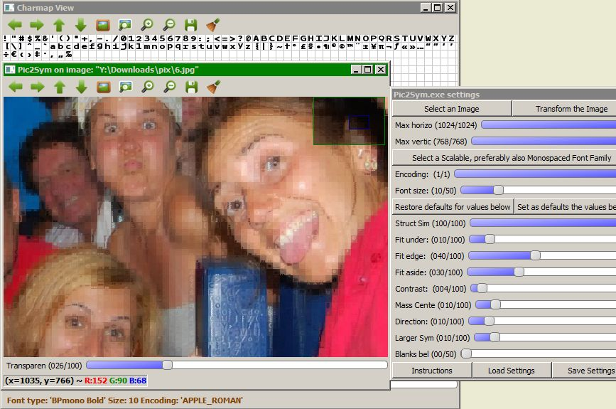](examples/6_BPmono_Bold_APPLE_ROMAN_10_2.5_0.25_1_0.75_0.1_0.2_0.2_0.1_0_2040_1350.jpg) 
It marks high in the following parts: eyes, eyebrows, wrinkles, some contours and texture of the shiny blue object in the close plane. 
The grid splits incur some unnatural transitions.

The bold symbols of the Apple Roman encoding of [BpMono](http://www.dafont.com/bpmono.font) font family usually produce pretty results. (The font is free and provided also in the [res](../res/) folder. To be visible to Pic2Sym, *it needs to be installed*.) 
_ _ _

27540 patches to approximate using 220 symbols (*Envy_Code_R_Regular_APPLE_ROMAN_10*); Duration: **256 s** (_version **1.0**_) 
[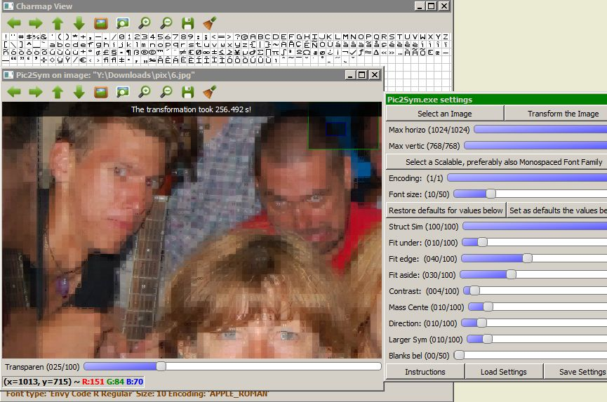](examples/6_Envy Code R_Regular_APPLE_ROMAN_10_2.5_0.25_1_0.75_0.1_0.2_0.2_0.1_0_2040_1350.jpg) 
The necklace, the guitar tail and some of the eyes look still ok. 
The aspect is quite blurry, as a consequence of not using a bold font.

Some of the glyphs used here are quite similar, in the sense they have just different accents. Such differences have almost no impact on the result, except the longer time required generating it.
_ _ _

27540 patches to approximate using 201 symbols (*ProFontWindows_Regular_APPLE_ROMAN_10*); Duration: **240 s** (_version **1.0**_) 
[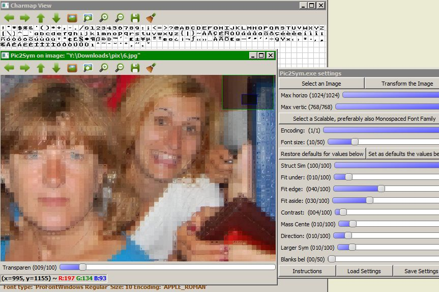](examples/6_ProFontWindows_Regular_APPLE_ROMAN_10_2.5_0.25_1_0.75_0.1_0.2_0.2_0.1_0_2040_1350.jpg) 
Approximated eyebrows, eyes, face contours and hairs have a fair\-enough appearance.

Although declared as *Regular*, the symbols look bold\-ish.
_ _ _

27540 patches to approximate using 214 symbols (*Anonymous_Pro_Bold_APPLE_ROMAN_10*); Duration: **250 s** (_version **1.0**_) 
[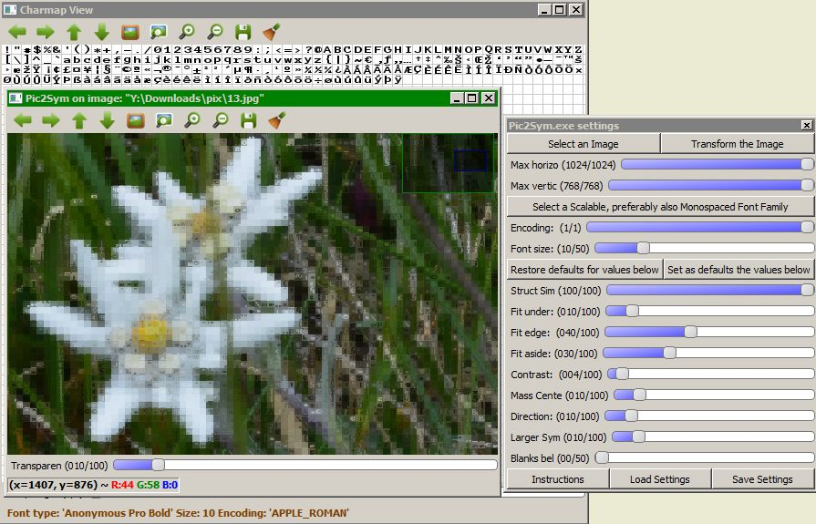](examples/13_Anonymous Pro_Bold_APPLE_ROMAN_10_2.5_0.25_1_0.75_0.1_0.2_0.2_0.1_0_2040_1350.jpg) 
Objects thinner than the font size normally can&#39;t maintain their aspect. 
Their background decides how clear they remain.
_ _ _

[Structural Similarity][] disabled; 27405 patches to approximate using 191 symbols (*BPmono_Bold_UNICODE_10*); Duration: **30 s** (_version **1.0**_) 
[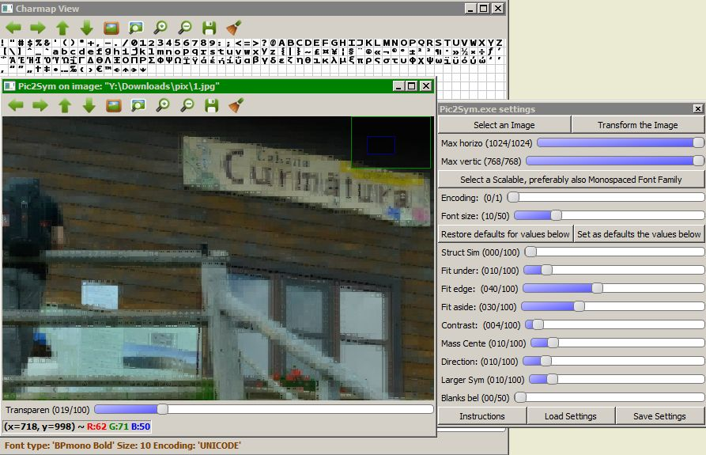](examples/1_BPmono_Bold_UNICODE_10_0_0.25_1_0.75_0.1_0.2_0.2_0.1_0_2030_1350.jpg) 
The thin lines on the quasi\-uniform wall are well approximated. 
Besides that, disabling [Structural Similarity][] produced the result several times faster. However, the method shouldn&#39;t be underestimated.
_ _ _

Using only [Structural Similarity][], this time; 27405 patches to approximate using 191 symbols (*BPmono_Bold_UNICODE_10*); Duration: **172 s** (_version **1.0**_) 
[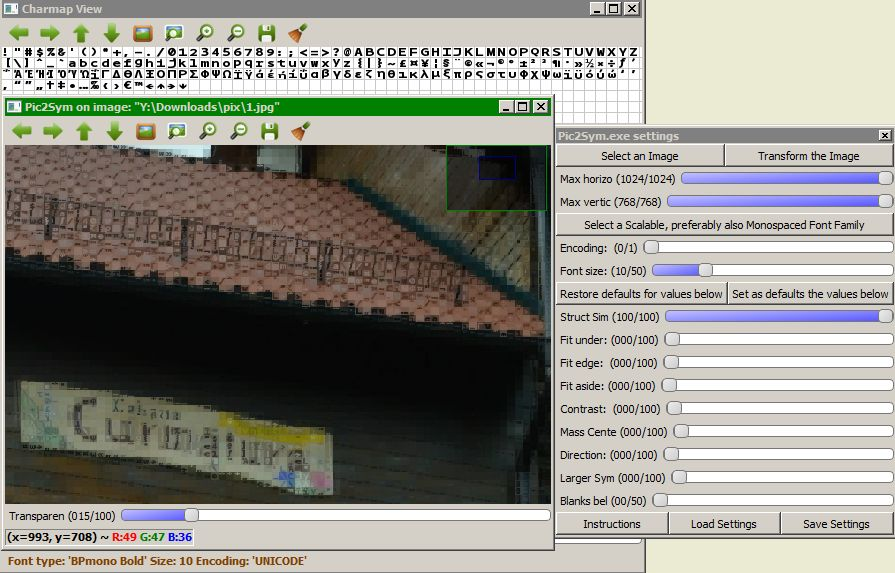](examples/1_BPmono_Bold_UNICODE_10_2.5_0_0_0_0_0_0_0_0_2030_1350.jpg) 
[Structural Similarity][] took more than 5 times the duration required by all the other techniques. Still, it captures additional subtleties when comparing the letters on the board and many more.

* * *

##### Less satisfactory results and their settings (with and without the Hybrid Result mode)

Using only [Structural Similarity][], again; 27540 patches to approximate using 341 symbols (*Monaco_Regular_UNICODE_10*) 
Duration: **385 s** (**no Hybrid**, _version **1.0**_): 
[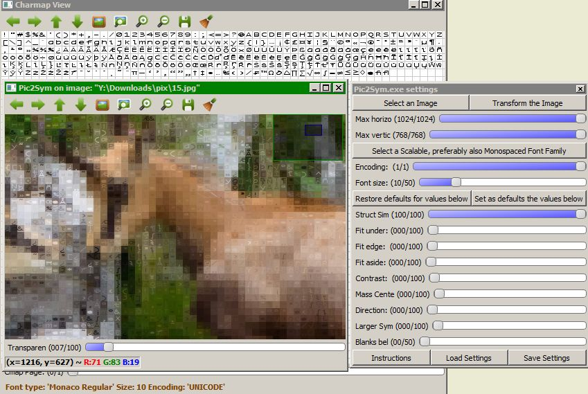](examples/15_Monaco_Regular_UNICODE_10_2.5_0_0_0_0_0_0_0_0_2040_1350.jpg) 
The chamois seem quite blurred and the background seriously competes for viewer&#39;s attention, more than it should, in my opinion.  
**Hybrid approximation** from below isn&#39;t affected by these concerns: 
[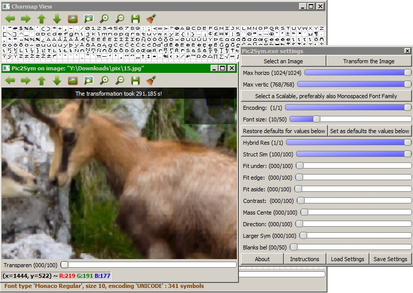](examples/15_Monaco_Regular_UNICODE_10_1_2.5_0_0_0_0_0_0_0_0_2040_1350.jpg) 
Obtained **durations**:
- _v1.3_: **159 s** (_using **2 threads** with **symbol batching disabled**_)
- _v1.2_: **180 s** (_using **2 threads**_); **314 s** (_using **1 thread**_)
- _v1.1_: **291 s**
_ _ _

Still using only [Structural Similarity][]; 27405 patches to approximate using 219 symbols (*Consolas_Italic_APPLE_ROMAN_10*) 
 Duration: **186 s** (**no Hybrid**, _version **1.0**_): 
 
*Italic* fonts cannot tackle top\-left corners well\-enough. 
There are just a few parts that looks like one would expect from an approximation. 
A reason might be that there are many large background differences among neighbor patches.  
**Hybrid approximation** seems better: 
[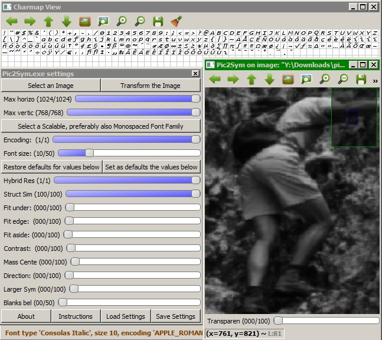](examples/7g_Consolas_Italic_APPLE_ROMAN_10_1_2.5_0_0_0_0_0_0_0_0_1350_2030.jpg) 
Obtained **durations**:
- _v1.3_: **101 s** (_using **2 threads** with **symbol batching disabled**_)
- _v1.2_: **106 s** (_using **2 threads**_); **198 s** (_using **1 thread**_)
- _v1.1_: **188 s**
_ _ _

Finally, [Structural Similarity][] disabled; 625 patches to approximate using 218 symbols (*Courier_New_Bold Italic_APPLE_ROMAN_10*) 
Duration: **1 s** (**no Hybrid**, _version **1.0**_): 
 
***Bold Italic*** fonts don&#39;t serve well when patches contain vertical texture, like the pajama of the man from top\-right corner.  
**Hybrid approximation** appears better. Duration: **1 s** (_v**1.1**, v**1.2** with **1** or **2 threads** and v**1.3** with **2 threads**_): 
[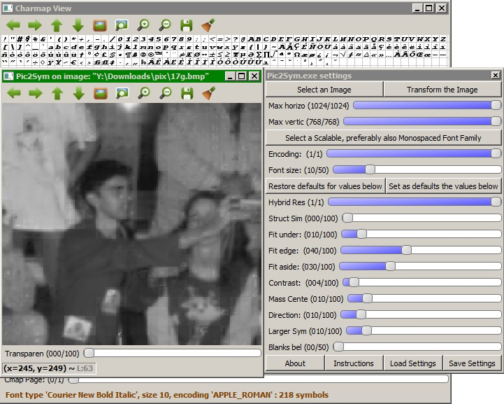](examples/17g_Courier New_Bold Italic_APPLE_ROMAN_10_1_0_0.25_1_0.75_0.1_0.2_0.2_0.1_0_250_250.jpg) 

* * *

The speed of generating the approximations depends on the machine running the application, so the enumerated durations are just orientative.

For better understanding how to configure the application, read the [Control Panel](CtrlPanel.md) and [Appendix](appendix.md) materials.

* * *

##### Several conclusions:
**Hybrid result mode** introduced in **version 1.1** *preserves image meaningfulness* **no matter the patch and its context**. However, the generated image won&#39;t deliver same impression as non\-hybrid results. Instead, such transformations *appear to be an interesting way of hiding symbols within pictures*.

*Non-hybrid transformations* of images are **more suitable** when:

- the images have *large\-enough uniform regions* and *clear contours* (***more clarity***)
- the *irrelevant parts from the scene are sufficiently dark and/or uniform* (***less focus shift***)
- the *symbols approximating the image* are:
	* *bold* (approximation is ***more than a grid of blurred cells***)
	* *of a small\-enough size* (***better accuracy***)

Cases **to avoid**:

- pictures with *lots of random context changes between patches* (they generate ***odd mosaics*** in **non-Hybrid mode**)
- *symbol sets* which:
	* contain more than 400 glyphs (***incurred time costs; little perceived difference on result***)
	* have a *size much too small* to distinguish them
	* have *lots of almost identical glyphs* (***large time\-penalty for little quality improvement***)
	* are *italic* when there are many regions with textures tilted differently
	* contain *glyphs filling almost solid their square* (such symbols are very likely to approximate ambiguous patches and ***they appear rigid, despite they are correctly selected***)

Version **1.3** allows *canceling transformations* and *visualizing drafts*, while preserving *most efficient multithreading switches* from **v1.2**. It performs better than v1.2 on multi-core machines as long as demanding only a few drafts.
Version **1.2** introduced *thread-parallelism* and provides maximum number of parallelization combinations.
Version **1.1** performs better than **1.2** and **1.3** for *sequential runs*.

These initial versions are useful for determining what problems, limitations, as well as opportunities exist and which solutions are best.

Next major versions will focus on more complex optimizations.

----------
[Back to start page](../ReadMe.md)

[Structural Similarity]:https://ece.uwaterloo.ca/~z70wang/research/ssim